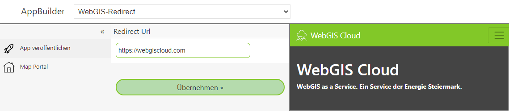

App Template: Redirect App
==========================

Die wohl einfachste *App* ist die Vorlage, die unter WebGIS-Redirect zu finden ist. Diese Vorlage dient dazu, einen
Anwender zu einer bestimmten Webseite umzuleiten.

Für diese App kann genau ein Parameter ``Redirect Url`` angegeben werden:

Unter ``Redirect Url`` wird die Url angegeben, auf die umgeleitet werden soll. Klickt man danach auf ``Übernehmen``, wird die 
Seite in der Vorschau in einem IFrame angezeigt.

Veröffentlicht man diese App, erscheint auf der Portalseite in der entsprechenden Kategorie eine Kachel.
Klickt der Anwender auf diese Kachel, wir er auf die hier angegebene Webseite umgeleitet.

Mit der *App* ist es möglich, beliebige Webseiten über die Portalseite anzuspringen. So können beispielsweise auch 
*DataLinq*-Seiten, wie eine Karte auf der Portalseite angeboten werden.

.. note::
   Die App leitet Anwender sofort auf die gewünschte Seite weiter. Das gilt nicht für den Ersteller dieser App.
   Der Ersteller bleibt auf einer Zwischenseite und muss die Weiterleitung per Klick veranlassen. Der Grund ist, dass
   die Administration dieser App nur über diese Zwischenseite erfolgen kann:

   .. image:: img/redirect2.png