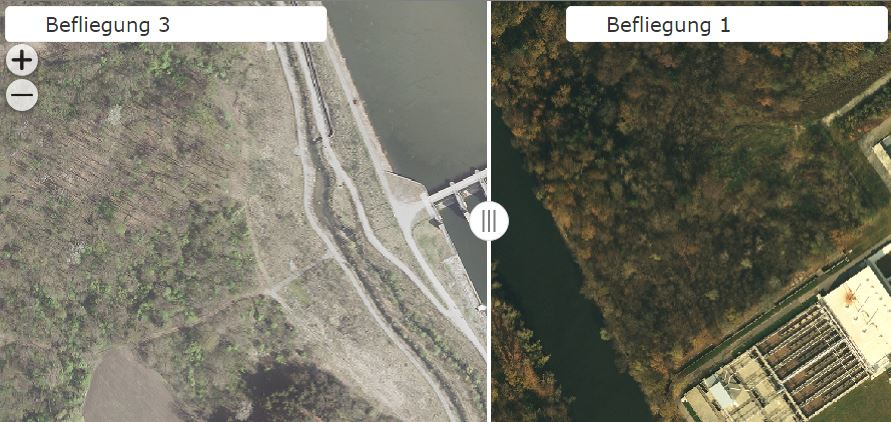
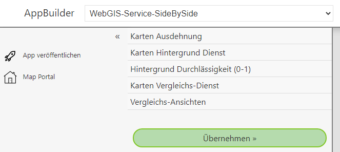
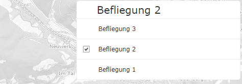
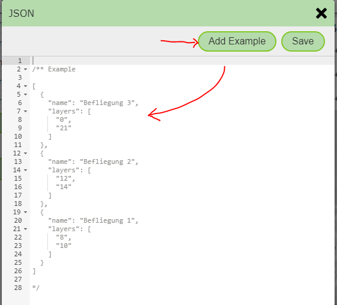

App Template: Service Side-by-Side
==================================

Mit dieser Vorlage besteht die Möglichkeit, einen Kartendienst in unterschiedlichen Darstellungen nebeneinander darzustellen.
Die Trennlinie zwischen den beiden Darstellungen ist dabei frei verschiebbar, damit ein besserer Eindruck der Unterschiede erkennbar wird.
Die Vorlage kann beispielsweise dazu benutzt werden, um unterschiedliche Befliegungsstände von Luftbildern zu vergleichen:

Wählt man die Vorlage aus, können folgende Parameter angegeben werden:

Hier eine Beschreibung der einzelnen Parameter:

Karten Ausdehnung
-----------------

Für jede WebGIS API Karten Anwendung muss eine Kartenausdehnung angegeben werden. Neben der Ausdehnung werden damit auch die Zoomstufen und die Kartenprojektion 
definiert (siehe Definition einer Ausdehnung im CMS).
Hier werden alle verfügbaren Ausdehnungen aus dem CMS aufgelistet. Durch anklicken eines Elements wird dieses ausgewählt.

Karten Hintergrund Dienst
-------------------------

Der Kartendienst, der zum Vergleich herangezogen wird, ist in der Regel im WMS/AGS Dienst. Diese haben den Nachteil, dass die Anzeige nicht so flüssig erscheint, 
wie bei einem vorprozessierten *Tiling*-Dienst. Damit die App beim Verändern des Kartenausschnittes trotzdem flüssig wirkt, muss hier ein Hintergrund-Dienst angegeben werden,
der unter dem eigentlich Dienst, der verglichen werden sollte, dargestellt wird.

.. note:: 
   Der Hintergrund Dienst sollte ein *Tiling*-Dienst sein. Außerdem ist darauf zu achten, dass der Dienst zur oben gewählten Ausdehnung passt (Projektion und Zoomstufen).

Hintergrund Durchlässigkeit
---------------------------

Da der Hintergrund Dienst nur der Usability und der Orientierung dient, es also quasi ein Nebendarsteller in der Anwendung ist, kann dieser transparent (aufgehellt) dargestellt werden.
Hier kann ein Wert zwischen 0 und 1 angeben werden, wobei ``0`` komplett durchlässig und ``1`` komplett deckend bedeutet.

Karten Vergleichs Dienst
------------------------

Hier wird der eigentliche Dienste angegeben, der verglichen werden soll. Es werden wieder alle im CMS verfügbaren Dienste aufgelistet. Es kann dabei genau ein Dienst ausgewählt werden.

Vergleichs-Ansichten
--------------------

Damit Daten aus dem Dienst verglichen werden können, muss der Dienst links und rechts mit unterschiedlichen Layer-Schaltungen dargestellt werden. Welche Layer das sind,
kann hier festgelegt werden. Die Möglichkeiten beschränken sich dabei nicht auf zwei Varianten, sondern es können beliebig viele Ansichten definiert werden.
Der Anwender kann in der App dann für die Seite die gewünschte Ansicht wählen:

Für diese Ansichten werden nicht die Darstellungsvarianten für diesen Dienst aus dem CMS herangezogen, sondern die einzelnen Schaltungen werden hier im *Json*-Format eingetragen.
Öffnet man den *JSON Editor*, muss zuerst ein Beispiel eingefügt werden, dass dann auf die eigenen Bedürfnisse angepasst werden kann:

.. note::
   Bei JSON handelt es sich die Javascript-Beschreibung eines Objektes. Das eingefügte Beispiel ist zuerst noch *auskommentiert*. Um es zu verwenden, müssen zuerst die Zeilen mit ``/*`` und ``*/`` entfernt werden.

Bei den einzelnen Ansichten müssen die Ids der betroffen Layer als *Array* angeführt werden. Die einzelnen Ids müssen Zeichenketten sein (umgeben von doppeltem Hochkomma): ``"layers": ["1", "2", "3"]``.
Da es sich bei den Ansichten um eine Auflistung (Array) handelt, müssen die Elemente mit Bestrich getrennt werden und von eckigen Klammen umgeben sein. Die einzelnen Ansichten-Elemente werden durch geschwungene
Klammern definiert. Als Attribute können ``name`` und ``layers`` angeführt werden.

Ein gültiges JSON sieht hier beispielsweise folgendermaßen aus:

.. code::

   [
        {
            "name": "Befliegung 3 (2020)",
            "layers": ["0","21"]
        },
        {
            "name": "Befliegung 2 (2015)",
            "layers": ["12","14"]
        }
   ]

Mit dem ``Save`` Button kann das JSON gespeichert werden. 

Zum Abschluss kann die App mit ``Übernehmen`` in der Vorschau angezeigt und danach mit ``App Veröffentlichen`` veröffentlicht werden.