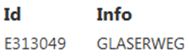

.. sectnum::
    :start: 5

.. _Anchor4 :

.. raw:: html

    
    
    
    
    
    

.. role:: grey
.. role:: brown
.. role:: green
.. role:: orange
.. role:: blue
.. role:: purple

Aufruf und Beispiele
====================

Abfrageergebnisse sind entweder als Rohdaten (SELECT) oder in aufbereiteter Form (REPORT) verfügbar. Der Aufruf besteht aus folgenden Teilen:

*	:grey:`URL zu DataLinq`

*	:brown:`Aufrufart (Select, Report)` 

*	:green:`Name (Id) des Endpunktes` 

*	:orange:`Name gewünschten Abfrage`

*	:blue:`(optional): Name des Views`

*	:purple:`(optional): Angabe der Übergabeparameter`

:grey:`DataLinq-URL /` :brown:`Aufrufart /` :green:`Endpoint` :orange:`@Query` :blue:`(@View)` :purple:`(?Parameter1=Wert1(&Parameter2=..)`

Bpsw. 

:grey:`http://localhost/api5/datalinq/`:brown:`report/`:green:`ssg-sdet`:orange:`@proj-geb`:blue:`@proj-gebbestand`:purple:`?GebaeudeId=E313049&Bezeichnung=Text123`

.. _Anchor41 :

Rohdaten aufrufen (SELECT)
--------------------------

Um die Rohdaten eines Abfrageergebnisses aufzurufen, ist als Abfrageart „SELECT“ zu wählen und die Angabe des Views wegzulassen. Die Daten werden als JSON zurückgegeben.

:grey:`http://localhost/api5/datalinq/`:brown:`select/`:green:`ssg-sdet`:orange:`@proj-geb`:purple:`?GebaeudeId=E313049`

.. code-block::

    [
    {
        "ID": "E313049",
        "PLTXT": "GLASERWEG"
    }
    ]

.. _Anchor42 :

Aufbereitete Daten aufrufen (REPORT) 
------------------------------------

Wenn für eine Abfrage ein oder mehrere Views bestehen, können diese aufgerufen werden und die Daten in einer aufbereiteten Form darstellen:

:grey:`http://localhost/api5/datalinq/`:brown:`select/`:green:`ssg-sdet`:orange:`@proj-geb`:purple:`?GebaeudeId=E313049`

.. code-block:: html 

    <table> 
        <tr> 
            <th>Id</th> 
            <th>Info</th> 
        </tr> 

        @foreach(var record in Model.Records) { 
            <tr> 
                <td>record["TP"]</td> 
                <td>record["PLTXT10"]</td> 
            </tr>
        } 
    </table> 

