Kundendatenbank bearbeiten
==========================

Dieses Beispiel soll zeigen, wie mit DataLinq Daten aus einer Datenbank angezeigt und bearbeitet 
werden können. Als Beispiel solle eine einfache Tabelle mit Namen und Adresse dienen.
Die Daten liegen dabei in einer *Postgres* Datenbank.

Datenmodel
----------

Die Tabelle ``customers`` besitzt neben einer eindeutigen Id ``id`` je ein Feld für den Name ``name``
und für die Adresse ``address``:

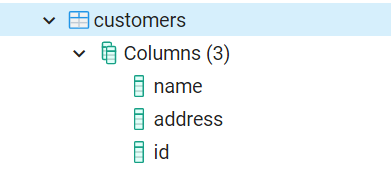

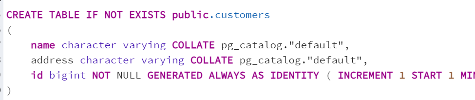

Endpunkt erstellen
------------------

Im ersten Schritt kann ein Endpunkt erstellt (zB. ``edit_customers``). Als *Connection Type* wird 
``Database`` eingestellt und der *Connection String* zur Postgres Datenbank angegeben.

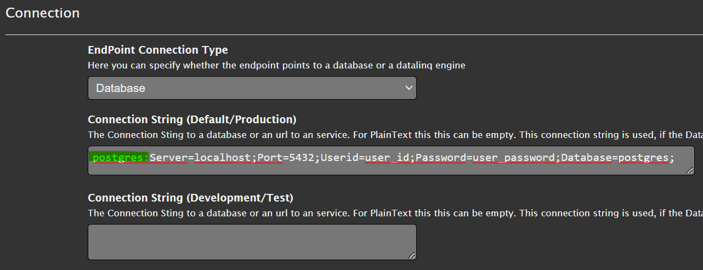

.. note::
   Wichtig ist der Prefix ``postgres:`` am Anfang des *Connection Strings*. Dadurch weiß DataLinq, 
   dass es sich um eine Postgres Datenbank handelt. Andere Prefixes sind beispielsweise ``SQL:`` 
   für SQL Server Datenbanken, ``Oracle:`` für Oracle Datenbanken oder ``sqlite:`` für filebasierte 
   SqLite Datenbanken.

Abfragen erstellen
------------------

Im nächsten Schritt muss auf die eine Abfrage erstellt werden, die die Kundendaten bereit stellt, zB ``select_customers``:

.. image:: img/edit_customers4.png

Die Abfrage ist ein einfache SQL Statement ``Select * from customers``. Außerdem wurde hier noch eine 
*optionale* Einschränkung nach dem ``id`` Feld eingeführt:

Die Zeile ``where id=@id`` wird hier nur der Abfrage hinzugefügt, wenn der Parameter ``id`` über die Url
übergeben wird. Dieser Wert wird dann über den SQL Parameter @id übergeben.

Befinden sich bereits Daten in der Datenbank und führt man die Abfrage aus, sollten die Daten angezeigt werden:

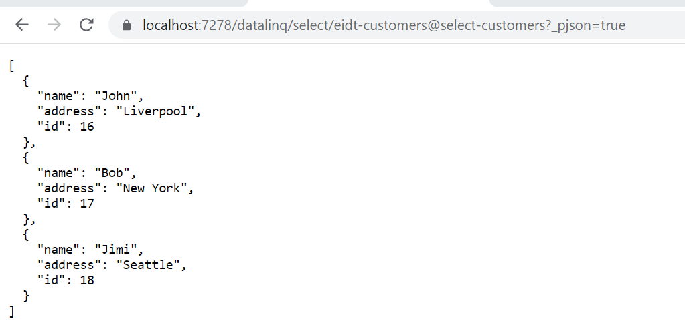

Zum Testen kann auch versucht werden, die ``id`` über als Url-Parameter mitzuschicken:

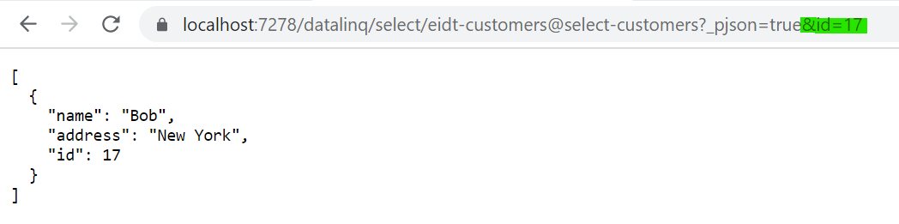

Im nächsten Schritt können Abfragen zum Erstellen (``add_customer``), Bearbeiten (``edit_customer``) 
und Löschen (``del_customer``) erstellt werden. Dabei handelt es sich nicht um Abfragen mit **SELECT**
sondern um allgemeine SQL Statements. Diese können später über Buttons in unseren Viewer getriggert werden:

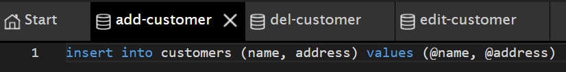

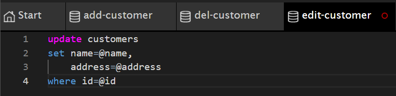

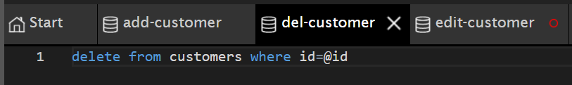

Views erstellen
---------------

Alle Viewers werden unter der Abfrage ``select_customers`` erstellt.

Der View, der eine Liste mit allen Kunden anzeigen soll, kann beispielsweise ``all-customers`` genannt werden.
Im zum *Hello World* Beispiel wird hier die Tabelle nicht einfach über die *DataLingHelper* Methode ``Table()``
angezeigt sondert über die einzelnen *Recorods* der Datenbank Tabelle iteriert:

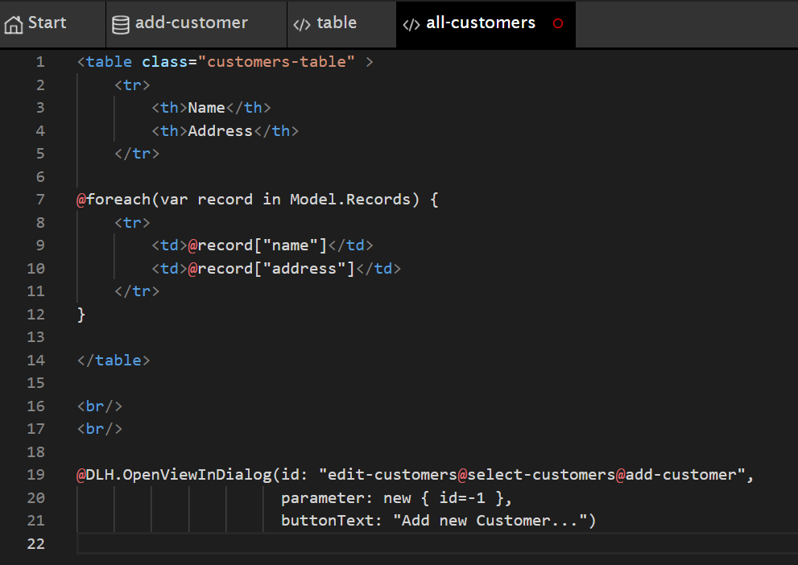

Unter der HTML Tabelle hier hier über die DataLinqHelper Method ``OpenViewInDialog`` ein Button eingefügt, 
der einen Dialog mit einem View zum Anlegen eines neuen Kunden anzeigen sollte. Das Ergebnis dieses Views
sollte folgendermaßen aussehen:

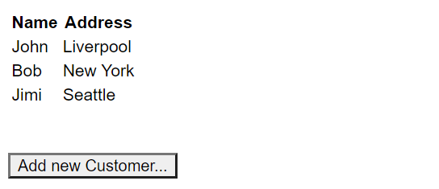

.. note::
   Hier wurde noch kein Styling vorgenommen. Dem ``<table>`` wurde aber bereits eine CSS Klasse ``customers-table``
   zugewiesen. Wie man individuelle Styles für einen Endpoint erstellen kann, wird weiter unter gezeigt.

Der Button unter der Tabelle funktioniert bereits und öffnet einen Dialog, mit einer Fehlermeldung, die
angibt dass der View ``add-customer`` unter der Abfrage ``select-custommer`` noch nicht existiert.

Um den Fehler zu beheben legen wir diesen View folgendermaßen an:

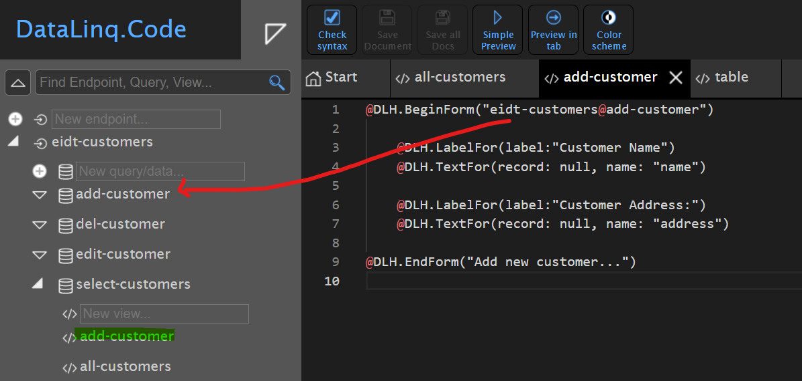

