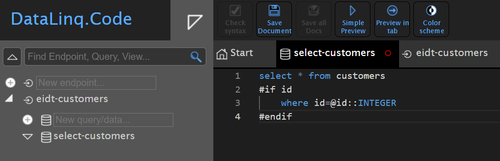

Kundendatenbank bearbeiten
==========================

Dieses Beispiel soll zeigen, wie DataLinq-Daten aus einer Datenbank angezeigt und bearbeitet 
werden können. Als Beispiel soll eine einfache Tabelle mit Namen und Adresse dienen.
Die Daten liegen dabei in einer *Postgres* Datenbank.

Datenmodell
-----------

Die Tabelle ``customers`` besitzt neben einer eindeutigen Id ``id`` je ein Feld für den Namen ``name``
und für die Adresse ``address``:


.. image:: img/edit_customers2.png

Endpunkt erstellen
------------------

Im ersten Schritt wird ein Endpunkt erstellt (zB. ``edit_customers``). Als *Connection Type* wird 
``Database`` eingestellt und der *Connection String* zur Postgres Datenbank angegeben.

.. image:: img/edit_customers3.png

.. note::
   Wichtig ist der Prefix ``postgres:`` am Anfang des *Connection Strings*. Dadurch weiß DataLinq, 
   dass es sich um eine Postgres Datenbank handelt. Andere Prefixes sind beispielsweise ``SQL:`` 
   für SQL Server Datenbanken, ``Oracle:`` für Oracle Datenbanken oder ``sqlite:`` für filebasierte 
   SqLite Datenbanken.

Abfragen erstellen
------------------

Im nächsten Schritt muss eine Abfrage erstellt werden, die die Kundendaten bereit stellt, z.B. ``select_customers``:



Die Abfrage ist ein einfaches SQL-Statement ``Select * from customers``. Außerdem wurde hier noch eine 
*optionale* Einschränkung nach dem ``id`` Feld eingeführt:

Die Zeile ``where id=@id`` wird hier nur der Abfrage hinzugefügt, wenn der Parameter ``id`` über die Url
übergeben wird. Dieser Wert wird dann über den SQL-Parameter @id übergeben.

Befinden sich bereits Daten in der Datenbank und führt man die Abfrage aus, sollten die Daten angezeigt werden:


Zum Testen kann auch versucht werden, die ``id``  als Url-Parameter mitzuschicken:

.. image:: img/edit_customers6.png

Im nächsten Schritt können Abfragen zum Erstellen (``add_customer``), Bearbeiten (``edit_customer``) 
und Löschen (``del_customer``) erstellt werden. Dabei handelt es sich nicht um Abfragen mit **SELECT**,
sondern um allgemeine SQL-Statements. Diese können später über Buttons in unseren Viewer getriggert werden:

.. image:: img/edit_customers7.png

.. image:: img/edit_customers8.png

.. image:: img/edit_customers9.png

Views erstellen
---------------

Alle Viewer werden unter der Abfrage ``select_customers`` erstellt.

Der View, der eine Liste mit allen Kunden anzeigen soll, kann beispielsweise ``all-customers`` genannt werden.
Im Vergleich zum *Hello World* Beispiel wird hier die Tabelle nicht einfach über die *DataLinqHelper*-Methode ``Table()``
angezeigt, sondern über die einzelnen *Records* der Datenbank Tabelle iteriert:


Unter der HTML Tabelle wird hier über die *DataLinqHelper*-Methode ``OpenViewInDialog`` ein Button eingefügt, 
der einen Dialog mit einem View zum Anlegen eines neuen Kunden anzeigen soll. Das Ergebnis dieses Views
soll folgendermaßen aussehen:


.. note::
   Hier wurde noch kein Styling vorgenommen. Dem ``<table>`` wurde aber bereits eine CSS-Klasse ``customers-table``
   zugewiesen. Wie man individuelle Styles für einen Endpoint erstellen kann, wird weiter unter gezeigt.

Der Button unter der Tabelle funktioniert bereits und öffnet einen Dialog mit einer Fehlermeldung, die
angibt, dass der View ``add-customer`` unter der Abfrage ``select-customer`` noch nicht existiert.

Um den Fehler zu beheben legen wir diesen View wie folgt an:


Hier wird mit ``@DLH.BeginForm("...")`` ein HTML Formular erstellt. Als Argument wird die *Route* zu einer
*Abfrage (Query)* angegeben. In diesem Fall die ``edit-customers@add-customer`` mit dem SQL ``INSERT`` Statement.

Danach werden die Felder angegeben, die befüllt werden können. Dazu wird zuerst immer mit ``@DLH.LabelFor()`` 
eine *Label* und mit ``@DLH.TextFor()`` ein Eingabe-Textfeld angegeben. Dieser Methode muss ein *Record (Datensatz)*
und der Namen des Feldes angegeben werden. In unserem Fall wird der *Record* erst erstellt, darum wird hier
``null`` angegeben. Wichtig ist, dass mit ``name:`` der Name des Datenbank-Feldes angegeben wird, in welches
der Wert aus dem Eingabe-Textfeld eingefügt werden soll.

Das Formular wird mit ``@DLH.EndForm("Button Text")`` abgeschlossen. Damit wird ein Button dargestellt, mit 
dem das Formular abgeschickt werden kann.

Klickt man jetzt auf den Button ``Add new customer..``, sollte der Dialog erscheinen und Werte können eingetragen werden:


Bestätigt man den Dialog mit ``Add new customer``, schließt sich der Dialog und der neue Kunde wird in die 
Datenbank übernommen. In der Liste wird der neue Kunde gleich angezeigt.

Im nächsten Schritt sollen bestehende Kunden geändert oder gelöscht werden können. Dazu muss zuerst die Tabelle
in unsere ``all-customers`` Ansicht angepasst werden. Es werden in jeder Zeile zwei Spalten mit jeweils einem
Button ``Update`` und ``Delete`` eingefügt. Das Ergebnis sieht beispielsweise wie folgt aus:


Über die Buttons werden *Views* in einem neuen Dialog angezeigt. Als Argument wird hier auch die *Id*
des jeweiligen Datensatzes übergeben (``parameter: new { id=record["id"] }``).

Startet man den Preview, sollte die Tabelle jetzt so aussehen:


Die Buttons öffnen bereits einen neuen Dialog mit Fehlermeldung, weil die entsprechenden *Views* noch nicht existieren.

Im nächsten Schritt werden unter ``select-customers`` die Views ``edit-customer`` und ``del-customer`` angelegt.

Der fertige View ``edit-customer`` sollte so aussehen:


Wird dieser View aufgerufen, wird der darüber liegenden Abfrage ``select-customers`` die *Id* des 
gewünschten Datensatzes übergeben. Der Datensatz befindet sich in ``Model.Records``. Am Anfang des 
*Scripts* wird dieser Datensatz der Variabel ``record`` zugewiesen mittels ``Model.Records.First()`` (First: 
der erste und hier einzige Datensatz).

Dieser Datensatz wird dann im Formular an ``@DLH.TextFor()`` übergeben. Damit wird das Eingabe-Textfeld 
gleich mit den entsprechenden Werten befüllt.
Da die Abfrage ``edit-customer`` die *Id* des Datensatzes für das UPDATE Statement benötigt, muss dieses 
Feld ebenfalls im Formular enthalten sein. Da der Anwender dieses Feld aber nicht sehen soll (oder braucht),
wird es im Formular als *Hidden-Field* eingefügt: ``@DLH.HiddenFor(record: record, name: "id")``.

Das fertige Formular sieht in der Vorschau dann wie folgt aus:


Bestätigt man diesen Dialog, sollte der Datensatz geändert werden. Hier können allerdings auch Datenbank-Fehler 
angezeigt werden:


Dieser kommt zustande, weil die *Id* in der Datenbank vom Typ ``bigint`` und per Parameter ein ``string`` 
übergeben wird. Der Grund ist, dass DataLinq alle Parameter über Url-Parameter übergibt und diese immer als 
Zeichenkette interpretiert werden. Kann oder möchte das Datenbank System das nicht automatisch umwandeln, muss
dies im SQL Statement erfolgen. Falls also dieser Fehler auftritt (Datenbankabhängig) können die 
SQL-Statements für UPDATE und DELETE folgendermaßen angepasst werden (hier für PostgreSQL):

.. code-block:: SQL

   update customers
   set name=@name,
      address=@address
   where id=@id::INTEGER

.. code-block:: SQL

   delete from customers where id=@id::INTEGER

Der fertige View für für ``del-customer`` sieht wie folgt aus:


Auch hier wird zuerst der erste und einzige Datensatz als Variable ```record`` ausgelesen.
Danach wird die Tabelle für die *Records* im *Model* angezeigt: ``@DLH.Table(Model.Records)``.
Dies sollte nur dazu dienen, damit der Anwender vor dem Löschen sieht, um welchen Datensatz es sich handelt.

Das Formular, das an die Abfrage ``del-customer`` mit dem DELETE Statement übermittelt wird, beinhaltet nur 
das *Hidden-Field* für den Datensatz *Id*.

Mit den oben gezeigten Änderungen ist die Anwendung fertig. Neue Datensätze können angelegt,
bestehende können geändert oder/und gelöscht werden.

Styling
-------

Im letzten Schritt soll das *Styling* für die Anwendung angepasst werden. Da es sich bei den *Views* um
*Razor Syntax* handelt, kann das *Styling* über HTML Tags, Inline oder auch dynamisch über Javascript erfolgen.

Für jeden Endpunkt kann auch eine übergeordnete CSS-Datei angelegt werden. Diese CSS-Datei wird dann in 
jedem *View/Report* unter diesem Endpunkt geladen. 
Zum Erstellen/Bearbeiten einer Endpunkt CSS-Datei muss der Eigenschaften Dialog des Endpunktes geöffnet werden
(durch Klick auf den Endpunkt in der Baumansicht).

Unter *Styling* gibt es den Button ``Open Endpoint CSS...``, der einen Editor mit den CSS-Styles öffnet.
Hier können die gewünschten Styles eingetragen und gespeichert werden:


Das Ergebnis sieht dann in etwa so aus:


   