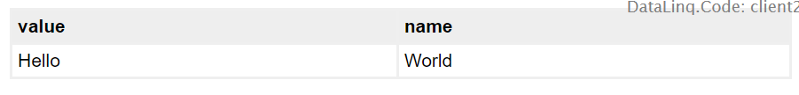

Hello World Beispiel
====================

In diesem Beispiel soll das Konzept eines DataLinq-Projektes anhand eines kleinen Beispiels 
erklärt werden. Für dieses Beispiel ist keine Verbindung zu einer Datenbank notwendig. Die "Daten"
werden als Text eingetragen.

Endpunkt erstellen
------------------

Im ersten Schritt muss ein Endpunkt erstellt werden. Ein Endpunkt ist, wie der Name schon sagt,
immer der Startpunkt einer Abfrage oder eines Reports. Der Endpunkt definiert, wo die Daten, 
die abgefragt werden, liegen (Datenbank, WebService, Text, ...).

Das Erstellen erfolgt über die *DataLinq.Code*-Oberfläche, indem der Name eines neues Einpunktes gewählt und
mit Enter bestätigt wird.

.. note::
   Für die Namen von Endpunkten sind nur bestimmte Zeichen zulässig: Kleinbuchstaben, Nummern und ``-``.
   Es sollten keine Sonderzeichen verwendet werden, weil der Name von Endpoints, Abfragen und Views später 
   ein Teil der *Aufruf Url* wird.

Nach dem Erstellen des Endpunktes erscheint dieser auf der obersten Ebene des Baumes. Ein Klick auf den
Endpunkt öffnet den *Eigenschaften Dialog*.

Für uns ist hier der *Connection Type* wichtig. Dieser gibt an, welche Art von Daten über den Endpunkt
angeboten werden. Da wir für *Hello World* keine Datenbank anbinden wollen, verwenden wir als Typ ``PlainText``:

.. note::
   `PlainText` bedeutet, dass Daten später in den Abfragen zeilenweise als Text eingetragen werden.
   Die Angabe eines *Connection Strings* entfällt für diesen *Connection Type*.

Abfrage erstellen
-----------------

Im nächsten Schritt muss eine Abfrage erstellt werden, die die Daten für unser Beispiel bereitstellt.
Dazu klappt man den noch leeren Knoten ``hello-world`` in der Baumansicht auf und gibt in das Eingabefeld 
`New Query/Data` einen gültigen Namen ein. Hier beispielsweise ``data``. Die Eingabe wird wieder mit Enter
bestätigt:

Klickt man in der Baumansicht auf den neu entstandenen Knoten ``data`` wird im *Content*-Bereich ein leeres 
Editorfenster angezeigt. Hier gibt man die eigentlich Abfrage ein, die die Daten liefern sollte
(Beim Endpoint Connection Type *Database* wäre das beispielsweise ein *SQL Select Statement*).

Bei Endpoints von Type ``PlainText`` kann hier jetzt ein beliebiger Text eingegeben werden, wobei jede Zeile 
(ausgeschlossen Leerzeilen) als Datensatz interpretiert wird. Geben wir hier beispielsweise ``Hello World`` 
ein:

Mit dem Button ``Simple Preview`` aus der Toolbar könnte man sich das Ergebnis dieser Abfrage anschauen. 
Allerdings wurden die Änderungen, die wir bisher am Endpoint und an der Abfrage vorgenommen haben noch nicht 
gespeichert (erkenntlich am roten Kreis im jeweiligen *Tab*). 
Zum Speichern der Änderungen muss zuerst auf den Button ``Save all Docs`` (oder ``Save Document`` für das aktuell sichtbare
Dokument) geklickt werden. Verschwinden die roten Kreise in den Tabs, kann das Ergebnis mit ``Simple Preview``
geöffnet werden.

Das Ergebnis sollte folgendermaßen aussehen:

.. note::
   Öffnet man den ``Preview`` einer Abfrage ist das Ergebnis immer ein *JSON* mit entsprechenden Daten.

Bei ``PlainText`` wird aus den Daten immer ein ``value`` / ``name`` Paar. Jede Zeile ist ein Datensatz.
Wird nicht genau angegeben, was ``value`` und was ``name`` ist, sind beide Werte identisch.

Um ``value`` und ``name`` anzugeben, erfolgt dies über einen ``:``. Alles vor dem ``:`` entspricht ``value``, alles dahinter
``name``. 

``PlainText`` eignet sich somit sehr gut, um einfache Auswahllisten zu erstellen.

Ändern wir die Abfrage in ``Hello:World`` und speichern die Abfrage, sollte das Ergebnis des Previews 
wie folgt aussehen:

View/Report erstellen
---------------------

Im letzten Schritt möchten wir die Daten als HTML-Tabelle zur Verfügung stellen. Dazu muss unter der
Abfrage in der Baumansicht unter ``New View...`` ein gültiger Name eingetragen und mit Enter bestätigt werden, 
zB ``table``:

.. image:: img/hello_world7.png

Klickt man auf den neu erstellten View, erscheint im *Content*-Bereich die *Razor*-Vorlage für den neuen 
View:

In der Vorlage wird per Default eine DataLinqHelper-Methode (``@DLH``) ``Table()`` eingefügt.
Die einfache Funktion stellt die Daten in einer einfachen Tabelle dar.

Öffnet man jetzt über eine der ``Preview`` Buttons diesen View, ist das Ergebnis unter *Hello World* 
Beispiel als HTML Tabelle:

