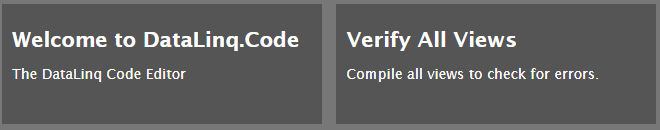
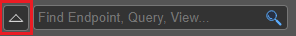
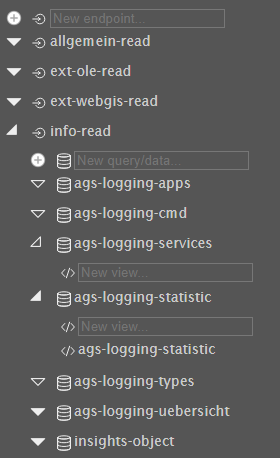
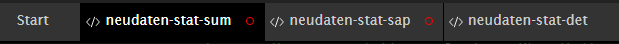
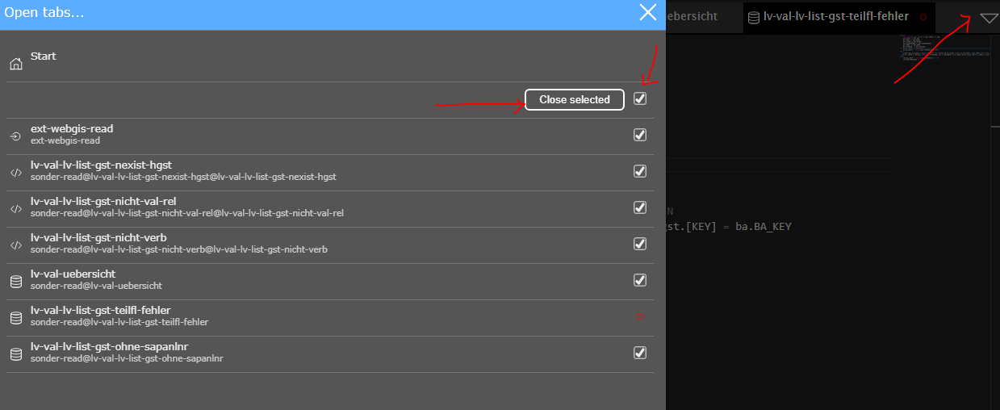
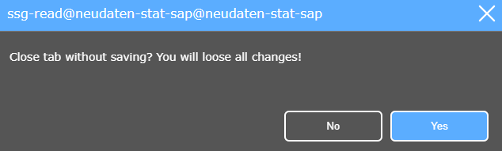
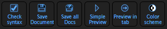
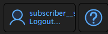
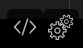

.. sectnum::
    :start: 3

DataLinq.Code Oberfläche
========================

.. image:: img/oberfl.png

Start
-----

Auf der Startseite von DataLinq.Code erscheinen folgende Felder.

Mit **Verify All Views** können alle Views verifiziert werden. Dabei wird auf Syntax und auch sicherheitsrelevante Keywords geachtet. Dies wird vor allem nach Updates empfohlen!

Sidebar
-------

Die Sidebar bietet über das Suchfeld die Möglichkeit nach Endpoints, Queries und Views zu suchen.

.. image:: img/oberfl_sidebar1.png

Mit dem "Pfeil nach oben" Button daneben lässt sich der aufgeklappte Baum wieder vollständig hochklappen.

Der folgende Screenshot zeigt ein Beispiel für einen aufgeklappten Baum.

An der Füllung der Dreiecke ist erkennbar ob sich noch Elemente darunter befinden, somit wird vor allem die Suche nach Views erleichtert. 

**neuen Endpoint/Query/View erstellen**

Wenn die entsprechende Ebene aufgeklappt ist, kann man einfach neue Endpoints, Queries/Data bzw. Views erstellen. Man gibt dafür den Namen ein und es öffnet sich anschließend der Code beziehungsweise die Einstellungen im Editorbereich.

**Endpoint/Query/View löschen**

Den Endpoint/Query/View öffnen und dann unter den Einstellungen unten mittels *delete* löschen. 

**Endpoint/Query/View Bezeichnung kopieren**

Fährt man mit der Maus über ein Element, erscheint rechts ein Copy-Symbol, durch welches die Bezeichnung in die Zwischenablage gelegt wird.

Tabs
----

Ein rotes Ringerl erscheint, sobald Änderungen im File vorgenommen wurden.

Wenn viele Tabs gleichzeitig geöffnet sind, kann über das Dreieck rechts ein Fenster geöffnet werden, welches ein übersichtlicheres Navigieren der geöffneten Files ermöglicht.

Damit können auch alle ausgewählten Files geschlossen werden, welche davor allerdings gespeichert werden müssen. 

Werden ungespeicherte Files geschlossen, wird der Vorgang abgefangen und muss extra bestätigt werden.

Toolbar
-------

Die Toolbar stellt folgende Buttons zur Verfügung:

*   **Check syntax:** Überprüft, ob Syntaxfehler im Code vorliegen
*   **Save Document:** Speichern des aktuellen Files (Strg+S)
*   **Save all Docs:** Speichern aller offenen Files (Strg+Shift+S)
*   **Simple Preview:** Im Pop-Up öffnen (F5)
*	**Preview in tab:** Im neuen Tab öffnen (Strg+F5)
*	**Color scheme:** Dark-Mode (de)aktivieren

.. note:: Vor dem Speichern wird ein Check durchgeführt, ob ein Fehler im View vorhanden ist. Gegebenenfalls werden die Fehlermeldungen im unteren Bereich des Editors angezeigt.

Toolbar rechts oben:

*	**Ausloggen**
*	**DataLinqHelper:** Beschreibung zu den DataLinqHelper-Funktionen 

Editor
------

Mit den beiden Buttons recht unten, lässt sich zwischen Code und Einstellungen umschalten. 

Genauere Beschreibungen zu den Einstellungen befinden sich im  Kapitel :ref:`Parametrierung<Anchor31>`.

