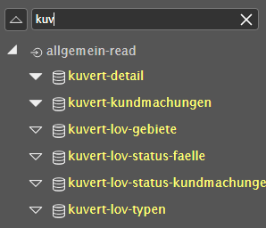

.. sectnum::
    :start: 3

DataLinq.Code Oberfläche
========================

.. image:: img/oberfl.png

Start
-----

Verify All Views

Sidebar
-------

.. image:: img/oberfl_sidebar2.png

suche
auf zu klappen; gefülltes dreieck was drinnen, sonst nicht 
neuer knoten: bei new endpoint
löschen: drauf klicken unten delete
copy auf seite um pfad kopieren

Tabs
----

wenn geändert: rotes ringerl im tab oben 

wenn viele tabs offen: dreieck rechts

alles zumachhen kommt vl noch

kommt vl noch dass abgefangen wird falls was ungespiechert geöffnet wirds

Toolbar
-------

Die Toolbar stellt folgende Buttons zur Verfügung:

.. image:: img/oberfl_toolbar1.png

*   **Verifizieren des aktuellen Views**
*   **Speichern des aktuellen Files**, falls ungespeichert (Strg+S)
*   **Speichern aller offnen Files**, falls ungespeichert (Strg+Shift+S)
*   **Im Pop-Up öffnen** (F5)
*	**Im neuen Tab öffnen** (Strg+F5)
*	**Dark-Mode (de)aktivieren**

.. note:: Vor dem Speichern wird ein Check durchgeführt, ob ein Fehler im View vorhanden ist. Gegebenenfalls werden die Fehlermeldungen im unteren Bereich angezeigt.

Toolbar rechts oben:

.. image:: img/oberfl_toolbar2.png

*	**Ausloggen**
*	**DataLinq Helper**

		suche in Help
		mit Bsp und Code kopieren

Content
-------

view: auf code, rechts unten auf eigenschaften wechseln

query: auf eigenschaften 

	soll man si herrichten dass man es auch testen kann

