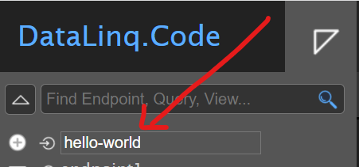
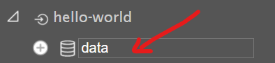
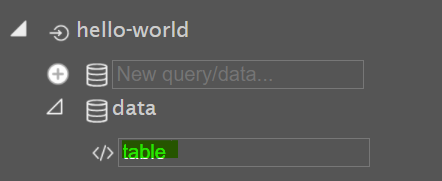
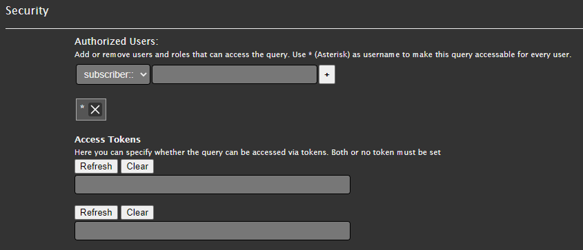

.. sectnum::
    :start: 4

.. _Anchor31 :

Parametrierung
==============

Der Navigationsbaum links bildet die Struktur der Endpoints, Queries und Views ab. Damit kann schnell ein Element ausgewählt und bearbeitet werden.

Endpunkte 
---------

Ein neuer Endpunkt kann seitlich an der Sidebar erstellt werden. Das oberste Element bietet die Möglichkeit, den Namen für den neuen Endpoint einzugeben und mit *Enter* zu bestätigen.

.. note::
   Für die Namen von Endpunkten sind nur bestimmte Zeichen zulässig: Kleinbuchstaben, Nummern und ``-``.
   Es sollten keine Sonderzeichen verwendet werden, weil der Name von Endpoints, Abfragen und Views später 
   ein Teil der *Aufruf Url* wird.

Ein Klick auf den Endpunkt öffnet den *Eigenschaften Dialog*, in welchem folgende EInstellungen getätigt werden können.

**General**

*   **EndPoint Id:** Eindeutiger Name des Endpoints, wird bei URL Aufruf verwendet

*   **EndPoint Name:** Bezeichnung des Endpunktes

*   **Description:** Optional, Beschreibung

**Connection**

*   Type

    *   **Database**: DB-Verbindung, bspw. 

        .. code-block::

            SQL:Server=db123.firma.at\instanz;Database=ssg;User Id=user1;Password=pwd1;

    *   **Api**: WebGIS API REST Schnittstelle, bspw. ``http://localhost/test_api5``
        Falls der Dienst berechtigt ist, können die Zugangsdaten eines berechtigten Subscribers mit 

        .. code-block::

            service=http://server123.at/api5test;user=username;pwd=12345
        
        angegeben werden.

    *   **GeoRss**: Ein GeoRss Dienst. Im *ConnectionString* kann der erste Teil der Connection
        angegeben werden. Das kann zB. der Server sein: ``https//some.georss.com``.
        Unter dem Endpunkt können mehrerer *Queries* angeben werden. Diese entsprechen bei GeoRss
        den Url Pfaden auf diesem Server: ``/services/rss``.

        .. note::
            Die beiden Url Teile aus Endpoint (ConnectionString) und Query werden beim Abholen
            des Dienstes einfach zusammengesetzt. Die beiden Teile müssen eine gültige Url ergeben.
            Eine Query muss daher beispielsweise mit einem ``/`` beginnen, um einen Pfad zu definieren. 

        Ist der Dienst über *Standard-Authentication* mit User und Passwort geschützt, kann der ConnectionString
        folgendermaßen angegeben werden:

        .. code-block::

            service=https//some.georss.com;user=username;pwd=12345

    *   **GeoJson**: Ein GeoJon Service. Die Vorgehensweise ist hier gleich wie bei **GeoRss** (siehe oben)

    *   **DataLinq**: Eine andere WebGIS DataLinq Anwendung. Der ConnectionString entspricht 
        der Url der DataLinq Applikation

    *   **PlainText**: PlainText bedeutet, dass Daten später in den Abfragen zeilenweise als Text 
    *   eingetragen werden. Die Angabe eines Connection Strings entfällt für diesen Connection Type.

    *   **TextFile**: Die Quelle sind lose Text Dateien. Das können einfache ``*.txt`` oder ``*.log`` Dateien 
        oder ``*.csv`` Dateien sein. Der ConnectionString ist bei diesem Typ das Verzeichnis, in dem 
        sich die Dateien befinden, zB. ``C:\logs``
  
**Security**

Setzen von autorisierten Usern / Rollen, siehe :ref:`Berechtigung<param_berechtigung>`.

**Info**

Unter *Info* wird das Erstelldatum des Endpoints angezeigt.

**Styling**

Mit Klick auf die Schaltfläche `Open EndPoint CSS...` kann das CSS-Dokument bearbeitet werden, auf dessen Stile von allen – in diesem Endpunkt vorhandenen – Views zugegriffen werden kann.

**Delete**

Mittels `Delete` kann der Endpoint gelöscht werden.

.. _Anchor32 :

Query (Abfragen) 
----------------

Nach der Auswahl eines Endpoints können für diesen Abfragen erstellt werden. Damit kann der Datenbestand des Endpoints (dort wird die Verbindung zum Datenbestand definiert) abgefragt werden. Je nach Verbindungstyp kann diese Abfrage unterschiedlich formuliert sein. Bei Abfragen auf Datenbanken wird dies in der Regel SQL-Code sein, bei Abfragen auf REST-Schnittstellen wird es eine URL sein.

Ähnlich wie zum Endpoint kann an der Sidebar unter dem dementsprechenden Endpoint eine neue Abfrage erstellt werden:

Klickt man in der Baumansicht auf den neu entstandenen Knoten der Abfrage, wird im Content Bereich ein 
leeres Editorfenster angezeigt.  Hier gibt man die eigentlich Abfrage ein, die die Daten liefern sollte 
(beim Endpoint Connection Type *Database* wäre das beispielsweise ein SQL Select Statement). 

Bei Endpoints von Type *PlainText* kann hier jetzt ein beliebiger Text eingegeben werden, wobei jede 
Zeile (ausgeschlossen Leerzeilen) als Datensatz interpretiert wird.

Bei Endpoints vom Type *Textfile* wird hier der Filename des Textfiles eingetragen.

Anschließend können folgende Einstellungen getätigt werden.

**General**

*   Query Id

    *   Eindeutiger Name der Abfrage, wird bei URL Aufruf verwendet

*   Name

    *   Bezeichnung des Abfrage

*   Description

    *   Optional, Beschreibung

**Statement (über Editor)**

*   Je nach Verbindungstyp kann diese Abfrage unterschiedlich formuliert sein

    *   Abfrage aus Datenbanken: SQL

    *   Abfrage aus REST-Schnittstellen: URL

*   Auch Parameter, bspw. zur Einschränkung der Ergebnisse, sind möglich

    *   SQL-Parameter: **@Parametername** 

        .. code-block:: SQL

            SELECT
                [OBJECTID], 
                [NAME]
            FROM projekt_gebaeude 
                WHERE gebaeudeid = @GebaeudeId

    *   WebGIS REST API, GeoRss, GeoJson: **{{Parametername}}** 
    
        .. code-block:: REST

            URL-PFAD/gebaeude?gebaeudeid={{GebaeudeId}}&…

        Bei der REST-Abfrage müssen die Parameter im CMS als Suchbegriff definiert sein.

*   Optionale Parameter werden nur eingefügt, wenn sie im Aufruf übergeben wurden. Sie können im Query-Statement mit ``#if PARAMETERNAME […] #endif`` definiert werden, der Inhalt zwischen diesen beiden Keywords wird dem Statement angehängt.

    *   SQL-Parameter: **@Parametername**

        .. code-block:: SQL

            SELECT
                [NAME],
                [FARBE]
                WHERE gebaeudeart = @GebaeudeArt
                #if dachfarbe
                    AND FARBE = @dachfarbe
                #endif

    *   REST: **{{Parametername}}** 

        .. code-block:: REST

            URL-PFAD/gebaeude?gebaeudeart={{GebaeudeArt}}
            #if dachfarbe
                    &farbe = @dachfarbe
            #endif

    *   Textfiles (bei Endpoint Typ **TextFile**).

        .. code-block::
            
            // filename
            my-log.csv

            // Optionale Parameter:

            // maximale Anzahl von Zeilen die gelesen werden
            maxlines=10
            // von wo wird gelesen: von oben (top) oder von unten (bottom)
            from=bottom

            // Textfilter, der auf die einzelnen Zeilen angewendet wird
            #if filter
                filter={{filter}}
            #endif

*   Test Parameter: Hier kann die Query mit Parametern getestet werden. Beim Ausführen der Abfrage wird die Abfrage-URL erstellt, siehe :ref:`Kapitel 5.1<Anchor41>`.

    .. image:: img/ad3_3.png
    
    .. note:: Bei Abfragen mit Parametern sollte man die Test Parameter so wählen, dass man die Abfrage jederzeit testen kann.

*   Domains: zum Übersetzen von Werten, siehe :ref:`Kapitel 6.7<Anchor57>`

**Security**

    *   Setzen von autorisierten Usern / Rollen, siehe :ref:`Berechtigungen<param_berechtigung>`

.. _Anchor33 :

Views (Ansichten)
-----------------

Zur Darstellung der Ergebnisse einer Abfrage können ein oder mehrere Ansichten erstellt werden.

Klickt man auf den neu erstellten View, erscheint im Content Bereich die Razor Vorlage für den neuen View, von welchem man über das *Zahnrad*-Symbol rechts unten zu den Einstellungen wechseln kann.

**General**

*	View Id

    *	Eindeutiger Name der Ansicht, wird bei URL Aufruf verwendet

*	Name

    *	Bezeichnung des Ansicht

*	Description

    *	Optional, Beschreibung

**Code (über Editor)**

    *	HTML mit ASP.NET Razor Markup

        .. image:: img/param_editor.png

.. _Anchor34 :

.. _param_berechtigung :

Berechtigung
------------

Für Endpunkte und Abfragen können hierarchisch Berechtigungen gesetzt werden. D.h. wer auf einen Endpunkt nicht zugreifen darf, darf auch nicht dessen Abfragen ausführen. Es können einzelne User oder auch Rollen berechtigt werden, Token- und Portalverbund sind ebenfalls möglich.

Dazu ist die Art (User, Rolle, etc.) zu wählen und der Name einzugeben und mit Klick auf das „+“-Symbol bzw. *Enter* zu bestätigen. Mit „*“ werden uneingeschränkte Berechtigungen gesetzt.

.. _Anchor35 :

Stile
-----

CSS-Stile können sowohl für einen Endpoint und alle darauf aufbauenden Views definiert werden (siehe :ref:`Kapitel 4.1<Anchor31>`) als auch innerhalb eines Views mit HTML ``<style>``-Tags bzw. als Inline ``style``-Attribut.
