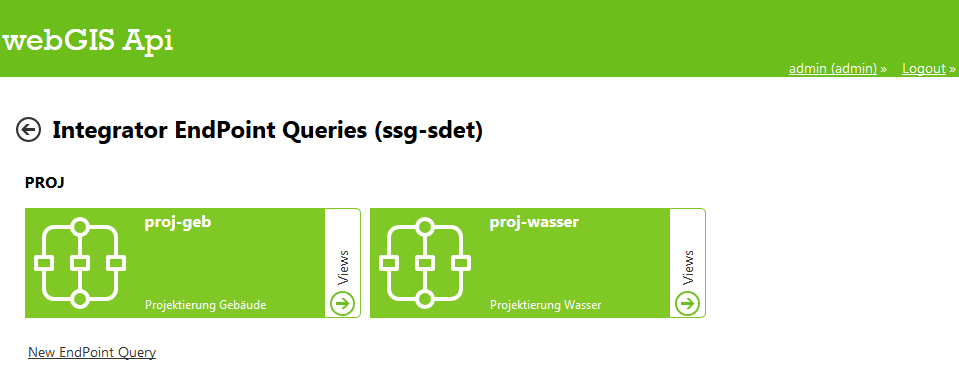

.. sectnum::
    :start: 4

Parametrierung
==============

.. _Anchor31 :

Endpunkte 
---------

Unter „DataLinq EndPoints“ kann ein neuer Endpunkt erstellt oder bestehende Endpunkte bearbeitet werden.

Mit Klick auf die Schaltfläche „Edit CSS“ kann ein CSS-Dokument erstellt werden, auf dessen Stile von allen – in diesem Endpunkt vorhandenen – Views zugegriffen werden kann (:ref:`Kapitel 3.5<Anchor35>`). Durch Klick auf „Queries“ können neue Abfragen für den jeweiligen Endpunkt erstellt werden (:ref:`Kapitel 3.2<Anchor32>`).

Mit Klick auf „Nav Tree“ wird links ein Navigationsbaum mit der Struktur der Endpoints, Query und Views angezeigt mithilfe dessen schnell ein Element ausgewählt und bearbeitet werden kann.

Über die Schaltfläche „New Endpoint“ kann in drei Schritten ein neuer Endpunkt erstellt werden:

*   General

    *   EndPoint Id

        * Eindeutiger Name des Endpoints, wird bei URL Aufruf verwendet

    *   EndPoint Name

        * Bezeichnung des Endpunktes

    *   Description

        * Optional, Beschreibung

* Connection

    *   Type

        *   Database: DB-Verbindung, bspw. 

            .. code-block::

                SQL:Server=db123.firma.at\instanz;Database=ssg;User Id=user1;Password=pwd1;

        *   Api: ArcGIS Rest Schnittstelle, bspw. http://localhost/test_api5

            *   Falls der Dienst berechtigt ist, können die Zugangsdaten eines berechtigten Subscribers mit 

                .. code-block::

                    service=http://server123.at/api5test;user=username;pwd=12345
            
                angegeben werden

        *   DataLinq: Eine andere WebGIS DataLinq Anwendung, bspw.

            .. code-block::

                ...

        *   Plugins, bspw. Wetterdienste, Twitter, etc.

*   Security

    *   Setzen von autorisierten Usern / Rollen, siehe :ref:`Kapitel 3.2<Anchor32>`

.. _Anchor32 :

Query (Abfragen) 
----------------

Nach der Auswahl einer Endpoints können für diesen Abfragen erstellt werden. Damit kann der Datenbestand des Endpoints (dort wird die Verbindung zum Datenbestand definiert) abgefragt werden. Je nach Verbindungstyp kann diese Abfrage unterschiedlich formuliert sein. Bei Abfragen auf Datenbanken wird dies in der Regel SQL-Code sein, bei Abfragen auf REST-Schnittstellen wird es eine URL sein.

Unter „New EndPoint Query“ wird eine neue Abfrage erstellt:

*   General

    *   Query Id

        *   Eindeutiger Name der Abfrage, wird bei URL Aufruf verwendet

    *   Query Name

        *   Bezeichnung des Abfrage

    *   Description

        *   Optional, Beschreibung

*   Statement (über Editor)

    *   Je nach Verbindungstyp kann diese Abfrage unterschiedlich formuliert sein

        *   Abfrage aus Datenbanken: SQL

        *   Abfrage aus REST-Schnittstellen: URL

    *   Auch Parameter, bspw. zur Einschränkung der Ergebnisse sind möglich

        *   SQL-Parameter: **@Parametername** 

            .. code-block:: SQL

                SELECT
                    [OBJECTID], 
                    [NAME]
                FROM projekt_gebaeude 
                    WHERE gebaeudeid = @GebaeudeId

        *   REST: **{{Parametername}}** 
        
            .. code-block:: REST

                URL/gebaeude?gebaeudeid={{GebaeudeId}}&…

            Bei der REST-Abfrage müssen die Parameter im CMS als Suchbegriff definiert sein.

    *   Optionale Parameter werden nur eingefügt, wenn sie im Aufruf übergeben wurden. Sie können im Query-Statement mit ``#if PARAMETERNAME […] #endif`` definiert werden, der Inhalt zwischen diesen beiden Keywords wird dem Statement angehängt.

        *   SQL-Parameter: **@Parametername**

            .. code-block:: SQL

                SELECT
                    [NAME],
                    [FARBE]
                    WHERE gebaeudeart = @GebaeudeArt
                    #if dachfarbe
                        AND FARBE = @dachfarbe
                    #endif

        *   REST: **{{Parametername}}** 
        
            .. code-block:: REST

                URL/gebaeude?gebaeudeart={{GebaeudeArt}}
                #if dachfarbe
                        &farbe = @dachfarbe
                #endif

    *   Test Parameter: hier kann die Query mit Parametern getestet werden. Bei Klick auf Test wird die Abfrage-URL erstellt, siehe :ref:`Kapitel 4.1<Anchor41>`.

        .. image:: img/ad3_3.jpg

*   Domains: zum Übersetzen von Werten, siehe :ref:`Kapitel 5.7<Anchor57>`

*	Security

    *   Setzen von autorisierten Usern / Rollen, siehe :ref:`Kapitel 3.2<Anchor32>`

.. _Anchor33 :

Views (Ansichten)
-----------------

Zur Darstellung der Ergebnisse einer Abfrage können ein oder mehrere Ansichten erstellt werden.

Unter „New EndPoint Query View“ wird eine neue Abfrage erstellt:

*	General

    *	View Id

        *	Eindeutiger Name der Ansicht, wird bei URL Aufruf verwendet

    *	View Name

        *	Bezeichnung des Ansicht

    *	Description

        *	Optional, Beschreibung

*	Code (über Editor)

        *	HTML mit ASP.NET Razor Markup

            .. image:: img/ad3_5.png
 
        *	Mit „Compile and Save“ wird der Code kompiliert und gespeichert, bzw. sonst eventuelle Fehlermeldungen ausgegeben.

        *	Im Editor ist unter „Help“ ein Link mit Beispielen zu DataLinqHelper-Funktionen (:ref:`Kapitel 5.2<Anchor52>`) finden

.. _Anchor34 :

Berechtigung
------------

Für Endpunkte und Abfragen können hierarchisch Berechtigungen gesetzt werden. D.h. wer auf einen Endpunkt nicht zugreifen darf, darf auch nicht dessen Abfragen ausführen. Es können einzelne User oder auch Rollen berechtigt werden, Token- und Portalverbund sind ebenfalls möglich.

Dazu ist die Art (User, Rolle, etc.) zu wählen und der Name einzugeben und mit Klick auf das „+“-Symbol bzw. Enter zu bestätigen. Mit „*“ werden uneingeschränkte Berechtigungen gesetzt.

.. _Anchor35 :

Stile
-----

CSS-Stile können sowohl für einen Endpoint und alle darauf aufbauenden Views definiert werden (siehe :ref:`Kapitel 3.1<Anchor31>`) als auch innerhalb eines Views mit HTML ``<style>``-Tags bzw. als Inline ``style``-Attribut.
