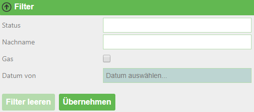
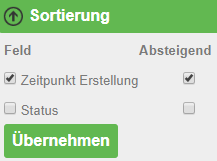
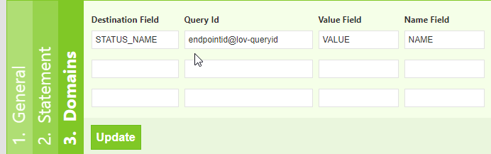

.. sectnum::
    :start: 6

Tipps und tricks für Views
==========================

.. _Anchor51 :

Zugriff auf Abfrageergebnisse
-----------------------------

Die Ergebnisse der Abfrage werden dem View als Model übergeben:

*	``Model.Success``

    *	*bool*

    *	war die Abfrage erfolgreich

*	``Model.CountRecords``

    *	*integer*
    
    *	Anzahl der zurückgegebenen Datensätze

*	``Model.ElapsedMillisconds``

    *	*integer* 
    
    *	Abfragedauer in Millisekunden

*	``Model.Records``

    *	*Dictionary<string,object>[]*

    *	Enthält die Datensätze des Ergebnisses

    *	**ACHTUNG:** da der Wert als Object-Typ gespeichert ist, sind **keine** direkten Vergleichsoperationen wie ``record[‘NAME‘] == ‘Franz‘`` möglich (Referenzvergleich). Hier muss über Equals verglichen werden, bspw. ``"Franz".Equals(record["NAME"])``

*	``Model.QueryString``

    *	*NameValueCollection*

    *	Enthält die Übergabeparameter des Aufrufes

    *	Zugriff bspw. über: ``Model.QueryString["Parametername"]``

Auf die Datensätze im Dictionary kann über Linq zugegriffen werden:

.. code-block::

    Model.Records.Where(r=>String.IsNullOrEmpty(Model.QueryString["x"]) || Model.QueryString["x"].Equals(r["x_field"])).OrderBy(r=>r["data_field")

.. _Anchor52 :

Hilfsfunktionen
---------------

Es gibt einige Hilfsfunktionen („DataLinqHelper“) mit denen zusätzliche Daten eingebunden oder etwa Formulare erzeugt werden können. Als Abkürzung kann statt „DataLinqHelper“ auch „DLH“ verwendet werden:

*	``DataLinqHelper.IncludeView(url)``

    *	Zeigt in einem View Daten aus einem anderen an

    *	Die URL ist ab der Endpunkt-Bezeichnung einzugeben:

        .. code-block ::
        
         	DataLinqHelper.IncludeView(“ssg-sdet@proj-geb@proj-geb-bestand?GebaeudeId =E313049“)

*	``DataLinqHelper.IncludeClickView(url,text)``

    *	siehe IncludeView, Inhalt wird erst bei Klick auf eine Schaltfläche geladen und angezeigt

    *	der Parameter ``text`` bezieht sich auf die Beschriftung der Schaltfläche

*	``DataLinqHelper.ResponsiveSwitcher()``

    *	Erzeugt eine Schaltfläche, die auf Klick alle HTML-Elemente mit der Klasse „responsive“ innerhalb der aktuellen Tabelle anzeigt bzw. wieder versteckt

*	``DataLinqHelper.IncludeCombo(id, url, valueField, nameField)``

    *	Erzeugt eine Dropdown-Liste mit den Ergebnissen einer Abfrage

    *	``id`` wird als HTML-Id-Attribut gesetzt

    *	``url`` zeigt auf die Abfrage, deren Ergebnisse aufgelistet werden sollen

        *	Bspw. ein Abfrage mit GroupBy

    *	``valueField`` befüllt den Options-Wert mit dem angegeben Feld aus den Ergebnissen

    *	``nameField`` befüllt den Options-Namen mit dem angegeben Feld aus den Ergebnissen

*	``DLH.UrlEncode(text)``

    *	Kodiert den Text für die Verwendung in einer URL

Diese und weitere Hilfsfunktionen sind in der Hilfe zu DataLinqHelper mit Beispielen angeführt. Der Link zur Hilfe ist im Razor Markup Code Editor bei der Erstellung von Views rechts oben zu finden.

In den Views kann auch JavaScript in ``<script>``-Tags definiert werden. jQuery ist bereits eingebunden.

.. _Anchor53 :

Beschränkung der Abfrageergebnisse - Query
------------------------------------------

Um die Serverlast und v.a. die Ladezeit beim Seitenaufbau am Client gering zu halten, ist es sinnvoll, die maximale Anzahl der Abfrageergebnisse und Felder zu beschränken:

*   bei API-Endpoints auf die WebGIS-Api ist diese Anzahl mit 1000 Datensätzen festgelegt, hier werden alle Spalten zurückgegeben, die im CMS definiert sind. 

*   DB-Abfragen können im SQL-Statement beschränkt werden, bspw.

    ====================================    ========================
    SELECT TOP 200	 * … 				    bei MSSQL
    SELECT * … LIMIT 200 				    bei MySQL, PostgreSQL
    SELECT * ... WHERE ROWNUM <= 200 		bei Oracle  
    ====================================    ========================
    

Idealerweise sollten die Ergebnisse durch eine Filterung mit (optionalen) Parametern (siehe :ref:`Kapitel 3.2<Anchor32>`) soweit wie möglich eingeschränkt werden um den AnwenderInnen eine schnellere Auswahl zu ermöglichen und nicht hunderte Zeilen durchsuchen zu müssen.

.. _Anchor54 :

Beschränkung / Filtern der Abfrageergebnisse
--------------------------------------------

Mithilfe von (optionalen) Parameter in den Queries lassen sich Abfrageergebnisse einschränken. In Views kann mit dem ``DataLinqHelper.FilterView`` ein Filter eingebaut werden, der eine einfache und übersichtliche Eingabe / Auswahl dieser Filterparameter ermöglicht. Im Hintergrund werden die Übergabeparameter einfach an die Aufruf-URL (siehe :ref:`Kapitel 4<Anchor4>`) angehängt. Werden bereits beim Aufruf der View über die URL Filter- bzw. Sortierungsparameter definiert, so sind diese in der GUI bereits ausgefüllt bzw. gesetzt.

.. code-block ::

    @DLH.FilterView( 
        "Filter", 
        new Dictionary<string, object>(){
            {"STATUS", new { displayname="Status", source="endpoint@lov-status", valueField="VALUE", nameField="NAME", prependEmpty=true, multiple="multiple"} }, 
            {"NACHNAME", new { displayname="Nachname" } }, 
            {"GAS", new { displayname="Nur Gas betroffen", dataType=DataType.Checkbox } }, 
            {"ERSTELLD_FROM", new { displayname="Datum von", dataType=DataType.Date } }, 
        }
    ) 

Ein Filterfeld kann als Auswahlliste definiert werden, dessen Werte aus einer anderen DataLinq-Query kommen, siehe Feld ``STATUS``. Bei Bedarf können auch mehrere Listenwerte mit ``;`` getrennt übergeben werden (``multiple=“multiple“``). Im SQL-Statement muss diese Aneinanderreihung wieder aufgesplittet werden. Bei einer REST-API Abfrage muss im CMS die Abfrage-Methode des Suchfeldes als „In“ definiert werden. 

Falls alle Filterfelder optional sind (also auch ohne eine einzige Einschränkung gesucht werden kann), kann man bei SQL-Statements eine allgemein gültige WHERE-Bedingung definieren und alle anderen optionalen Bedingungen mit „AND …“ anhängen. 

**REST-API**

.. code-block :: REST

    dienst@cms/queries/abfrage? 

    #if STATUS 
        &status_in={{STATUS}} 
    #endif 
    #if NACHNAME 
        &nachname={{NACHNAME}} 
    #endif 
    #if ERSTELLD_FROM 
        &date_from={{ERSTELLD_FROM}} 
    #endif 
    #if GAS 
        &gas_betroffen=Ja* 
    #endif 
    #if _orderby 
        &_orderby={{_orderby}} 
    #endif 

**SQL**

.. code-block :: SQL

    SELECT TOP(200) 
        status, 
        erstellt, 
        ...
    FROM tabelle 
    WHERE 0 = 0 

    #if STATUS 
        and status IN (SELECT value FROM STRING_SPLIT(@STATUS, ';')) 
    #endif 

    #if NACHNAME 
        and nachname = @NACHNAME 
    #endif 

    #if GAS 
        and gasanschluss = true 
    #endif 
    #if ERSTELLD_FROM 
        and erstellt >= CONVERT (date, @ERSTELLD_FROM, 104) 
    #endif 
    #if _orderby 
        ORDER BY @_orderby 
    #endif 

In der View wird der Filter gerendert:

.. _Anchor55 :

Sortieren der Abfrageergebnisse
-------------------------------

Neben der Filterung steht mit DataLinqHelper.SortView ein weiterer Baustein zur Verfügung, mit dem die Datensätze im View per GUI sortiert werden können. Die Sortier-Felder werden wie die Filterparameter im Hintergrund an der Aufruf-URL mit ``_orderby=…`` angehängt. Absteigende Sortierungen werden mit einem Minus („-“) vor dem Spaltennamen übergeben.

.. code-block ::

    @DLH.SortView( 
        "Sortierung", 
        new Dictionary<string, object>(){ 
            {"ERSTELLD", new { displayname="Zeitpunkt Erstellung" }}, 
            {"STATUS", new { displayname="Status" }}, 
        }
    ) 

In der Query müssen diese Felder entgegengenommen werden, siehe Statements in :ref:`Kapitel 5.4<Anchor54>` In der View wird das Sortierwerkzeug gerendert:

.. _Anchor56 :

Aktualisierung - Aufteilen von statischen und dynamischen Inhalten
------------------------------------------------------------------

Bei der (periodischen) Aktualisierung von Views werden alle Inhalte neu geladen. Falls in den Views CSS-Styles oder JavaScript vorkommt, wird dieses ebenfalls wieder dazu geladen und kann (v.a. bei JavaScript-Triggern) die Seite auf Dauer langsam machen (bis wieder eine „harte“ Aktualisierung mit F5, oder ein neuer Aufruf über die URL erfolgt).

Ein Beispiel für View-Inhalte die häufig am selben Client aktualisiert werden könnten Hydrographie-Daten – als eine Art Dashboard, das je Minute aktualisiert wird – sein. In der „einfachen“ Form besteht diese Seite aus den tabellarischen Daten (HTML), Karte (JavaScript), CSS-Styles und JavaScript zum Anzeige der Diagramme – alles in einer einzigen View. Wenn dieser View über den ``DLH.RefreshViewTicker`` alle 60 Sekunden neu geladen wird, kommt jedes Mal JavaScript und CSS dazu – obwohl sich nur die tabellarischen Daten (HTML) ändern.

Hier macht es Sinn, den statischen, immer gleich bleibenden Code (JavaScript, CSS) vom dynamischen Teil (HTML) zu trennen und nur diesen neu zu laden. Immer wenn ein View neu geladen wurde, wird das Event „onpageloaded“ gefeuert. Auf dieses Ereignis kann im statischen Teil wird reagiert und bspw. Klick-Listener gesetzt werden:

.. code-block:: html

    <script> 
        webgis_datalinq.events.on('onpageloaded, function(channel, sender, args){ 
            $(".TABDET.clickable tbody tr.extended-click").on("click", function() { 
                var id = $(this).attr("stoer_id"); 
                ... 

.. _Anchor57 :

Queries mit Domain-Übersetzung
------------------------------

Wer kennt es nicht: In einer Tabelle wird ein Attribut eines Objektes mit einem Wert kodiert, bspw. 0 für 0 „Wald“, 1 für „Wiese“ und 2 für „verbautes Gebiet“. In einer Tabellenansicht möchte man diese Werte nun mit den richtigen Namen übersetzen um es den NutzerInnen verständlicher zu machen. Natürlich könnte man im Code des Views eine Unterscheidung bauen. Kling kompliziert? Ist es ja auch! Wir haben eine viel einfachere Lösung für Sie: Query-Domains! 

Im „Destination Field“ wird die Spaltenbezeichnung (kann auch ein Alias sein) jenes Feldes angegeben, das die kodierten Werte enthält. Unter „Query Id“ wird eine Lookup-Tabelle angegeben, die einerseits die kodierten Werte enthält und andererseits die Übersetzung. „Value-“ bzw. „Name Field“ geben die Spaltennamen dieser Lookup-Tabelle an. Wird im View des ursprünglichen Query auf das Feld (in der Grafik „STATUS_NAME“) zugegriffen, so wird nicht der kodierte Werte (bspw. 1) sondern die Übersetzung („Wiese“) ausgegeben. Tja, mit Query-Domains kann das Leben so einfach sein! Starten Sie jetzt.

