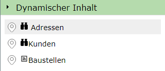
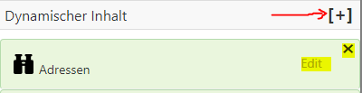
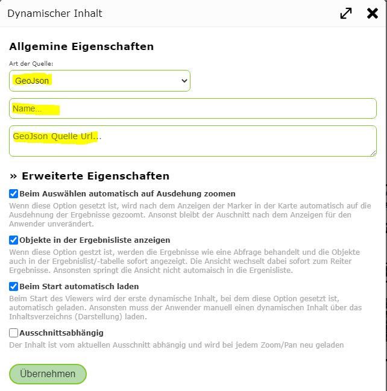
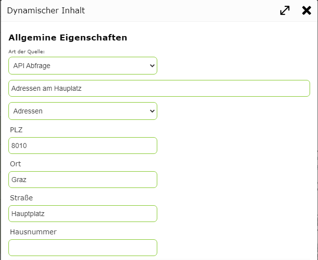

Dynamischer Inhalt
==================

Neben Kartenkacheln und Kartendiensten können auch sogenannte *dynamische Inhalte* in eine Karte eingebunden werden.
*Dynamische Inhalte* werden in der als Marker Punkte dargestellt, die der Anwender anklicken kann um nähere Informationen zum gewählten Ort zu erhalten.

Für *dynamische Inhalte* sind folgende Quellen möglich:

* **GeoJSON**: Ein GeoJSON mit Punkten, der über das Internet abrufbar ist.
* **GeoRSS**: Ein GeoRSS Feed Punkten, der über das Internet abrufbar ist.
* **API Abfrage**: Eine Abfrage auf einen Kartendienst, der von der WebGIS API bereitgestellt wird.

Für den Anwender erscheinen *dynamische Inhalte* im Darstellungsvarianten TOC in einem eigenen *Container*:

Klickt der Anwender auf einen der Angeboten Inhalte, werden die Ergebnisse als Marker in der Karte dargestellt.

.. note::
   In einer Karte kann immer nur ein dynamische Inhalte gleichzeitig angezeigt werden. Die Anzeige entspricht einer Suche/Abfrage.
   Wählt der Anwender einen anderen *dynamischen Inhalt* aus oder Frage eine bestimmte Thema ab, wird er aktuelle *dynamische Inhalt* ausgeblendet.

Dynamische Inhalt hinzufügen
----------------------------

Ein *dynamischer Inhalt* wird in im *MapBuilder* über die *Sidebar* über den entsprechendend *Container* erstellt:

Ein bereits erstellter *dynamischer Inhalt* kann über den ``Edit`` Text bearbeitet bzw über den ``x`` Button gelöscht werden. Damit ein *dynamischer Inhalt* in der Karte eingebunden wird,
muss er in der Liste der *dynamischen Inhalte* ausgewählt erscheinen.

Der Dialog für das Erstellen oder Bearbeiten eines *dynamischen Inhalts* erscheint in etwas folgendermaßen:

Unter ``Allgemeine Eigenschaften`` muss zuerst der Typ des Dienstes gewählt werden (z.B. ``GeoJSON``). Außerdem muss Name vergeben werden, unter dem der Dienst im Kartenviewer im Container ``Dynamische Inhalte`` angezeigt wird.
Ist der Typ ``GeoJSON`` oder ``GeoRSS`` muss hier ebenfalls die Url angegeben, von der der Inhalt abgeholt werden soll.

Wählt man als Typ ``API Abfrage`` muss keine Url angegeben werden, sondern eine bestehende Abfrage eines Dienstes gewählt werden. 
Um die Objekte einzuschränken, kann diese optional über die angebotenen Suchbegriffe der Abfrage erfolgen (zB nur Adressen einer bestimmten Straße):

Unter ``Erweiterte Eigenschaften`` kann definiert werden, welche Aktion zusätzlich beim Laden des Dienstes ausgeführt werden soll bzw. ob der Inhalt automatisch beim Aufruf der Karte aktiv ist.
So ist für manche Inhalte sinnvoll, wenn nach der Auswahl automatisch auf an die Position er Ergebnisse *gezoomt* wird.

Eine Besonderheit ist der Punkt ``Ausschnittsabhängig``. Wird dieser Punkt für einen *dynamischen Inhalt* ausgewählt wird die Daten immer neu geladen, wenn der Anwender ein Ausschnitt in der Karte (Pan, Zoom)
ändert. Das ist für Inhalt mit sehr vielen Ergebnissen sinnvoll. Der Anwender erhält immer nur die im aktuellen Ausschnitt relevanten Daten.
Voraussetzung ist hier, dass die angeführte Quelle die Übergage eines aktuellen Ausschnitts über den ``bbox`` parameter unterstützt. Beim Typ ``API Abfrage`` wird das automatisch bereitgestellt. Bei anderen Typen
hängt es vom dahinterliegenden Dienst ab. Unterstützt ein Dienst diese Möglichkeiten nicht, sollte diese Option nicht gewählt werden, weil der komplette Inhalt dann beim jedem Zoom geladen wird.

.. note::
   Werden im WebGIS CMS Abfragen parametriert, bestimmen auch einige der dort eingestellten Eingenschaften das verhalten der *dynamischen Dienste* (bei Typ ``API Abfrage``).
   Werdem im WebGIS CMS unter den ``Erweiterten Eigenschaften`` einer Abfrage die Option ``Layer Zoomgrenzen anwenden`` gewählt, würde auch ein *dynamischer Inhalt* nur angezeigt werden,
   wenn sich die Karte innerhalb der Maßstabsgrenzen des zugrundeliegenden Layers befindet.

Mit ``Übernehmen`` wird der neue *dynamische Inhalt* für die Karte erstellt bzw. die Änderungen übernommen.
