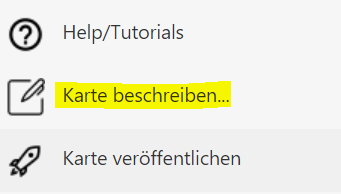
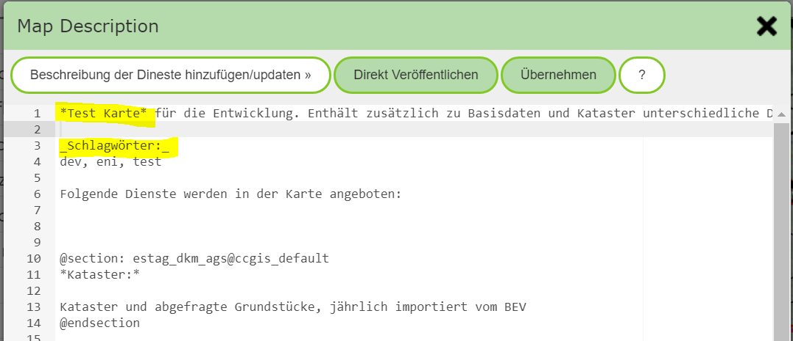

Beschreibung von Karten
=======================

In diesem Abschnitt wird gezeigt, wie Karten für den Anwender beschrieben werden können.

Die Beschreibung der Karte wird angezeigt, wenn der Anwender in der Karte auf das (c)-Symbol (links unten) oder auf `Karteninfo & Copyright` im *Burger Menü* (Rechts oben) klickt.
In diesem Bereich werden auch die Beschreibungen der einzelnen Dienste inklusive Copyright Informationen angezeigt.

Die Beschreibung kann im MapBuilder über den *Sidebar Button* `Karte beschreiben` erstellt bzw. bearbeitet werden:

Damit öffnete sich ein Dialog zum Erstellen/Bearbeiten der Karten-Beschreibung:

Im Text können einfache *Markup*-Befehle gemacht werden, um in der Beschreibung später **fett** (Text innerhalb von Sternchen) oder *kursiv* (Text innerhalb von Underscores) darzustellen.

.. note::
   Karten können auf der Portalseite auch über eine Suchfeld gesucht werden. Dazu wird nicht nur der Titel der Karte herangezogen, sondern es wird dabei eine Volltextsuche über die hier erstellte Beschreibung durchgeführt.
   Darum empfiehlt es sich, wie hier im Beispiel markiert, einige Schlagwörter anzuführen, die über die Karte vom Anwender gefunden werden können.

Der Dialog bietet noch folgende Werkzeuge:

* **Beschreibung der Dienste hinzufügen/updaten:** Wie schon erwähnt, erfolgt die Suche nach Karten über die Portalseite durch eine Volltextsuche. Möchte man dafür auch die Beschreibung der einzelnen Dienste verwenden, 
  erfolgt das Hinzufügen über diesen Button. Die Dienste werden dazu in `@sections` eingefügt. Dadurch kann der Text zu einem späteren Zeitpunkt hier wieder upgedatet werden. Die Texte innerhalb der `@sections` sollten nicht geändert werden,
  da diese beim nächsten Update verloren gehen würde. Mit `@section` wird die automatisch generierte Beschreibung markiert.

.. note:: 
   Das Hinzufügen der Dienste-Beschreibungen sollte nur dort erfolgen, wo es auch sinnvoll ist. Macht man das für jede Karte, liefert die Volltextsuche für Karten später zu viele Ergebnisse. Ist beispielsweise der Katasterdienst in jeder
   Karte vorhanden, liefert eine Suche nach Kataster dann auch alle Karten. 
   Eine gute Praxis ist es, der eigentlichen Beschreibung sinnvolle Schlagwörter hinzufügen, über die die Karte gefunden werden kann.

* **Direkt Veröffentlichen**: Diese Button wird nur angeboten, wenn der MapBuilder mit einer bestehenden Karte geöffnet wurde. Für diese Karte kann die Beschreibung hier geändert und direkt veröffentlicht werden.
  Damit erspart man sich den Zwischenschritt des einfachen Übernehmens und das Veröffentlichen der gesamten Karte danach. Diese Option ist zu empfehlen, wenn für eine Karte nur die Beschreibung bearbeitet werden soll. 
  Die Karte muss danach nicht mehr extra veröffentlicht werden.  

* **Übernehmen**: Die vorgenommen Änderung an der Beschreibung werden übernommen. Damit wird die Beschreibung noch nicht automatisch veröffentlicht. Die Veröffentlichung erfolgt erst, wenn auch die Karte veröffentlicht wird.
