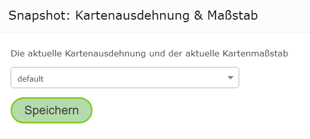

Snapshots
=========

Im MapBuilder kann innerhalb der *Vorschaukarte* der gezoomt oder die aktuelle Layer/Themensichtbarkeit geändert werden.
Beim Veröffentlichen einer Karte werden diese Einstellungen übernommen. Ruft ein Anwender eine veröffentlichte Karte
auf, wird die Karte mit der letzten Einstellung angezeigt.

Aus diesem Grund muss vor dem Veröffentlichen immer wieder auf die gewünschten Einstellungen gewechselt werden.
Das es beim Erstellen von Karten immer wieder notwendig sein kann, die Ansicht im MapBuilder zu ändern (z.B. um die Kartendienste zu testen),
kann es sehr aufwendig sein, die Starteinstelllungen für die Karte wieder herzustellen.

Um diesem Vorgang zu vereinfachen, können *Snapshots* verwendet werden.
*Snapshots* speichen bestimmte Eigenschaften der Karte. Beim Öffnen der Karte, werden die gespeicherten *Snapshot* Eigenschaften geladen
und nicht mir beim Veröffentlichen angezeigten Eigenschaften.

Folgende Eigenschaften können innerhalb eines *Snapshots* gespeichert werden.

* Kartenausschnitt und Maßstab
* Aktuelle Themen/Layer Sichtbarkeit
* Die im Darstellungsvarianten TOC aufgeklappten Container und Gruppen.
  Diese Eigenschaft kann sogar ausschließlich über einen *Snapshot* gespeichert werden.

Die Verwaltung der *Snapshots* für eine Karte findet man im *MapBuilder* an unterschiedlichen Stellen:

Kartenausschnitt und Maßstab
----------------------------

In der linken unteren Ecke in der Karte befindet sich ein *Snapshot* Symbol. Mit einem Klick darauf 
öffnet sich folgender Dialog:

Hier kann ein *Snapshot* ausgewählt werden. 

.. note::
   In der Regel sollte man immer ``default`` verwendet werden. Alternative Snapshots machen nur Sinn,
   für Testzwecke zwischen unterschiedlichen Ansichten gesprungen werden sollte.

Klickt man auf ``Speichern`` wird der aktuelle Kartenmaßstab und der Ausschnitt in den Snapshot übernommen.

Themen/Layer-Sichtbarkeit und Container
---------------------------------------

Verwendet man den Darstellungsvarianten TOC befindet sich in der Überschrift beim ``Darstellung`` ebenfalls ein *Snapshot*
Symbol. Ein Klick öffnet folgenden Dialog:

   
Hier sollte wieder ``default`` ausgewählt werden. Gespeichert wird hier die aktuelle Sichtbarkeit der Themen/Layer.
Außerdem wird gespeichert welche Gruppen und Container im Darstellungsvarianten TOC aufgeklappt sind.

.. note::
   Öffnet ein Anwender eine Karte wird standardmäßig immer der erste Darstellungsvarianten Container (meistens Hintergrund)
   aufgeklappt dargestellt. Möchte man einen anderen Container beim Start aufgeklappt sehen, erfolgt dies über den hier gezeigten Weg
   mit *Snapshots*

Snapshots verwalten
-------------------

In der *Sidebar* befindet sich ebenfalls ein *Snapshot* Symbol mit dem Text ``Auf Snapshot zurücksetzen``. Klickt man auf diesen 
Button öffnet sich folgender Dialog:

Hier können die einzelen *Snapshots* verwaltet werden. Hier ist auch ersichtlich, welche Eigenschaften im *Snapshot* gespeichert sind.
Möchte man beispielsweise nicht, dass die aufgeklappten Themengruppen gespeichert werden sollten können diese mit dem Button ``Unset (remove)``
entfernt werden. Die Darstellung der Eigenschaften ändert sich dann beispielsweise zu:

Klickt man auf den Button ``Snapshot auswählen`` werden die Eigenschaften in der aktuellen Kartenvorschau übernommen.
Der hier ausgewählte *Snapshot* wird auch später in der veröffentlichte Karte verwendet.

.. note::
   Möchte man für eine Karte keinen *Snapshot* verwendet, löschte man für in diesem Dialog mit ``Unset (remove)`` alle Eigenschaften.

   