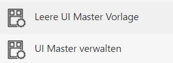
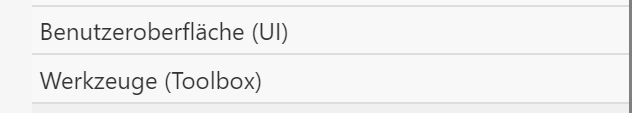
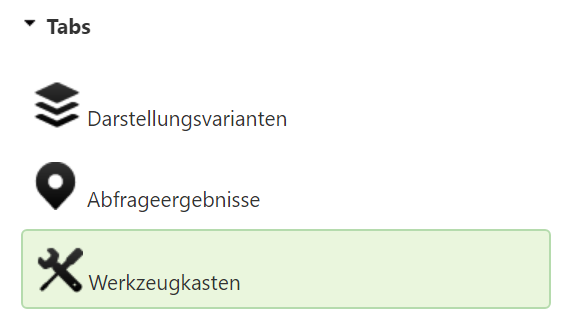
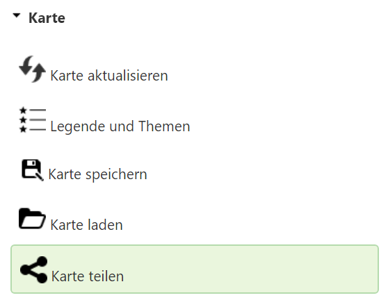
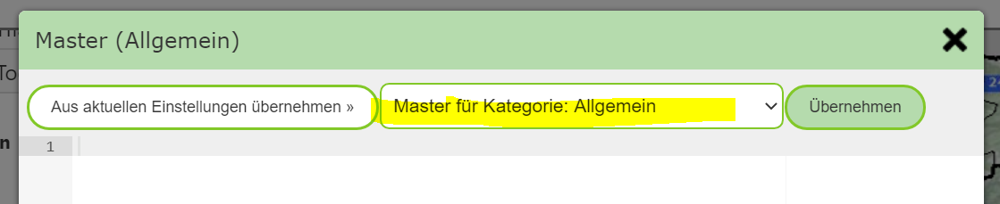
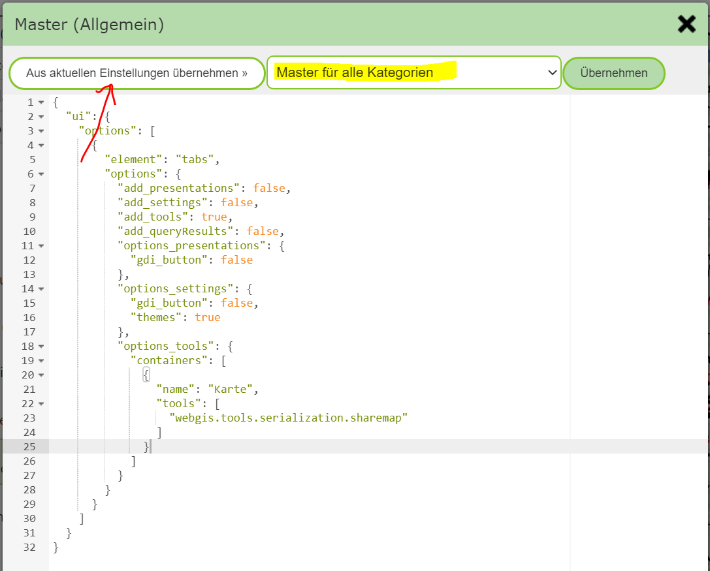
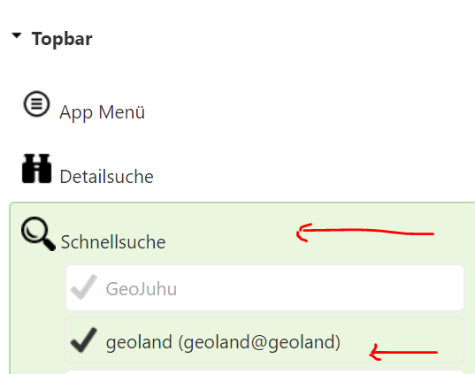
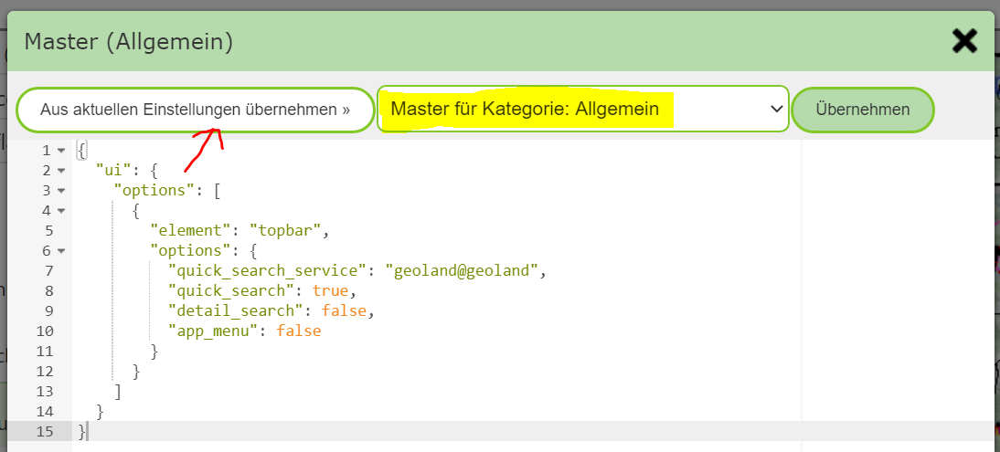

UI Master Vorlagen im MapBuilder erstellen
==========================================

Die praktische Vorgehensweise zum Erstellen von *UI Master vorlagen* erfolgt mit dem MapBuilder.

Als erstes muss eine bestehende Karte mit dem MapBuilder geöffnet werden. In der *Sidebar* des 
MapBuilders stehen folgende Werkzeuge für *UI Master Vorlagen* zu Verfügung:

.. note::
   Diese Werkzeuge sind nur sichtbar, wenn der *MapBuilder* mit einer bestehenden Karte aufgerufen wird.
   Da sich *UI Master Vorlagen* auch auf eine Kartenkategorie beziehen, muss diese dem MapBuilder über den
   Url-Parameter ``categorie`` übergeben werden. Das erfolgt automatisch, wenn mit einer bestehenden Karte
   begonnen wird.

Da man in der Regel nur wenige Elemente definiert, die für alle Karten verwendet werden, müssen alle nicht
notwendigen Element in dieser Karte weggeklickt werden.
Elemente, die von *UI Master Vorlagen* betroffen sein können, befinden sich in den beiden Gruppen:

Zur Vereinfachung dieses Schrittes kann das oben schon angeführte Werkzeug ``Leere UI Master Vorlage`` verwendet werden.
Das Werkzeug öffnet einen Hinweis, dass alle UI-Elemente aus der Karte entfernt werden. Dies wirkt sich nicht auf die
bereits veröffentlichte Karte aus, solange sie nicht nach diesem Schritt noch einmal veröffentlicht wird.

Bestätigt man den Dialog mit ``UI Element entfernen``, werden alle Elemente aus den beiden oben angeführten 
Gruppen gelöscht (UI, Werkzeuge).

.. note::
   Alle weiteren Elemente aus den anderen Gruppen können/sollten erhalten bleiben und haben keinen Einfluss auf
   das Ergebnis. Um später Vorlagen erzeugen zu können, muss aber mindestens eine Kartenausdehnung und ein Kartendienst 
   ausgewählt werden. Welcher nicht relevant ist, weil Kartendienste nicht in die Vorlagen mit einfließen.

Nun kann man beispielsweise das Werkzeug *Karte teilen* für alle Karten bereitstellen.
Bei Werkzeugen ist dabei wichtig, dass zuerst unter ``Benutzeroberfläche (UI)`` der *Tab* ``Werkzeugkasten`` aktiviert
wird. Ohne Werkzeugkasten werden in der Vorlage später die Werkzeuge nicht angezeigt:

Danach ist unter ``Werkzeuge (Toolbox)`` das entsprechende Werkzeug auszuwählen: 

Auch in der Kartenvorschau sollte jetzt wieder der Werkzeugkasten mit genau diesem einen Werkzeug ersichtlich werden.

Ist die Kartenvorschau fertig aufgebaut, kann in der *Sidebar* auf das Werkzeug ``UI Master Verwalten`` geklickt werden.
Damit öffnet sich ein Editor, in dem die *UI Vorlagen* für die aktuelle Kartenkategorie bzw. die gesamte Portalseite 
verwaltet werden können:

Über die Auswahlliste wird festgelegt, worauf sich die angezeigt Vorlage bezieht:

* Master für Kategorie: [aktuelle Kategorie]
* Master für alle Kategorien

Beide Vorlagen sind nach dem ersten Aufruf leer. Da wir das *Karten teilen* in allen Karten der Portalseite hinzufügen
möchten, wechseln wir zu ``Master für alle Kategorien``.
Um die Vorlage aus den aktuellen Einstellungen im MapBuilder zu übernehmen, muss auf ``aus aktuellen Einstellungen übernehmen``
geklickt werden:

Mit dem Button ``Übernehmen`` wird die aktuelle Vorlage gespeichert.

.. note::
   Um Fehler zu vermeiden, wird beim Speichern noch geprüft, ob es sich bei der Vorlage um ein gültiges JSON Objekt handelt.

.. note::
   Eine Vorlage kann später wieder gelöscht oder verändert werden. Zum Löschen ist der gesamte Text zu entfernen und 
   auf ``Übernehmen`` zu klicken.

Möchte man beispielsweise auch noch das App-Menü für alle Karte hinzufügen, ist dieses unter ``Benutzeroberfläche (UI)`` auszuwählen
und die obigen Schritte zu wiederholen.

Nun möchten wir für alle Karten in der aktuellen Kartenkategorie einen Schnellsuche-Dienst hinzufügen.

Dazu beginnen wir noch einmal mit dem Werkzeuge ``Leere Master UI Vorlage`` und wählen dann unter 
``Benutzeroberfläche (UI)`` die Schnellsuche und den entsprechenden Dienst:

Die Schnellsuche sollte auch hier zuerst in der Kartenvorschau wieder erscheinen.
Im Anschluss Werkzeug ``UI Master verwalten`` öffnen und die aktuellen Einstellungen für die Kartenkategorie übernehmen:

.. note::
   Nachdem die *UI Master Vorlagen* erstellt wurden, den MapBuilder wieder verlassen
   Die aktuelle Karte nicht veröffentlicht, da sonst alle ursprünglich eingestellen UI-Element aus der Karte
   verschwinden würden.