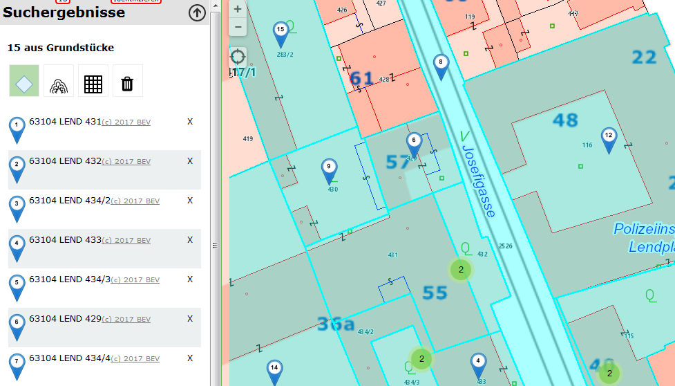
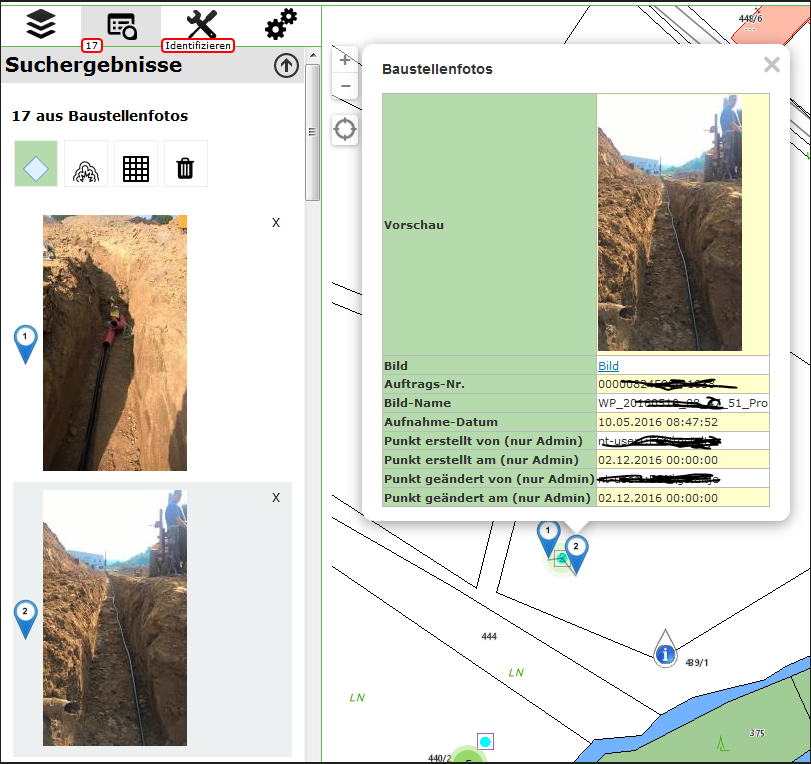

Benutzerdefinierte Marker
=========================

Findet der Anwender im Kartenviewer Ergebnisse, werden diese standardmäßig mit einem blauen Marker markiert. Mit einem Klick auf den Marker werden dann die Attribute dieses Objektes angezeigt. 
In gewissen Fällen ist es jedoch wünschenswert, ein anderes Symbol für den Marker zu verwenden. Wie das bewerkstelligt wird, soll diese Beschreibung zeigen.

Allgemeine Vorgehensweise
-------------------------

Die Art, wie Marker dargestellt werden, erfolgt in den Javascripts der API innerhalb des *webgis-Objekts* über ein Array mit dem Namen ``markerIcons``. 
Die Keys für dieses Array entsprechen Konstanten, die beim Entwickeln vergeben wurden. So ist beispielsweise der rote Marker für die aktuelle Position wie folgt definiert worden:

.. code-block :: Javascript

    this.markerIcons["currentpos_red"] = {
        url: function () { 
            return webgis.css.imgResource('position_red.png', 'markers') 
        },
        size: [38, 38], 
        anchor: [19, 19], 
        popupAnchor: [0, -20]
    }; 

Jedes Objekt, das einen Marker beschreibt, hat folgende Eigenschaften:

*   ``url``

    Eine Funktion, die die Url des Marker-Bildes zurückgibt. Hier wird noch mit der Funktion ``webgis.css.imgResource()`` gearbeitet. Diese kann verwendet werden, wenn die Marker im api5/content/api/img Verzeichnis liegen. 
    Der erste Parameter gibt den Namen der Datei an, der zweite den Unterordner.
    Wenn sich ein Marker Icon nicht in diesem Verzeichnis befindet, kann hier auch eine absolute Url angegeben werden: http://.....

*   ``size``:
    Die Größe des Marker-Bildes in Pixel.

*   ``anchor``:
    Die Bildkoordinaten des Einfügepunktes des Markers (von links, oben) in Pixel.

*   ``popupAnchor``:
    Der Einfügepunkt der Info-Blase relative zum Einfügepunkt des Markers in Pixel. 

Die Marker für die Abfrageergebnisse sind folgendermaßen definiert:

.. code-block :: Javascript

    this.markerIcons["query_result"]["default"] = {
        url: function (index, feature) { 
            return webgis.css.imgResource('marker_blue.png', 'markers'); 
        },
        size: function (index, feature) { return [25, 41]; },
        anchor: function (index, feature) { return [12, 42]; },
        popupAnchor: function (index, feature) { return [0, -42]; }
    };

Der Key für das markerIcons-Object ist hier „query_result“. Das ist wieder ein Array, dem als Key die Url-Id einer Abfrage zugewiesen werden kann. 
Hier wird „default“ verwendet, weil die Definition für alle Abfragen (für die nichts anderes definiert wurde) verwendet werden soll.

Der Unterschied zum ersten Beispiel ist außerdem, dass hier auch die Größe und der Einfügepunkt Funktionen sind. Als Parameter wird dieser Funktion folgendes übergeben:

*   ``index``: 
    Eine fortlaufende Nummer. Gibt ein Index des Suchergebnisses an, für den der Marker abgeholt wird.

*   ``features``:
    Das eigentliche Feature als Javascript Object (in GeoJSON-Notation) für das der Marker abgeholt wird.

Die beiden Parameter dieser Funktion werden innerhalb des Funktionsrumpfes nicht berücksichtigt. Der Grund dafür ist, dass standardmäßig immer der gleich Marker für alle Ergebnisse zurück geliefert wird.

Wenn man nun eine Seite, die auf die WebGIS API zugreift, programmiert, können diese Werte nach den Laden der Datei api.min.js überschreiben werden. 
Die Syntax entspricht der oben gezeigten, allerdings kann hier natürlich nicht mit „this“ auf das markerIcons-Array zugegriffen werden, das geht nur innerhalb des webgis-Objekts. 
Anstelle von „this“ kann man direkt mit „webgis“ auf die Definitionen zugreifen:

.. code-block :: Javascript

    webgis.markerIcons["currentpos_red"] = {
        url: function () { 
            return "http://myserver.com/markers/mein_super_marker_symbol.png" 
        },
        size: [20, 20], 
        anchor: [9, 9], 
        popupAnchor: [0, -10]
    }; 

Marker in der custom.js
-----------------------

Der erste Wert, der in der Beispieldatei überschrieben wird, ist der default-QueryResult-Marker:

.. code-block :: Javascript

    webgis.markerIcons["query_result"]["default"] = {
        url: function (i, f) {
            return webgis.css.imgResource('marker_blue_' + (i + 1) + '.png', 'markers'); 
        },
        size: function (i, f) { return [25, 41]; },
        anchor: function (i, f) { return [12, 42]; },
        popupAnchor: function (i, f) { return [0, -42]; }
    };

Hier wird jetzt anstelle des blauen Markers ein blauer Marker mit einer Zahl darin angezeigt. Die Zahl gibt den Index des Abfrageergebnisses an. 
Wenn man ins portal5/content/api/img/markers Verzeichnis geht, erkennt man, dass es dort Dateien mit dem Namen marker_blue_1.png, marker_blue_2.png, …, marker_blue_1000.png gibt. Diese werden hier mit dem Index nachgebildet:

.. code-block :: Javascript

    'marker_blue_' + (i + 1) + '.png', 'markers'

**Achtung:** Der Index, der der Funktion übergeben wird, beginnt mit 0. Daher (i+1).

Das Ergebnis dieser Änderung sieht wie folgt aus:

Die Marker bekommen so eine fortlaufende Nummer, was auch für den Anwender sehr praktisch ist, weil so gleich optisch eine Zuordnung zwischen Liste und Karte möglich ist.

Das nächste Beispiel bezieht sich nur auf die Abfrage „gemeinden“:

.. code-block :: Javascript

    webgis.markerIcons["query_result"]["gemeinden"] = {
        url: function (i, f) {
            if (f.properties.Gemeinde == "Graz")
                return webgis.css.imgResource('marker_circle_sketch_vertex_99.png', 'markers');
            return webgis.css.imgResource('marker_circle_sketch_vertex_' + (i + 1) + '.png', 'markers');
        },
        size: function (i, f) { return [21, 21]; },
        anchor: function (i, f) { return [11, 11]; },
        popupAnchor: function (i, f) { return [0, -11]; }
    };

Hier wird ebenfalls ein „runder“ Marker mit fortlaufender Nummer verwendet. Allerdings wird hier direkt auf die Attribute des abgefragten Features zugriffen. 
Im Beispiel wird einem Feature, bei dem das Attribut „Gemeinde“ gleich „Graz“ ist, ein fixer Marker mit der Nummer 99 zugewiesen (Eishockey Fans wissen warum).

Alle anderen Funktionen sind nicht vom Index oder vom Feature abhängig, weil alle Marker gleich groß sind und den gleichen Einfügepunkt haben.
Ist das nicht so, könnte man auch in diesen Funktionen das Feature abfragen und gegebenenfalls unterschiedliche Werte zurückgeben. 

Ein Beispiel für eine Zuordnung aufgrund von Feature-Eigenschaften könnte beispielsweise ein Thema „medizinische Einrichtungen“ sein. 
Man könnte so unterschiedliche Marker für Ärzte, Krankenhäuser, Apotheken, usw. darstellen.

Das Ergebnis aus diesem Beispiel würde etwa so aussehen:

.. image:: img/image2.png

Die weiteren Beispiele, die hier angeführt sind, betreffen nicht mehr die Marker, sondern die Darstellung der Ergebnisliste. In dieser Liste wird immer nur eine Vorschau (wenige Attribute) angezeigt. 
Diese angezeigten Attribute entsprechen den ersten drei Attributen, nach denen für dieses Thema gesucht werden kann (WebGIS nimmt einmal an, dass diese Attribute aussagekräftig für eine Vorschau sind). 
Wenn man hier eine andere Darstellung möchte, kann das mit folgenden Beispielen bewerkstelligt werden:

.. code-block :: Javascript

    webgis.hooks["query_result_feature"]["grundstuecke"] = function (map, $parent, feature, base) {
        base(map, $parent, feature);
        $("<a style='color:gray;font-size:.9em' href='http://bev.gv.at' target='_blank'>(c) 2017 BEV</a>").appendTo($parent);
    };

Der „Hook“ wird aufgerufen, wenn ein Ergebnis für die Vorschau gerendert wird. Es wird die Karte, das Parent-HTML-Element, das Feature und die Ursprungs- oder Default-Funktion übergeben. 

Im Beispiel wird erst einmal die Ursprungsfunktion aufgerufen, damit alles wieder so gerendert wird wie immer: base(map, $parent, feature). 
Dieser Funktion übergibt man die gleichen Werte außer *base* selbst!

Dahinter wird hier einfach ein Link zum BEV mit einem Copyright Meldung angefügt. Das Ergebnis entspricht dem Screenshot von oben mit den blauen Marken. 
In der Liste ist hinter jedem Ergebnis der Link in grauer Farbe erkennbar (könnte man natürlich auch in einer neuen Zeile machen).

Interessanter ist diese Methode, wenn es für eine Abfrage keine aussagekräftigen Attribute für eine Vorschau gibt. 
Bei uns gibt es ein Thema mit Baustellenfotos, dass man mit Identify in der Karte abfragen kann. Ein  Feld „Vorschau“ wird im CMS ein Imageexpression auf das Bild erzeugt. 
Um dieses Bild in der Vorschau anzuzeigen, dient folgender Code:

.. code-block :: Javascript

    webgis.hooks["query_result_feature"]["enetze_fotos"] = function (map, $parent, feature, base) {
        $(feature.properties.Vorschau).appendTo($parent);
    };

Hier wird die base-Funktion nicht mehr aufgerufen, sondern gleich das Bild eingefügt. Das Ergebnis ist folgendes:

Die Bilder werden hier gleich in der Vorschau bei den Suchergebnissen angezeigt. Klickt man auf ein Foto, wird in der Karte der entsprechende Marker Popup sichtbar.

Dynamische Marker
-----------------

Die oben gezeigten Beispiele verweisen auf statische Marker Icons. Zusätzlich gibt es noch die Möglichkeit, die Marker dynamisch erzeugen zu lassen. 
Dabei kann die Größe und die Farben übergeben werden.
Um für die Abfrageergebnisse dynamische Marker zu verwenden, würde der Eintrag in der custom.js folgendermaßen lauten:   

.. code-block :: Javascript

   webgis.markerIcons["query_result"]["default"] = {
       url: function (i, f) {
           return webgis.baseUrl + '/rest/numbermarker/' + (i + 1);
       },
       size: function (i, f) { return [33, 41]; },
       anchor: function (i, f) { return [16, 42]; },
       popupAnchor: function (i, f) { return [0, -42]; }
    };

Die Url zu dynamischen Markern lautet `{ webgis-api-url }/rest/numbermarker` oder `{ webgis-api-url }/rest/textmarker`, also beispielsweise https://api.webgiscloud.com/rest/numbermarker.
Der Unterschied zwischen ``numnbermarker`` und ``textmarker`` besteht darin, dass beim ``numbermarker`` nur Nummern übergeben werden dürfen.
Bei ``textmarker`` können auch Texte übergeben werden, die allerdings abgeschnitten werden, wenn der Text nicht mehr in den Marker passt.

Hier ein paar Beispiele für den Aufruf mit Übergabe von diversen Eigenschaften:

Marker mit Number:

https://api.webgiscloud.com/rest/numbermarker/42

Marker mit bestimmter Größe (default 33/41):

https://api.webgiscloud.com/rest/numbermarker/42?w=100&h=120

**Achtung:** Der Wert für die Höhe muss immer größer sein als die Breite!

Marker Farben übergeben (Füllfarbe, Umrandungsfarbe, Textfarbe als RGB Hex-Code, 3- oder 6-stellig):

https://api.webgiscloud.com/rest/numbermarker/42?w=100&h=120&c=fff,f88,fcc

Beispiele für Textmarker:

https://api.webgiscloud.com/rest/textmarker/LoremImspum?w=100&h=120&c=fff,f88,fcc&fs=22

Hier wurde zusätzlich der Parameter ``fs`` (FontSize) übergeben, der die Textgröße in Pixel angibt.

.. note::
   Marker können auch für *dynamische Inhalte* angepasst werden. Die Vorgehensweise ist fast ident wie hier gezeigt
   und folgt im nächsten Kapitel. Die dort gezeigt Beispiele lassen sich auch auf die Marker von Abfragen anwenden.

