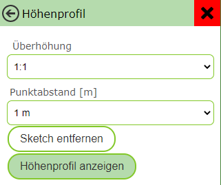

Benutzerdefinierte Werkzeuge
============================

Benutzerdefinierte Werkzeuge, sind Werkzeuge, die in der Werkzeugleiste des Viewers aufscheinen, die aber nicht zu den Standardwerkzeugen von WebGIS gehören.

Diese Werkzeuge können ein einfacher Button sein (Anzeige zu erweiterten Metadaten einer Karte). Benutzerdefinierte Werkzeuge können allerdings auf Interaktion mit der Karte reagieren (Klick in die Karte oder Rechteck aufziehen). In allen Fällen wird nach einer Benutzeraktion (Klick auf Button, Klick in die Karte, Rechteck aufziehen) ein Link aufgerufen, an den entsprechende Werte übergeben werden können.

Werkzeuge mit Karteninteraktion
-------------------------------

Die benutzerdefinierten Werkzeuge werden in der custom.js mit folgendem Befehl dem Viewer hinzugefügt:

.. code-block :: Javascript

    webgis.custom.tools.add({
        name: 'Super Tool',
        command: 'https://www.google.com/maps/@{y},{x},19z',
    });

Fügt man ein benutzerdefiniertes Werkzeug in die custom.js ein, wird es in allen Karten dieser Portalseite hinzugefügt. Soll das Werkzeug nur einer bestimmten Karte oder bestimmten Karten auftauchen, kann dies über entsprechende Bedingen gelöst werden. So steht beispielsweise in der Variable mapUrlName der Name der aktuell aufgerufenen Karte:

.. code-block :: Javascript

    if (mapUrlName === "Geoland") {
        webgis.custom.tools.add({
            name: 'Super Tool',
            command: 'https://www.google.com/maps/@{y},{x},19z'
        });
    }

**Tipp:** Diese Methode kann natürlich auf alle hier beschriebenen Methoden angewandt werden (Marker, Usability usw.)

Der Übergabeparameter ist ein Objekt, welches das Werkzeug beschreibt. Das Objekt muss mindestens die Eigenschaften ``name`` und ``command`` aufweisen. 

Die folgende Liste beschreibt die möglichen Eigenschaften:

*   ``name``

    Ein Name für den Button

*  ``id`` (optional ab Build 5.22.2401)

    Die *ID* für ein benutzerdefiniertes Werkzeug wird vom System automatsich zufällig und eindeutig vergeben. Der Parameter muss hier in der Regel nicht angegeben werden. 
    Eine Ausnahme kann sein, wenn das Werkzeug über einem parametrierten Aufruf des Kartenviewers ausgewählt werden soll (Parameter ``tool``). 
    Hier kann eine *ID* angebenben werden bei der selber sichergestellt werden muss, dass diese *ID* eindeutig ist.

    Beispiel:

     .. code-block :: Javascript

        webgis.custom.tools.add({
            id: 'my_supertool',
            name: 'Super Tool',
            ...
        });

    Dieses Werkzeug kann mit dem Url Parameter ``https://.....?...&tool=webgis.tools.custom.my_supertool`` aufgerufen werden (``webgis.tools.custom`` wird vom System automatsich an die ageführte *ID* vorangestellt).

*   ``command``

    Ein Link, der aufgerufen wird, sobald die entsprechende Useraktion ausgeführt wurde. Diesem Link können über Platzhalter Werte über den aktuellen Kartenauschnitt oder der geklickten Position übergeben werden (siehe unten) 

*   ``command_target``

    Gibt an, wie der Link aufgerufen werden soll:

    *	``command_target: 'self'``

        Der Link wird im aktuellen Browser-Tab geöffnet

    *	``command_target: 'dialog'``

        Der Link wird in einem Dialog innerhalb des Viewers ausgeführt.

        **Achtung:** Das funktioniert oft nicht mit Drittseiten (zB Google Maps). Diese Seiten lassen sich nicht innerhalb eines IFrames anzeigen, um nicht die allgemeinen Regeln ihrer API zu umgehen.

    *	``command_target: '_blank' (Defaultwert)``

        Der Link wird in einem neuen Browser-Tab geöffnet

*   ``tooltype``

    *	Keine Angabe (Defaultwert)

        Das Werkzeut ist ein einfacher Button. Ein Klick auf diesen Button ruft den Command-Link auf

    *	``tooltype: 'click'``

        Nach dem auswählen des Werkzeuges, muss der Anwender in die Karte klicken, um den Command-Link aufzurufen.

    *	``tooltype: 'box'``

        Nach dem auswählen des Werkzeuges, muss der Anwender in der Karte ein Rechteck aufziehen, um den Command-Link aufzurufen.
        
        **Hinweis zur Usability:** Das Ziehen der Maus bei gedrückter Maustaste ist eigentlich für das Verschieden des Kartenausschnittes reserviert. Das Aufziehen eines Rechtecks ist hier die Ausnahme. Da der Anwender in den meisten Fällen ersteres möchte, funktioniert das Rechteck aufziehen immer nur einmal, nachdem ein entsprechendes Werkzeug ausgewählt wurde. So werden beispielsweise beim Auswählen von Geoobjekte mittels Rechteck nach dem Aufziehen die Ergebnisse angezeigt. Im Hintergrund schaltet sich das Rechteckaufziehen wieder ab und der Anwender kann normal in der Karte navigieren. Will er weitere Geoobjekte selektieren muss er zum Identify-Werkzeug zurückkehren und wieder Rechteck auswählen.
        
        Bei den benutzerdefinierten Werkzeugen bedeutet das, dass nach dem Aufziehen des Rechtecks die Aktion ausgeführt wird. Der Viewer schaltet danach allerdings automatisch zum Default-Werkzeug zurück, damit in der Karte wieder normal navigiert werden kann. Möchte der Anwender erneut ein Fenster aufziehen, muss er das Werkzeug wieder aktiv auswählen.

*   ``container``

    Gibt an, wo in der Werkzeugleiste das Werkzeug angezeigt wird. Der Defaultwert ist hier „Werkzeuge“:

    *	``container:'Navigation'``

    *	``container:'Auswahl'``

    *	``container:'Werkzeuge'``

    *	``container:'Darstellung'``

*   ``image``

    Ein Link zu einem Icon (26x26 Pixel), für den Werkzeug Button.
    Dieser Link kann ein absolute Link sein:
    ``image:'https://www....../icon.png'``

    Befindet sich das Icon bei der API im content/api/img/tools Verzeichnis, recht es auch aus nur den Namen des Bildes anzugeben:
    ``image: 'cursor-plus-26-b.png'``

*   ``tooltip``	

    Ein Tooltip, der angezeigt wird, wenn man den Mauszeiger über den Button bewegt.

*   ``description``

    Damit kann eine Beschreibung für das Werkzeug angegeben werden. Wenn ein Werkzeug eine Benutzeraktion erfordert (zB in die Karte klicken) wird dieser Text im Werkzeug Dialog angezeigt. Für länge Beschreibungen könne einzelne Absätze im String mit ``|`` getrennt werden.

Für die Eigenschaft ``command`` können verschiede Platzhalter in dir Url eingefügt werden, um Parameter aus der Karte in einen andere Web-Seite zu übergeben. Abhängig vom *tooltype* können unterschiedle Platzhalter verwenden werden, bzw. hab diese unterschiedliche Bedeutungen:

*   ``{map.minx}, {map.miny}, {map.maxx}, {map.maxy}``

    *   *ToolTypes:* kein, click, box

    *   Die Ausdehnung des aktuellen Kartenausschnittes in geographischen Koordinaten. X entspricht hier dem Rechtswert (geographische Länge) und Y dem Hochwert (geographische Breite)  

*   ``{map.bbox}``

    *   *ToolTypes:* kein, click, box

    *   Die Boundingbox des aktuellen Kartenausschnittes in geographischen Koordinaten. 

        Entspricht: ``{map.minx}, {map.miny}, {map.maxx}, {map.maxy}``

*   ``{map.centerx}, {map.centery}``

    *   *ToolTypes:* kein, click, box

    *   Der Mittelpunkt des aktuellen Kartenausschnittes in geographischen Koordinaten

*  ``{map.scale}``

    *   *ToolTypes:* kein, click, box

    *   Der aktuelle Kartenmaßstab

*   ``{map.MINX}, {map.MINY}, {map.MAXX}, {map.MAXY}, {map.BBOX}, {map.CENTERX}, {map.CENTERY}``

    *   *ToolTypes:* kein, click, box

    *   Wie oben, nur werden hier geographischen Koordinaten übergeben, sondern Koordinaten im Karten Koordinatensystem (z.B. GK-M34)
    
        X entspricht hier dem Rechtswert und Y dem Hochwert

*   ``{x}, {y}``

    *   *ToolTypes:* click, box

    *   Der Punkt auf den der Anwender geklickt hat in geographischen Koordinaten.

        Zieht der Anwender ein Fenster auf, entspricht dieser Wert dem Mittelpunkt des Fensters 

*   ``{X}, {Y}``

    *   *ToolTypes:* click, box

    *   Wie oben, nur für Koordinaten im Karten Koordinatensystem.

*   ``{minx}, {miny}, {maxx}, {maxy}``

    *   *ToolTypes:* box

    *   Das Rechteck, das der Anwender aufgezogen hat in geographischen Koordinaten

*   ``{bbox}``

    *   *ToolTypes:* box

    *   BoundingBox des Rechteckes, das der Anwender aufgezogen hat.

        Entspricht: ``{minx}, {miny}, {maxx}, {maxy}``

*   ``{MINX}, {MINY}, {MAXX}, {MAXY}, {BBOX}``

    *   *ToolTypes:* box

    *   Wie oben, nur für Koordinaten im Karten Koordinatensystem.

    ``{wkt}, {wkt-4326}``

    *   *ToolTypes:* sketch0d (=point), sketch1d (=line), sketch2d (=polygon)

    *   Damit kann über ein benutzerdefiniertes Werkzeug die Sketchgeometrie als Well-Known-Text ``POINT(...), LINESTRING(...), POLYGON(...)`` übergeben werden.
        Der Geometrie kann in WGS84 oder der aktuellen Kartenprojektion übergeben werden.

Benutzerdefinierte Werkzeuge mit Eingabefeldern
-----------------------------------------------

Falls schon im aus dem Viewer heraus Parameter ausgewählt werden sollten, die dann an die Zielseite übergeben werden, kann dies über die ``uiElements`` Eigenschaften erfolgen:

.. code::

   webgis.custom.tools.add({
        name: 'Höhenprofil',
        command: 'https://server.com/profile?ueberhoehung={ueberhoehung}&hintergrund=bmapgrau&stuetzpunktabstand={stuetzpunktabstand}&polygonzug={wkt}&crs=31256',
        command_target: 'dialog',
        tooltype: 'sketch1d',
        image: 'profil.png',
        uiElements: [
            { type:'label', label:'Überhöhung' },
            {
                id: 'ueberhoehung',
                type: 'select',
                options: [
                    { label: '1:1', value: 1 },
                    { label: '2:1', value: 2 },
                    { label: '3:1', value: 3 }
                ]
            },
            { type: 'label', label: 'Punktabstand [m]' },
            {
                id: 'stuetzpunktabstand',
                label: 'Punktabstand [m]',
                type: 'select',
                options: [
                    { label: '1 m', value: 1 },
                    { label: '2 m', value: 2 },
                    { label: '3 m', value: 3 }
                ]
            }
        ]
    });

Im Beispiel wird gezeigt wie ein Werkzeug für Höhenprofile erstellt werden kann. Der Anwender kann im Viewer vor dem Aufruf der Ziel-Url noch eine Überhöhung und einen Stützpunktabstand angeben.
Die ``id`` des jeweiligen Eingabeelements kann als Platzhalter in der Url verwendet werden.

Der Werkzeugdialog für dieses Beispiel würde wie folgt aussehen:

