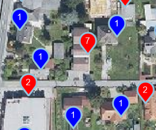
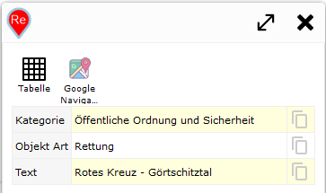
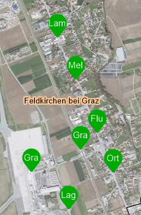

Dynamische Inhalte
==================

Wurden in eine Karte *dynamische Inhalte* eingefügt (siehe Abschnitt ``MapBuilder``) können die Marker und Ergebnisse ebenfalls über die ``custom.js`` angepasst werden.

Marker
------

Das Anpassen der Marker für *dynamische Inhalte* kann wie bei Abfragemarker über die Auflistung ``webghis.markerIcons[]`` angepasst werden.
Allerdings lautet die Listenwerte anstelle von ``query_result`` hier ``dynamic_content`` und ``dynamic_content_extenddependent``:

* ``webghis.markerIcons["dynamic_content"]["default"]``:
  Definition von *Marker Icons* für allgemeine *dynamische Inhalte*. Standardmaßig werden hier Marker mit Nummern angezeigt.

* ``webghis.markerIcons["dynamic_content_extenddependent"]["default"]``:
  Für *dynamische Inhalte*, die bei jeder Änderung des Kartenausschnittes neu geladen werden. Dazu muss beim beim Erstellen des Inhalt ``Ausschnittsabhängig`` angegeben werden (siehe ``MapBuilder``).
  Standardmäßig werden hier Marker ohne fortlaufende Nummern angezeigt. Fortlaufende Nummern wie bei *statischen dynamischen Inhalten* würden den Anwender hier nur verwirren, weil beispielsweise 
  beim jedem verschieben der Karte ein Marker eine neue fortlaufende Number bekommen kann.

Schränkt man die ``webghis.markerIcons["dynamic_content"]`` bzw ``webghis.markerIcons["dynamic_content_extenddependent"]`` mit ``["default"]`` ein, gilt die Definition für alle *dynamischen Inhalte*.
Anstelle von ``["default"]`` kann auch der Anzeigename des *dynamischen Inhalts* angegeben werden, zB ``webghis.markerIcons["dynamic_content_extenddependent"]["Aktuelle Baustellen"]``

.. note::
   Da eine grundlegende Beschreibung für Marker schon im vorherigen Kapitel für Abfrageergebnisse gezeigt wurde und die Vorgehensweise analog ist, werden hier 
   nur ein paar Beispiele aus der Praxis angeführt.

**Beispiel**

Ein *dynamischer Inhalt* stellt Kunden als Punkt auf der jeweiligen Adresse dar. Die Grundlage ist eine ``API-Abfrage``. 
Weil auf einer Adresse mehrere Kunden wohnen können (Mehrfamilienhaus) wurde bei der entsprechenden Abfrage ``Union`` eingestellt (siehe Tutorial CMS - Abfragen). Dadurch werden
Kunden, die sich am selben Adresspunkt befinden zu einem *Objekt/Marker* zusammenfasst. Die ``Properties`` des Features entsprechen durch das Zusammenfassen einem Array (normalerweise allgemeines Objekt bzw. ``Record``).
Jeder Eintrag in diesem Objekt entspricht einem ``Record`` für einen Kunden.

In der Karte sollten Marker in unterschiedlichen Farben dargestellt werden, wenn sich unter einer Adresse mehrere Kunden befinden. Dazu wird abgefragt, ob ``properties`` ein Array ist.
Außerdem soll die Anzahl der Kunden unter einer Adresse im Marker als Zahl angezeigt werden.

.. code-block :: JavaScript

   webgis.markerIcons["dynamic_content_extenddependent"]["Kunden"] = {
        url: function (i, f) {
            if (Array.isArray(f.properties) && f.properties.length > 1) {  // wenn Array mit mehren Einträgen => roter Marker 
                return webgis.baseUrl + '/rest/numbermarker/' + f.properties.length + '?c=f00';
            }
            return webgis.baseUrl + '/rest/numbermarker/1?c=00f';  // sonst blauber Marker
        },
        size: function (i, f) { return [33, 41]; },
        anchor: function (i, f) { return [16, 42]; },
        popupAnchor: function (i, f) { return [0, -42]; }
    };

Ergebnis:

Hooks 
-----

Über ``hooks`` kann nach dem Laden eines *dynamischen Inhalts* auf die die Features zugegriffen werden. Dabei können die Features auch geändert werden.
Ein Anwendungsbeispiel für ``hooks`` ist beispielsweise das Umbenennen oder Einschränken der Attribute, die für den *dynamischen Inhalt* angezeigt werden sollten.

Folgende Auflistungen stehen dabei zur Verfügung:

* ``webgis.hooks["dynamic_content_loaded"]["default"]``:
  Hier kann eine Funktion angegeben werden, der das Ergebnis eines dynamischen Inhalts (GeoJSON) übergeben wird.

* ``webgis.hooks["dynamic_content_feature_loaded"]["default"]``:
  Hier kann eine Funktion angeführt werden, der einzelne Features eines dynamischen Inhalts nach dem Laden übergeben werden.

**Beispiel:**

In der Karte sollten maximal 100 Ergebnisse angezeigt werden, auch wenn der *dynamische Dienst* mehr Ergebnisse liefert:
Die Regel sollte nur für den *dynamischen Inhalt* mit dem Namen ``Solr`` angewendet werden:

.. code-block :: JavaScript

    webgis.hooks["dynamic_content_loaded"]["Solr"] = function (response) {
        response.features = response.features.slice(0,100);
    };

Der gleiche Inhalt liefert sehr viele Attribute mit nicht anwenderfreundlichen Namen zurück. Es sollte im nächsten Schritt nur wenige Attribute 
übernommen und übersetzt werden. Dies sollte für jedes *Feature* einzelnen erfolgen:

.. code-block :: JavaScript
    
    webgis.hooks["dynamic_content_feature_loaded"]["Solr"] = function (feature) {
        if (feature.properties) {
            var properties = feature.properties;
            //console.log(properties);

            feature.properties = {
                Kategorie: properties.map_category || '',
                "Objekt Art": properties.subtext || '',
                Text: properties.textexact || '',
            };
        }
    };

Ergebnis:

Im letzten Schritt sollte für diesen Dienst auch noch die Marker angepasst werden. Die Einfärbung sollte je nach ``Kategorie`` unterschiedlich sein.
Außerdem sollte im Marker die ``Objekt Art`` als Text angezeigt werden. Wenn es sich um die Kategorie ``Haltestelle`` handelt sollte als Text das
zweite Wort von ``Text`` angezeigt werden, weil das in diesem Beispiel immer dem Namen der Haltestelle entspricht (erstes Wort wäre Ort/Gemeinde):

.. code-block :: JavaScript

    webgis.markerIcons["dynamic_content_extenddependent"]["Kagis Solr"] = {
        url: function (i, f) {
            var label = f.properties["Objekt Art"].substr(0, 2);
            switch (f.properties.Kategorie) {
                case 'Öffentliche Ordnung und Sicherheit':
                    return webgis.baseUrl + '/rest/textmarker/' + label + '?c=f00';
                case 'Gesundheit':
                    return webgis.baseUrl + '/rest/textmarker/' + label + '?c=0f0';
                case 'Soziale Einrichtung':
                    return webgis.baseUrl + '/rest/textmarker/' + label + '?c=00f';
                case 'Haltestelle':
                    var words = f.properties.Text.split(' ');
                    return webgis.baseUrl + '/rest/textmarker/' + words[Math.min(words.length, 1)].substr(0, 3) + '?c=0a0,0a0';
            }
            return webgis.baseUrl + '/rest/textmarker/' + label + '?c=f0f';
        },
        size: function (i, f) { return [33, 41]; },
        anchor: function (i, f) { return [16, 42]; },
        popupAnchor: function (i, f) { return [0, -42]; }
    };

Ergebnis:

