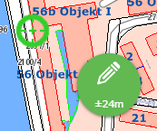
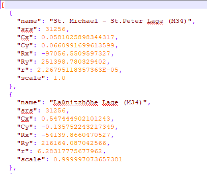

Spezielle Themen
================

SpatialRefenceSystem
--------------------

Für eine WebGIS Karte können verschiedene Koordinatensystem verwendet werden. Bestimmte Berechnungen (z.B. das Messen einer Strecke) wird im jeweiligen Kartensystem kartesisch durchgeführt. Kartesisch bedeutet in diesem Zusammenhang, dass für eine Berechnung einfach die (X, Y) Werte verwendet werden.

Dabei kann zu Problemen kommen, wenn das Koordinatensystem große Verzerrungen aufweist, weil dann ebenfalls die (X, Y) Werte „verzerrt“ sind. Gemessene Distanzen entsprechen so nicht mehr der Distanz in der Natur. Ein Beispiel ist die WebMercator Projektion, die in unsere Breite schon eine sehr hohe Verzerrung beim Hochwert aufweist. Gemessene Längen und Flächen wären in dieser Projektion hier immer zu groß.

Abhilfe kann hier die Variable calcCrs schaffen. Durch diese kann der EPSG Code für ein Koordinatensystem angegeben werden, in dem Berechnungen durchgeführt werden:

.. code-block :: JavaScript

    if (mapUrlName === "Basemap_at") {
        calcCrs = 31287;  // Lambert
    }

Für diese Karte würden Berechnungen etwa im österreichweiten Lambert System durchgeführt werden. Alle Koordinaten für die Berechnung würden somit erst im Hintergrund nach Lambert transformiert werden. Mit den so erhaltenen Koordinaten wird die Berechnung durchgeführt.

Beispiele:

.. code-block :: JavaScript

    calcCrs = 31256;    // Rechnen im GK-M34

Wird dieser Wert nicht angeben, erfolgt die Berechnung immer im jeweiligen Karten Koordinatensystem. Ist dieses eine geographisches Koordinatensystem oder WebMercator, empfiehlt es sich, die Variable zu setzen!

WebGIS und GNSS
---------------

Will man mit WebGIS über eine externe GPS Antenne vermessen, kann dies auch über die custom.js eingestellt werden. Da es sich hierbei um eine eher spezielle Anwendung handelt, und das Thema eher umfangreich ist, wird es hier nur rudimentär beschrieben. Eine genauere Beschreibung erfolgt bei Bedarf auf Nachfrage.

Die verantwortlichen Einträge lauten:

.. code-block :: JavaScript

    webgis.currentPosition = webgis.currentPosition_watch;

    webgis.currentPosition.minAcc = 0.5;   // [m]
    webgis.currentPosition.maxAgeSeconds = 0.1;  // [s]
    webgis.currentPosition.useWithSketchTool = true;  

Der letzte Eintrag ist dafür verantwortlich, dass man die GPS in allen Sketchtools verwenden kann. Der Anwender erhält dazu eine zusätzlich Bubble „GPS“. Diese in standardmäßig deaktiviert (grau). Zieht man die Bubble aus dem Inaktiv-Bereich, ändert sie ihre Farbe von Rot auf Grün, je nachdem ob die eingestellt Genauigkeit erreicht wurde. Ist sowohl Bubble als auch das angezeigt Positionsfadenkreuz grün, kann der Anwender durch einen Klick auf die Bubble, eine Vertex für den Sketch übernehmen. Dies kann er so lange wieder holen (Karte folgt dem Fadenkreuz bei Bewegung) bis er die Bubble wieder zurück in den Inaktiv-Bereich schiebt. 

Info: Solange die Bubble aktiv ist, kann ein Vertex nur mit diesem Werkzeug gesetzt werden!  

Soll noch eine zusätzliche Helmert Transformation (2D) angebracht werden, um eventuelle Spannungen im Festpunktfeld auszugleichen, kann diese in folgender Form angegeben werden:

.. code-block :: JavaScript

    webgis.continuousPosition.helmert2d = {
            srs: 31256,
            Cx:  0.600,
            Cy: -0.234,
            Rx: -67946.151,
            Ry: 215079.498,
            r: 399.9992 * Math.PI / 200,
            scale: 1 + (-6.576 * 1e-6)
    };

Gibt es unterschiedliche räumliche getrennt Transformationen können diese über ein „Transformations Info Service“ abgeholt werden.

.. code-block :: JavaScript

    webgis.continuousPosition.useTransformationService = true;

Dieses Transformations Info Service ist ein WebGIS Dienst. Er liefert die Definitionen der einezelnen Transformationen. Die Informationen der einzelnen Transformationen müssen im etc/trafo Verzeichnis in einer Datei helmert.json liegen. Die Form dieser Datei sieht in etwa so aus:

