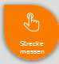
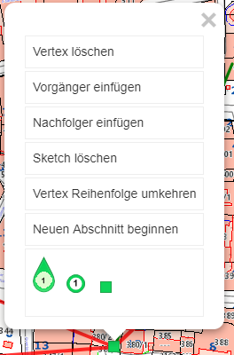

Usability
=========

Einige Features aus API lassen sich über sogenannte Usability-Konstante steuern. Diese können natürlich auch über die custom.js für einzelne Karten oder komplette Portalseiten gesetzt werden.

Die *ClickBubble* dient zur besseren Bedienbarkeit des Viewers auf Touch Geräten. Werkzeuge, die einen Klick in die Karte voraussetzen, (z.B. Identify) sind oft schwer zu bedienen, weil ein Klick mit dem Finger meist zu ungenau ist. 
Aktiviert man die ClickBubble, erscheint diese bei jedem Werkzeug, das Klick-Interaktion voraussetzt:
 

 
Der Anwender kann jetzt nicht mehr wie gewohnt in die Karte klicken, sondern zieht die Bubble an den gewünschten Ort, um eine Aktion auszulösen. Die Spitze markiert dabei den Punkt, für den die Aktion ausgelöst werden soll. 
Ist die Bubble am gewünschten Ort, kann sie einfach wieder losgelassen werden und kehrt automatisch an den rechten oberen Rand zurück und die Aktion (z.B. Identify) wird gestartet.

Klickt der Anwender auf die Bubble (ohne ziehen) öffnet sich eine Beschreibung, wie diese bedient werden kann.

Manche Werkzeuge setzen auch die Möglichkeit einer rechten Maustaste voraus (z.B. das Kontextmenü für den Sketch beim Messen oder Editieren). Dafür gibt es eine weitere Bubble, die aktiviert werden kann. 
Auf diese kann der Anwender klicken, um das Kontextmenü zu öffnen. Ebenso kann man diese an eine bestimmte Stelle ziehen, um genau für einen bestimmten Ort das Kontextmenü zu öffnen (z.B. einen bestimmten Vertex verschieben oder löschen, rechtwinklig zu Kante konstruieren, usw.).

Mit diesen Werkzeugen stehen einem versierten Anwender alle Möglichkeiten des Konstruierens (inkl. Snapping) auch auf mobilen Geräten zur Verfügung.

Diese Werkzeuge stehen normalerweise nicht zur Verfügung, sondern müssen über die custom.js  aktiviert werden.

.. code-block :: JavaScript

    // ClickBubble aktiviern 
    webgis.usability.clickBubble = true;
    // ContextMenu Bubble aktiviern
    webgis.usability.contextMenuBubble = true;

Da die Werkzeuge nur Geräten mit Touch Bedienung praktisch sind, kann anstelle von true/false auch die Methode isTouchDevice() verwendet werden:

.. code-block :: JavaScript

    webgis.usability.clickBubble =
    webgis.usability.contextMenuBubble = webgis.isTouchDevice();

Beim Sketch bestand bisher für den Anwender die Möglichkeit, auf einen Vertex zu klicken und so ein Popup Menü zu öffnen:

Dies ist allerdings nicht mehr notwendig, wenn eine rechte Maustaste bzw. die ContextMenu Bubble zur Verfügung steht. Mit folgender Variable kann man dieses Menü trotzdem wieder aktivieren:

.. code-block :: JavaScript

    webgis.usability.sketchMarkerPopup = true;  // Empfehlung: false!!

Ebenfalls ist es oft wünschenswert, dem Anwender weniger Werkzeuge beim Zeichnen anzubieten. So sind die Konstruktionswerkzeuge eher für versierte Anwender und nicht in jeder Karte sinnvoll. Mit folgender Variabel können die Konstruktionswerkzeuge deaktiviert werden:

.. code-block :: JavaScript

    webgis.usability.constructionTools = false;

Das komplette Kontextmenü beim Zeichnen kann man mit folgendem Code deaktivieren:

.. code-block :: JavaScript

    webgis.usability.sketchContextMenu = false;

Beim Konstruieren des Sketches können diverse *Tastatur Shortcuts* verwendet werden, z.B. können bei gedrückter ``a`` Taste Vertices auf einer Kante gesetzt bzw. mit gedrückter ``d`` Taste gelöscht werden.
Mit gedrückter ``Ctrl`` Taste kann ein Fenster aufgezogen und damit Vertices selektiert werden. Diese können dann im *Bulg* gelöscht oder verschoben werden.

Ob diese Funktionalität zur Verfügung steht, erfolgt über folgende Schalter:

.. code-block :: JavaScript

   webgis.usability.allowSketchShortcuts = true;
   webgis.usability.allowSelectSketchVertices = true;
