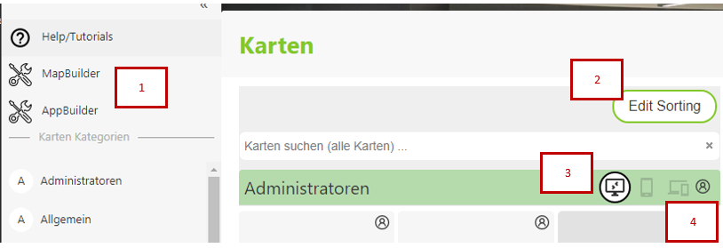

Karten Portal Seiten verwalten
===============================

Kartenportalseiten sind für den Anwender der Einstiegspunkt zu den Karten. Innerhalb von *Karten Portal Seiten* können mehrere Karten 
unterschiedlichen Kategorien zusammengefasst werden. Die Karten erscheinen auf der Portalseite als Kacheln mit Titel und optional mit 
individuellem Logo/Vorschaubild und Beschreibung. Erstellt werden die Karten mit dem *MapBuilder*.

Neben *Karten Viewer* Aufrufen können auf *Karten Portal Seiten* nach noch Links zu *WebGIS Apps* enthalten sein. Diese *Apps* werden
mit dem *App Builder* erstellt. *Apps* sind vorgefertigte *Templates* die für bestimmte Aufgaben maßgeschneidert sind. Über den *AppBuilder*
kann eine Vorlage ausgewählt und mit den notwendigen Parametern (z.B Diensten) erweitert werden. Ein einfache *Redirect* auf eine anderer 
Webseite kann auch über eine *App* erzeugt werden. Damit können auf einer *Karten Portal Seite* beliebige Links als Kachel eingefügt werden 
(siehe dazu die AppBuilder Dokumentation).

Für den Administrator/Kartenautor sieht die Portalseite in etwas folgendermaßen aus:

1. Hier kann der *MapBuilder* und der *AppBuilder* aufgerufen werden, um neue Karten oder Apps für diese *Karten Portal Seite* zu erstellen.
 
2. Sind bereits Karten (Kacheln) und Kategorien erstellt worden, kann mit den Button ``Edit Sorting`` die Reihenfolge der Karten und Kategorien geändert werden. 
   Bei Karten kann einfach die gewünschte Kachel verschoben werden. Die Reihenfolge der Kategorien erfolgt über *Sidebar* (links)

3. Beim Veröffentlichen von Karten und Apps kann die bevorzugte Zielplattform für diese Anwendung angegeben werden. Je nachdem mit welchen Gerät (Desktop, Handy)
   der Anwender die *Karten Portal Seite* aufruft, werden nur die entsprechenden Kacheln angezeigt. Die aktuelle Ansicht kann jedoch immer (auch vom Anwender)
   geändert werden. Diese erfolgt mit diesen Buttons (Desktop, Mobiles Geräte, Hybrid). Diese Symbol wird auch in den einzelnen Kacheln neben dem Kartentitel angezeigt.

4. Inhalte innerhalb einer *Karten Portal Seite* können noch weiter eingeschränkt werden. Dazu kann der *Berechtigungs Button* verwendet werden. Dieser steht sowohl
   für eine komplette *Kategorie* oder auch einzelen *Kacheln* zur Verfügung. Der Anwender muss den gesamten *Berechtigungsstack* durchlaufen, um eine Karte 
   aufrufen zu können: **Portal Seite** => **Kategorie** => **Karte (Kachel)**. Wird einer dieser Schritte verweigert, ist die Kachel für den Anwender nicht sichtbar.

