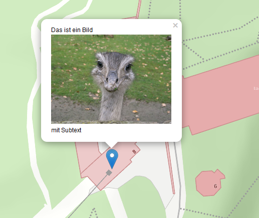
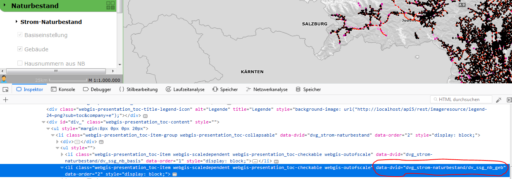
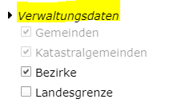

Url Parameter
=============

Optional zum normalen Aufruf können noch Parameter übergeben werden:

.. code-block::

    https://{Host}/{Portal-Applikation}/{Aortal-Seite}/{Kategorie}/{Kartenname}?param1=1&param2=2

Kartenausschnitt und Marker
---------------------------

**Parameter:**

*   ``bbox``

    Gibt eine Bounding-Box an, auf die Kartenansicht automatisch zoomt. Die Syntax lautet hier: [x-min],[y-min],[x-max],[y-max] bzw. bei geographischen Koordinaten [lng-min],[lat-min],[lng-max],[lat-max], wobei „lng“ für den geographischen Längengrad und „lat“ für den geographischen Breitengrad stehen. 
    Die Werte werden mit Beistrich getrennt. Als Kommazeichen für die einzelnen Werte wird ein „.“ vorausgesetzt.

    Beispiel: ``&bbox=14.6,47.3,15.2,48.1`` 

*   ``center``

    Gibt das Zentrum an, auf das nach dem Start in der Kartenansicht gesprungen wird. Die Syntax lautet hier: [x],[y] bzw. [lng],[lat] 

    Die Werte werden mit Beistrich getrennt. Als Kommazeichen für die einzelnen Werte wird ein „.“ vorausgesetzt.

    Beispiel: ``&center=14.6,47.3``   

    Wird kein Maßstab angeben (Parameter scale), zoomt die Ansicht auf einem Maßstab 1:1000.

*   ``srs``

    Der Viewer setzt voraus, dass die Koordinaten für ``bbox`` und ``center`` als geographische Koordinaten in WGS 84 übergeben werden. Ist dies nicht der Fall, muss das Koordinatensystem über diesen Parameter spezifiziert werden. 
    Übergeben wird hier der EPSG-Code des Koordinatensystems ohne dem „EPSG:“ Literal, also als Integer Zahl.

    Beispiel (GK-M34): ``&srs=31256``

*   ``scale``

    Gibt den Maßstab an, auf dem in der Kartenansicht gezoomt wird. Der Parameter wird nur berücksichtigt, wenn auch die Parameter ``center`` oder ``marker`` übergeben werden.

*   ``marker``

    Soll ein Punkt in der Karte mittels Marker dargestellt werden, kann der Marker über diesen Parameter definiert werden. Hier wird als Syntax ein Javascript Objekt mit entsprechenden Eigenschaften übergeben.

    Beispiel (mind): ``&marker={lng:14.7,lat:47.2}``

    Das Objekt wird durch geschwungen Klammern abgegrenzt. Die einzelnen Eigenschaften des Objekts werden mittels Beistrich voneinander getrennt. Die Zuweisung einer Eigenschaft folgt mit folgender Syntax: [Eigenschaft]:[Wert] also beispielsweise lng:14.2 
    
    Entspricht der Wert einem String, muss dieser in einfachen Hochkommata angeführt werden:

    Text:‘Popup Text‘

    Eine Beschreibung der einzelnen Werte folgt unten.

    Wenn nicht über die Parameter ``center`` oder ``bbox`` anders definiert, zoomt die Kartenansicht auf den Marker. Der Maßstab kann dafür über den Parameter ``scale`` übergeben werden.  

Einen Marker übergeben
-----------------------

Wie oben schon beschrieben, kann über den Parameter ``marker`` ein Marker beim Aufruf in eine Karte übergeben werden. Die Übergabe-Syntax ist dabei immer die Darstellung des Markers als Javascript Objekt (siehe oben). 
Folgende Tabelle führt alle möglichen Eigenschaften dieses Objekts an. Double-Werte sind immer Zahlen mit einen „.“ (Punkt) als Komma Separator. Integer Zahlen dürfen nur aus Zahlen bestehen. 
Strings müssen mit Hochkommata versehen werden. Die fett gedruckten Eigenschaften müssen angeführt werden:

*   ``lng``

    *   *Double*

    *   Der geographische Längengrad, an dem der Marker eingefügt werden soll

*   ``lat``

    *   *Double*

    *   Der geographische Breitengrad, an dem der Marker eingefügt werden soll

*   ``x``

    *   *Double*
    
    *   Falls die Übergabe der Koordinaten nicht in geographischen Koordinaten erfolgt, können hier die X,Y Koordinaten und die Koordinatensystem (als EPGS-Wert) übergeben werden. Werden diese Werte angeführt, sind lng und lat keine Pflichtfelder mehr.

*   ``y``

    *   *Double*

    *   Falls die Übergabe der Koordinaten nicht in geographischen Koordinaten erfolgt, können hier die X,Y Koordinaten und die Koordinatensystem (als EPGS-Wert) übergeben werden. Werden diese Werte angeführt, sind lng und lat keine Pflichtfelder mehr.

*   ``srs``

    *   *Integer*

    *   Falls die Übergabe der Koordinaten nicht in geographischen Koordinaten erfolgt, können hier die X,Y Koordinaten und die Koordinatensystem (als EPGS-Wert) übergeben werden. Werden diese Werte angeführt, sind lng und lat keine Pflichtfelder mehr.

*   ``icon``

    *   *String*

    *   (z.Z. nicht benutzt, es wird immer der Standardmarker gesetzt)

*   ``text``

    *   *Integer*

    *   Soll der Marker Information in Form von Text besitzen, kann dies über diesen Parameter erfolgen. Der Text wird dann als Popup-Text beim Klick auf den Marker angezeigt.

        Innerhalb des Textes können auch Links auf Bilder angeführt werden. Bilder werden mit einem „img:“ als Prefix gekennzeichnet, also beispielsweise *img:http://…../bild.jpg*.

*   ``openPopup``

    *   *Boolean*

    *   true/false

        Wird ein Text übergeben, kann hier angeführt werden, ob der Popup-Text automatisch dargestellt wird oder erst durch einen Klick auf den Marker durch den Anwender.

            

**Beispiele:** 

Ein Marker mit dem Text „Hallo Welt“:

.. code-block::

    &marker={lng:14.7,lat:47.2,text:‘Hallo Welt‘}

Ein Marker mit projezierten Koordinaten:

.. code-block::

    &marker={x:-68014.6,y:215601.4,srs:31256}

Ein Marker mit Text und eingeschlossenem Bild. Wird nach dem Öffnen des Viewers automatisch angezeigt (``openPopup=true``). Die Zeilenumbrüche dienen hier nur der Veranschaulichung:

.. code-block::

    &marker={ 
    lng:15.4,
    lat:47.09,
    openPopup:true,
    text:
    ‘Das ist ein Bild img:https://upload.wikimedia.org/wikipedia/de/6/68/Nandu_gesamtes_Bild.jpg mit Subtext‘
    }

Mehrere Marker übergeben
------------------------

Über den Parameter ``markers`` können auch mehrerer Marker übergeben werden. Die Syntax muss dabei einem ``Array`` aus einzelnen Markern entsprechen.
Die Marker werden hier nicht nur in der Karte angezeigt, sondern in der Karte als *Dynamischer Inhalt* übernommen. Über den optionalen Parameter ``markers_name`` 
kann ein Name übergeben werden, mit dem der *Dynamische Inhalt* im TOC angezeigt wird. 

**Beispiel**:

.. code-block::

   &markers_name=Ziele&markers=[{lng:14.7,lat:47.2,text:'Ziel 1'},{lng:14.9,lat:46.8,text:'Ziel 2'},{lng:14.8,lat:47.4,text:'Ziel 3'},{lng:15.8,lat:47.1,text:'Ziel 4'},{lng:15.2,lat:46.9,text:'Ziel 5'}]

Abfragen
--------

An den Viewer kann beim Aufruf eine Abfrage mit Werten übergeben werden. Diese Abfrage ist dann automatisch im Viewer als aktuelles Abfrage/Identifythema aktiv. 
Wenn optional noch Werte übergeben werden, wird diese Abfrage ausgeführt und auf die Ergebnisse gezoomt. Ergebnisse werden in der Karte selektiert und mit Markern markiert.

*   ``query``, ``abfragethema``

    Beide Parameter sind möglich, die Funktionsweise ist gleich. Übergeben wird die Abfrage-Url, wie sie im CMS festgelegt wurde.

    Beispiel: ``&query=gemeinden``   

*   Abragewerte: ``name``, ``plz``, ``str``, ``hnr``, …

    Die Abfragewerte heißen so, wie sie im CMS definiert wurden

*   ``query2``, ``abfragethema2``, ``querythemeid``

    Wird eine Abfrage übergeben, stellt sich das Abfragethema für *Identify* und *Suche* in der Benutzeroberfläche 
    ebenfalls auf dieses Thema.
    Möchte man das voreingestellte Abfragethema auf ein (anderes) Thema setzen, kann einer dieser Parameter verwendet werden.

    Beispiel: ``querythemeid=bezirke``, ``querythemeid=%23``

.. note::
   Die Abfrage-Id für "sichtbare Themen" ist ``#``. Dieses Zeichen ist allerdings in Urls reserviert und kann nicht 1:1 verwendet 
   werden, sondern muss als ``%23`` kodiert werden.          

Darstellungsfilter
------------------

Werden in einer Karte Darstellungsfilter angeboten, kann ein Filter über einen Url-Parameter übergen werden.

*   ``filter``

    Die id des Filters (wie im CMS).

*   ``filterarg_{argument}`` 
 
    Für jedes Argument des Filters muss eine Wert übergeben werden. ``{argument}`` ist hier der Platzhalter für das entsprechende Argument. 

*  ``filterservice`` (optional)

   Die Id für den Filter ist nicht eindeutig und kann in unterschiedlichen Diensten vorkommen. Möchte man den Filter für genau einem bestimmten Dienst aktivieren,
   kann die Id des Dienstes hier angegeben werden. Ansonsten wird der Filter für jeden Dienst mit diesem Filter angewendet. Die Dienst-Id besteht in der Regel aus ``{Dienst Id}@{CMS Id}``.
   Eine Alternative ist, die Dienst-Id gleich über den Parameter ``filter`` zu definieren: ``{service-id}~{filterid}``. 

.. note::
   Sollten Filter auch über das Darstellungsfilter-Werkzeug angezeigt werden (wenn der Anwender auf das Werkzeug ``Darstellungsfilter`` klickt), MUSS die Dienst-Id mitübergeben werden!
   
Beispiel:

``&filter=my-filter&filterarg_WERT1=abc``

mit eindeutiger Dienst Zuweisung:

``&filter=my-filter&filterservice=my-service@my-cms&filterarg_WERT1=abc``
oder
``&filter=my-service@my-cms~my-filter&filterarg_WERT1=abc``

Werkzeuge
---------

Der Viewer kann mit einem voreingestelltem Werkzeug aufgerufen werden:

*  ``tool``
   
   Mit diesem Parameter wird die Id des Werkzeugs übergeben, dass beim Aufruf der Karte ausgewählt werden sollte.

   Beispiel: ``&tool=webgis.tools.measureline``

Die möglichen Werkzeug-Ids können unter https://api.webgiscloud.com/rest/tools nachgeschlagen werden.

.. note::
   Es können nur Werkzeuge und keine einfachen Werkzeug-Buttons übergeben werden. *Einfache Werkzeugbuttons* sind Werkzeuge,
   die schon beim Anklicken die gewünschte Aktion ausführen, wie *gesamter Ausschnitt*, *Refresh*, *Zurück*.

Für das Editwerkzeug ``&tool=webgis.tools.editing.edit`` können optional noch weitere Parameter übergeben werden:

* ``editthemeid``: Die ``Id`` des Editthemas, das aktiv gestetzt werden sollte. Die ``Id`` ist im CMS beim entsprechenden Editthema nachzuschlagen.
* ``ed_[FIELD_NAME]``: Der Wert für ein Feld in der Editmaske.
* ``tooloption``: Das Edit-Subwerkzeug, dass ausgewählt werden sollte. ``&tooloption=newfeature`` => es wird die Editmaske geöffnet, um einen neues Feature zu bearbeiten.
  
.. note::
   Der Parameter ``tooloption`` funktioniert nur, wenn die Karte am Desktop mit dem *WebGIS 6 Desktop Layout* geöffnet wurde. 
   Ist dies nicht der Fall, muss der Anwender selbstständig auf ``Neues Objekt`` klicken. 

Sichtbarkeit/Darstellungsvarianten
----------------------------------

Um beim Aufruf schon eine bestimmte Darstellung anzugeben, kann hier eine Liste von Darstellungsvarianten angeführt werden. Diese werden dann in der angeführten Reihenfolge „automatisch angeklickt“. 
Im CMS hat jede Darstellungsvariante beim Dienst eine Url. Im Viewer können diese Darstellungsvarianten allerdings wieder zu Buttons und Checkboxes gruppiert sein 
oder sich in Dropdowns befinden. Darum funktioniert die Übergabe der Url einer Darstellungsvariante nur, wenn diese in keiner Gruppe ist. Wenn sich die Darstellungsvariante in einer Gruppe befindet, 
kann nur die komplette Gruppe als Parameter übergeben werden. Die interne Url für eine Gruppe ist immer dvg_[Name der Gruppe in Kleinbuchstaben, Leerzeichen werden Underscore, …). 
Wenn man sich nicht sicher ist, wie der interne Name einer Gruppe oder einer Darstellungsvariante unterhalb eines Dropdowns oder einer Gruppe ist, kann man dies über die Entwicklungstools des Browsers feststellen (F12).
Jedes Element, auf das man in Darstellungsvarianten TOC klicken kann, hat ein Attribut mit dem Namen „data-dvid“. Der Wert dieses Attributes entspricht der Id, die man über einen parametrierten Aufruf übergeben kann:

*   ``presentation``, ``darstellungsvariante``

    Beide Parameter sind möglich, die Funktionsweise ist gleich.

    Beispiel: ``&presentation=dvg_strom-naturbestand/dv_ssg_nb_geb,dvg_kataster``

Sichtbarkeit von einzelnen Layern
---------------------------------

Ist das Sichtbarschalten nicht über Darstellungsvariaten möglich, können auch einzelne Layer sichtbar bzw. unsichtbar geschalten werden. Hierzu werden die Namen (inklusive Gruppe) über einen Parameter übergeben.
Befindet sich der Layer in einer Gruppe, muss der komplette Pfad mit *Backslash* als Trennzeichen in der Url übergeben werden.

würde somit folgenden Layernamen ergeben: ``Verwaltungsdaten\Bezirke``.

Mehrere Layer können mit Beistrich getrennt angeführt werden.

*   ``showlayers``, ``sichtbar``
    
    Beide Parameter sind möglich, die Funktionsweise ist gleich. Die hier angeführten Layer wurden zusätzlich sichtbar geschalten.

*   ``hidelayers``, ``unsichtbar``
    
    Beide Parameter sind möglich, die Funktionsweise ist gleich. Die hier angeführten Layer wurden unsichtbar geschalten.

Beispiele:

``showlayers=Verwaltungsdaten\Bezirke,Verwaltungsdaten\Landesgrenze``
``hidelayers=Verwaltungsdaten\Bezirke,Verwaltungsdaten\Landesgrenze``

.. note::
   Das Schalten einzelner Layer sollte wenn möglich vermieden und nur in Ausnahmefällen verwendet werden. Layernamen und Gruppen können sich im Laufe der Zeit für einen Dienst ändern, was die verwendeten Aufruflinks unbrauchbar macht.
   Ebenso wird nicht unterschieden, in welchem Dienst sich ein Layer mit dem Namen befinden muss. Gibt es hier Doppeldeutigkeiten, kann das zu Fehlern in der Darstellung führen.

Sichtbarkeit von Hintergrunddiensten
------------------------------------

Hintergrunddienste (Basemaps) können über den Parameter ``basemap`` eingeschalten werden. Es können mit Beistrich getrennt mehrere Dienste (ids) angegeben werden, wobei der erste Dienst Hintergrund Basemaps und alle weiteren *Oberlayer* Basemaps sein müsssen.

Beispiele:

``basemap=orhto_tiles_gray@my_cms``

oder mit zusätzlichem Basemap *Overlay* Dienst:

``basemap=ortho_tiles_gray@my_cms,streets_tiles_default@my_cms``

Snapshots
---------

Wurden im *MapBuilder* für eine Karte mehre *Snapshots* angelegt, kann ein bestimmter *Snapshot* über den Url-Parameter ``snapshot`` übergeben werden.
Die Karte wird dann mit der für den Snapshot eingestellen Layer-Sichtbarkeit und Ausschnitt geladen.

Beispiel:

``snapshot=snapshot-name``

Dienste hinzufügen
------------------

Beim Aufruf einer Karten können noch zusätzliche Dienste übergeben werden. Dazu muss über den Parameter ``append-services`` oder ``gdiservices`` eine mit Bestrich getrennt Liste von Dienst Ids übergeben werden.
Die angeführten Dienste werden in der Reihenfolge in die Karte eingefügt, wie sie übergeben werden. Neue Dienste werden einer Karte grundsätzlich ganz eingefügt. Der zuletzt eingefügte Dienst überdeckt alle bereits eingefügten Dienste.
Befindet sich ein Dienst bereits in der Karte, wird dieser ignoriert.

*  ``append-services`` gleichbedeutend mit ``gdiservices``
   z.B.: ``append-services=service1,service2,service1@cms1``

Allgemeine (originäre) Url Parameter
------------------------------------

Neben den hier angeführten Url-Parametern können auch allgemeine Parameter übergeben werden. Als allgemeiner Parameter wird jeder Parameter behandelt, der keinem oben angeführten Parameter-Schlüsselwort (``query``, ``abfragethema``, ...)
entspricht.

Diese Parameter werden als *originale* Aufrufparameter behandelt und bei jedem Request innerhalb der Viewer-Session an den Server übergeben. Dort können diese Parameter dann verarbeitet werden.

**Anwendungsbeispiele für allgemeine (originäre) Url Parameter:**

Eine Karte zum Bearbeiten von Projekten soll immer mit einer Projekt-ID aufgerufen werden. In der Karte soll durch einen gesperrten Filter gewährleistet sein, dass nur die Objekte auf dem 
entsprechenden Projekt dargestellt werden. 

Aufruf: ``http://...?...&project_id=4711...``

Der gesperrte (*locked*) Filter, die der Anwender innerhalb der Viewer-Session nicht ändern kann, kann auf *originäre* Url-Parameter folgendermaßen zugreifen:
  
Filter: ``PROJECT_ID='[url-parameter:project_id]'`` 

Über den Prefix ``url-parameter:`` wird zum setzen des Filters auf den Url-Parameter zugegriffen (funktioniert nur für gesperrte Filter).

Außerdem sollte der Anwender neue und bestehende Objekte editieren können. Damit die Filter funktionieren, muss dazu die Projekt-ID automatisch beim Editieren in ein Feld übernommen werden.
Dazu muss im CMS für dieses Edit-Feld bei ``AutoValue`` der Wert ``custom`` eingestellt werden. Im Eingabefeld für den *custom* AutoValue muss man folgendes eingeben:

``url-parameter:project_id``

Auch hier wird über den Prefix ``url-parameter:`` angegeben, dass der Wert aus einem *originären* Url Parameter kommt.
Für weitere Prefixe kann angegeben werden, ob der Wert nur beim INSERT oder UPDATE gesetzt werden soll:

``oninsert:url-parameter:project_id``
``onupdate:url-parameter:project_id``