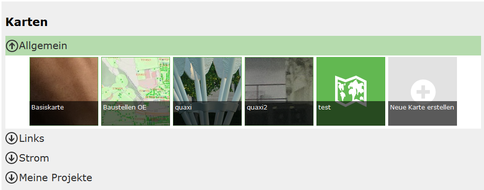

Voraussetzung
=============

In diesem Dokument wird beschrieben, wie Karten, die für eine Portalseite erstellt wurden parametriert aufgerufen werden könne. Voraussetzung ist hier, dass eine Portalseite existiert, die Karten enthält.

Karten sind in einer Portalseite wie in einer Kartensammlung organisiert. Jede Karte hat einen Namen und ist einer Kategorie zugeordnet:

Der Aufruf einer Karte erfolgt immer über die Url:

.. code-block::

    https://{Host}/{Portal-Applikation}/{Portal-Seite}/{Kategorie}/{Kartenname}

==================  =============================================================================
Host	            Der Server, auf dem die Portal Applikation installiert ist
Portal-Applikation	Der Name der Portal Applikation im IIS
Portal-Seite	    Die Url der Portalseite, wie sie vom Subscriber/Ersteller festgelegt wurde
Kategorie	        Kategorie, in der sich die Karte befindet
Kartenname	        Der Name der Karte
==================  =============================================================================

**Achtung:** Beinhaltet der Kartenname oder die Kategorie Sonderzeichen, müssen diese für die Darstellung in der Url kodiert werden. Leerzeichen können mit %20 oder zur besseren lesbarkeit auch mit einer Tilde (~) angegeben werden. ZB. Plaung~und~Kataster

Will man beispielsweise die Basiskarte direkt aufrufen, lautet die Url:

.. code-block::

    https://{host}/{portal-applikation}/{portal-seite}/Allgemein/Basiskarte
