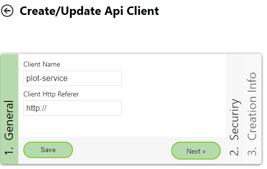

Plot Service
============

Mithilfe des *PlotService* API können Ausdrucke im PDF Format abgeholt werden. Dazu wird 

* der Name (plus Kategorie und Portalseite) der Karte
* ein Drucklayout
* ein Maßstab
* und eine Bounding-Box (plus EPSG-Code, falls nicht WGS 84)

übergeben.

Layout Xml Files
----------------

Die API versucht  den übergeben Bereich in das Kartenlayout einzupassen, unter der Voraussetzung, dass dies für den übergeben Maßstab möglich ist.
Dazu probiert die API unterschiedliche Papiergrößen (A4, A3, ...) und Ausrichtungen (Hoch-, Querformat) aus. Sobald eine Papiergröße gefunden wird, wir ein PDF File für diese Papiergröße erzeugt.

Welche Papiergrößen und Ausrichtungen möglich sind, kann im jeweiligen Layout.xml File definiert werden:

.. code:: xml

   <layout to-jpg-if-greater="5" image-format="jpg" 
      plot_service_page_sizes="A4,A3,A2"
      plot_service_page_orientations="Landscape,Portrait" >

Die Attribute für das *PlotService* beginnen mit ``plot_service_``:

* ``page_sizes``: Papiergrößen
* ``page_orientations``: Ausrichtungen

Die Reihenfolge der hier angeführten Werte entspricht auch dir Reihenfolge, in der getestet wird, ob der gewünschte Ausschnitt mit dem übergeben Maßstab gedruckt werden kann.
Im hier gezeigten Beispiel würde beispielsweise so getestet:

1. A4.Portrait
2. A4.Landscape
3. A3.Portrait
4. A3.Landscape
5. ...

Wird bis zum Schluss keine mögliche Papiergröße/Ausrichtung Kombination gefunden, gibt die API einen Fehler zurück.

.. note::
   Die beiden Xml-Attribute ``plot_service_page_sizes`` und ``plot_service_page_orientations`` sind die Voraussetzung, damit ein Ausdruck erstellt werden kann. Das Druckservice
   funktioniert in der Regel für alle Karten, allerings nur für Layouts, für die die beiden Attribute gesetzt wurden.
   Zusätzlich muss/kann beim Aufruf der API eine ``ClientId`` und ``ClientSecret`` (siehe unten) übergeben werden. Das Erzeugen von PDFs ist nur für die Karten möglich, die für den 
   aktuellen Client sichtbar sind. Ebenfalls müssen alle Dienste in der Karte für den Client berechtigt sein. Andernfalls liefert die API einen Fehler.

.. note::
   Beim Aufruf des *PlotService* wird eine Karte übergeben. Die übergeben Karte muss das Druckwerkzeug und dem entsprechenden Layout enthalten! 
   Ist das Layout nicht im MapBuilder für diese Karte definiert worden, liefert das *PlotService* eine Fehlermeldung.

.. note::
   Manche Layout sind über ``<layout scales="5000,2500,1000" >`` nur für bestimmte Maßstabe zugelassen. Das gibt auch wenn dieses Layout mit den *PlotService* verwendet wird. Wird ein anderer Maßstab übergeben, liefert das *PlotService* eine Fehlermeldung.

REST Aufruf
-----------

Das *PlotService* lässt sich über die REST Schnittstelle der WebGIS API unter ``https://{api-url}/rest/plotservice`` aufrufen. Der Aufruf muss über einen ``HTTP POST`` Request erfolgen.
Als Parameter werden die oben angeführten zwingenden Parameter übergeben (als Http Form):

.. code::

   mapName=Basiskarte&mapCategory=Allgemein&mapPortal=dev&layout=lkmyzkjugleodsjpu-75pdg@ccgis_default&scale=1000&bbox=-68310.17,215052.83,-67577.19,216004.68&bbox_srs=31256

* ``mapPortal``, ``mapName``, ``mapCategory``: Damit wird die Karte definiert, die gedruckt werden sollte.

* ``layout``: Gibt das Layout an, das gedruckt werden sollte. In diesem Layout müssen die oben angeführten Attribute ``plot_service_page_sizes`` und ``plot_service_page_orientations`` enthalten sein. 
  Als Wert kann hier die CMS Id das Layouts (siehe oben) oder der CMS-Name des Layouts angeführt werden, zB ``layout=strom-standard``. 

* ``scale``: Der Zielmaßstab für den Plot. Hier kann auch eine Liste von Maßstäben übergeben werden ``scale=1000,2000,5000``. Das Plotservice probiert in sortierter Reihenfolge (kleinster Wert zuerst), ob ein Druck möglich ist.
  Sobald eine Maßstab/Papiergrößen Kombination gefunden wird, wird der Druck mit dieser Kombination erstellt. Vorgehensweise: Erster Maßstab wird mit allen möglichen Papierformaten getestet. Ist keine Kombination möglich,
  wird der nächste Maßstab verwendet. Ist das Layout nur für bestimmte Maßstäbe zugelassen (siehe oben), müssen alle Übergebenen Maßstäbe zugelassen sein. Ansonsten wir ein Fehler zurückgegeben.

* ``bbox``: Der Bereich (Bounding-Box), der ausgedruckt werden sollte. Werden die Koordinaten hier nicht in *WGS84* (=EPSG Code 4326) übergeben, muss das Koordinatensystem über den Parameter ``bbox_srs`` als EPSG Code übergeben werden.

Das Response eines *PlotService* Aufrufes kommt als JSON in folgender Form:

.. code:: Javascript

   {
      "name": "print_0a0d0ccb44f54ad7b9dce8f328052ae2.pdf",
      "base64": "JVBERi0xLjQKJdP0zOEKMSAwIG9iago8PAovQ3JlYXRpb25EYXRlKEQ6MjAyMDEyMTQwODQyNDYrMDEnMDAnKQovQ3JlYXRvcihQ....",
      "page_format": "A4.Landscape",
      "scale_dominator": 1000,
      "success": true,
      "exception": null
   }

* ``name``: Eine Name für die Ausgabedatei (Vorschlag)
* ``base64``: Das eigentliche PDF File (Base64 kodiert)
* ``page_format``: Das für den Plot gewählte Papierformat
* ``scale_dominator``: Der verwendete Maßstab
* ``success``: Gibt an, ober der Ausdruck ohne Fehler erfolgt ist (``true``). Wird hier ``false`` zurück gegeben, ist während des Druckes ein Fehler aufgetreten. Eine genauere Beschreibung des Fehlers wird unter ``exception`` angeführt.
* ``excepiton``: Hier werden Fehler wärendend des Ausdrucks als ``String`` zurück gegeben. Ein Fehler kann zB sein, dass der übergebene Ausschnitt mit keinem Papierformat möglich ist. Fehler können aber auch in den zugrundeliegenden Diensten
  auftreten. Hier kann es auch vorkommen, dass ein PDF zurückgeliefert wird, in dem Daten/Dienste fehlen können. Um sicher zu gehen, dass während des Ausdrucks alle Dienste verfügbar waren, ist daher unbedingt der ``success`` und ``excepiton`` 
  Wert auszuwerten.  

Weiter optionale Übergabeparameter sind:

* ``dpi``: Die Auflösung, in der gedruckt werden sollte, default ``dpi=120``
* ``filters``: Übergabe von Darstellungsfiltern
* ``presentations``: Darstellungsvarianten

API Client (.NET Standard)
--------------------------

Wird das *PlotService* von einem .NET Programm aufgerufen, wird empfohlen, die Library ``E.Standard.WebGIS.Api.Client`` zu verwendet. Darin ist ein Service ``E.Standard.WebGIS.Api.Client.Services.WebGISPlotService`` enthalten,
das den Aufruf abstrahiert. Damit wird vor allem die Übergaben von komplexeren Parametern (``filters``, ``presentations``) vereinfacht.

Ein Beispielprojekte, das die Vorgehensweise zeigt, ist die .NET Core Konsolenanwendung ``WebGIS.Api.Test.Client``.

Um das Service verwenden zu können, muss es über *DependencyInjection* eingebunden werden. Zusätzlich muss auch 
``IHttpClientFactory`` für die *DependencyInjection* hinzugefügt werden, zB:

.. code:: 

   services.AddHttpClient("plostservice", c => {})
         .ConfigurePrimaryHttpMessageHandler(() => new HttpClientHandler()
          {
             ServerCertificateCustomValidationCallback = (sender, cert, chain, sslPolicyErrors) => { return true; }
          });

   services.AddWebGISPlotService(o=>
   {
      o.HttpClientName = "plotservice";
   });

Danach kann ``WebGISPlotService`` über *DependencyInjection* eingebund werden. Die Methode ``RunAsync``
führt einen Aufruf zum PlotService aus:

.. code:: 

   var response = await plotService.Run("https://localhost:44341", 
      new WebGISPlotServiceRequestOptions("dev", "Allgemein", "Basiskarte und Kataster", "layout-standard", 2000)
      {
         BBox = new double[] { -68310.17, 215052.83, -67577.19, 216004.68 },
         BBoxSrs = 31256
      });
   
   // alternativ mit übergaben von mehrere möglichen Maßstäben
   var response = await plotService.Run("https://localhost:44341", 
      new WebGISPlotServiceRequestOptions("dev", "Allgemein", "Basiskarte und Kataster", "layout-standard", new int[]{ 1000,2000,2880 })
      {
         BBox = new double[] { -68310.17, 215052.83, -67577.19, 216004.68 },
         BBoxSrs = 31256
      });
  
.. note::
   Alle weiteren möglichen Übergabeparameter können dem ``WebGISPlotServiceRequestOptions`` entnommen werden.

Der Rückgabewert ist vom Type ``WebGISPlotServiceResponse``. Auch hier ist es wieder wichtig zu überprüfen,
ober der Plot erfolgreich war (``response.Success = true``):

.. code:: 

   Console.WriteLine($"Request Succeeded: { response.Success }");
   if (!response.Success)
   {
      Console.WriteLine($"Response Message: { response.ExceptionMessage  }");
   }
   else
   {
      string fileName = $@"c:\temp\{ response.Name }";
      Console.WriteLine($"Write file: { fileName }");

      await System.IO.File.WriteAllBytesAsync(fileName, response.BinaryResult);
   }

Darstellungsvarianten
---------------------

Darstellungsvarianten können über den Parameter ``presentations`` übergeben werden. Der Parameter muss ein JSON String sein. 
Hier wird nur beschrieben, wie Darstellungsvarianten über die API Client Library übergeben werden:

.. code::

   Presentations = new WebGISPresentationDefinition[]
   {
      new WebGISPresentationDefinition()
      {
         Id="dv_overviewmap_off",
         ServiceId="overviewmap_ags@my_cms"
      },
      new WebGISPresentationDefinition()
      {
         Id="dv_streets_and_addresses",
         ServiceId="basemap_ags@my_cms",
         Check = true
      }
   }

Die hier übergebenen Darstellungsvarianten entsprechend den *Layerschaltungen* aus dem CMS auf Dienstebene (Nicht die unter *Karten Viewer/Darstellungsvarianten*).
Dazu muss für jede Darstellungsvariante, die geschalten werden sollte die *Id* Der Darstellungsvariante und die *Id* des Dienstes übergeben werden.
Die Übergebenen Darstellungsvarianten werden in der Reihenfolge ausgeführt, in der sie hier angeführt werden.

Der Wert für ``Check`` (default = null) gibt an, wie die Darstellungsvariante angewendet wird:

* ``null`` (default): Darstellungsvariante wird wie eine *Button-Darstellungsvariante* behandelt. Alle Layer des Dienstes, außer die in der Layerschaltung angeführten, werden unsichtbar. Alle Layer aus der *Layerschaltung* werden sichtbar geschalten.
* ``true``, ``false``: Die Layer, die in *Layerschaltung* angeführt sind, werden sichtbar (``true``) oder unsichtbar (``false``) geschalten. Die Sichtbarkeit aller anderen Layer bleibt unberührt (entspricht einer *Checkbox-Darstellungsvariante*)

.. note::
   Wird ein hier angeführter Dienste, Darstellungsvariante oder Layer nicht gefunden, liefert die API eine Fehlermeldung und keine Druck wird erzeugt.

Layer Sichtbarkeit
------------------

Ähnlich wie bei Darstellungsvarianten, können auch einzelne Layer über den Parameter ``layers`` sichtbar bzw. unsichtbar geschalten werden:

.. code::

   Layers = new WebGISLayerVisibilityDefintion[]
   {
      new WebGISLayerVisibilityDefintion()
      {
         ServiceId="tor_tiles_gray@my-cms",
         Layers=new string[]{ "0" },
         Visible=true
      },
      new WebGISLayerVisibilityDefintion()
      {
         ServiceId="strassen_tiles_default@my-cms",
         Layers=new string[]{ "0" },
         Visible=true
      }
   }

Hier muss die *Id* des Dienstes und eine Liste von *Layer-Ids* (oder Layer Namen) übergeben werden. Der Wert für ``Visible`` gibt an, ob die Layer sichtbar (``true``) oder unsichtbar (``false``) geschalten werden.

.. note::
   Wird ein hier angeführter Layer nicht gefunden, liefert die API eine Fehlermeldung und keine Druck wird erzeugt.

.. note::
   Möchte man Hintergrunddienste schalten, ist die *Layer-Id* für den *TileCache* immer ``"0"``. Schaltet man einen Hintergrunddienst mit dieser Methode, werden alle anderen Hintergrunddienste automatisch unsichtbar geschalten.
 

Authentication
--------------

Karten, Dienste usw. können über das WebGIS CMS berechtigt werden. Möchte man nicht öffentliche Dienste ausdrucken,
müssen entsprechende *Credentials* beim API Aufrufen übergeben werden. Die Authenfikation erfolgt für API Aufrufe in der Regel über *Clients*.

Eine *Client* kann von einem *Subscriber* über die API Administrations Oberfläche angelegt werden:

Wichtig für den Aufruf sind die ``ClientId`` und das ``ClientSecret``:

.. image:: img/plotService2.png

Im CMS müssen jetzt alle notwendigen Dienste für diesen Client berechtigt werden. Der Name, der im CMS angegeben werden muss ist ``{subscriber}@{client-name}``.
Wurde der oben gezeigte Client vom Subscriber ``subscriber::gis-admim`` angelegt, muss im CMS ``subscriber::gis-admin@plot-service`` angeben werden.

Beim Aufruf der API muss die *ClientId* und das *ClientSecret* mit folgenden Parameter übergeben werden:

.. code::

   &client_id=....&client_secret=...

Verwendet man die .NET Standard API Client Library, kann der Client beim Aufruf folgendermaßen übergeben werden:

.. code::

   var response = await plotService.RunAsync("https://localhost:44341", 
            new WebGISPlotServiceRequestOptions("dev", "Allgemein", "Basiskarte und Kataster", "strom-standard", 2000)
            {
                BBox = new double[] { -68310.17, 215052.83, -67577.19, 216004.68 },
                BBoxSrs = 31256
            },
            new WebGISApiClient("0e4....", "8337f....."));

