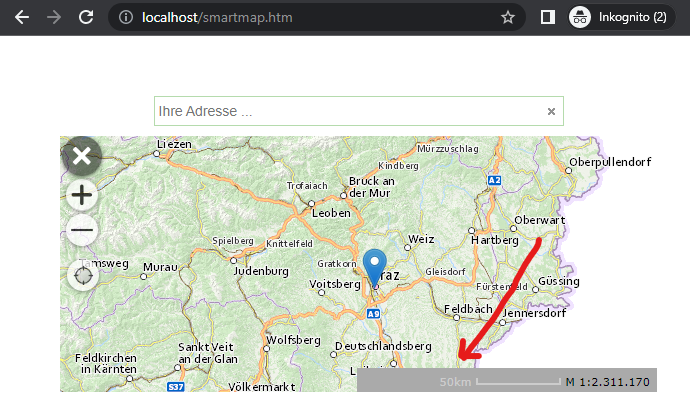

Smartmap mit Verschiebbarem Kartenmarker
========================================

In diesem Beispiel sollte nicht nur der Marker in der Karte dargestellt werden,
wenn der Anwender ein Ergebnis in über die Suche findet. Der Marker sollte auch 
über einen Klick in die Karte gesetzt werden können. Ein Marker, der sich 
bereits in der Karte befindet, sollte ebenfalls per *Drag & Drop* an eine beliebige 
Stelle gezogen werden können.

Immer wenn die Position des Marker in der Karte neu gesetzt wird, sollte die 
Webseite darüber informiert werden und die dann beispielsweise an das Server-backend 
schicken um weiter Information abzufragen.

.. note::
    Zusätzlich wird hier noch eine Maßstabsleiste mit Sanduhr in die Karte eingebaut.
    Das erfordert zusätzliche *HTML Elemente* und die ``map.ui.createHourglass`` Methode (siehe unten).

Die einzubindenden Script entsprechen denen der einfachen *Smartmap* aus dem letzten Beispiel.

Im HTML Block, kommen jetzt die Element für die Maßstabsleiste dazu:

.. code:: html

    

    

    

        

            

        

    

Im Javascript wird zum Beispiel von vorher folgendermaßen erweitert:

.. code:: javascript

    // The WebGIS API Client ID
    webgis.clientid = 'ba2c101cbe6d40ad96c897be5dadf2eb';  // only an example client id, not valid

    webgis.init(function () {
    var map = null, draggableMarker = null;

    function setDraggableMarkerPos(lng, lat) {
        if(!map) {
            return;
        }

        if(!draggableMarker) {
            draggableMarker = webgis.createMarker({
                lat: lat,
                lng: lng,
                icon: 'blue',
                draggable: true
            });
            draggableMarker.addTo(map.frameworkElement);
            draggableMarker.on('dragend', function(e) {
                var pos = draggableMarker.getLatLng();
                commitPosition(pos.lng, pos.lat);
            });
        } else {
            draggableMarker.setLatLng({lat: lat, lng: lng});
        }

        commitPosition(lng, lat);
    };

    function commitPosition(lng, lat) {
        console.log('commit coordinates to server', lng, lat);
    };

    $('#smartmap-container').webgis_smartmap({
            map_options: {
                services: 'geoland_bm@webgiscloud',
                extent: 'web_mercator_at@webgiscloud',
                enabled: false
            },
            quick_search_service: 'webgis_cloud_allgemein@webgiscloud',
            quick_search_category: '',
            quick_search_placeholder: 'Ihre Adresse ...',
            quick_search_map_scale: '',
            quick_tools: 'webgis.tools.navigation.currentPos',
            on_init: function (options) {
                map = options.map;
                // UI
                // temporäre DOM Elemente in den webgis-contaier kopiren
                $('#map-container-ui').children().each(function () {
                    $(this).appendTo($(options.webgisContainer));
                });
                options.map.ui.createHourglass('#map-container-hourglass');

                map.setScale(2000000, [15.2, 47.3]);

                map.frameworkElement.on('click',function(e) {
                    if(e.latlng) {
                        console.log('map-click', e.latlng);
                        setDraggableMarkerPos(e.latlng.lng, e.latlng.lat);
                    }
                });
            }
        })
        .data('eventHandlers')
        .events
        .on('onfeaturefound', function (channel, args) {
            var feature = args.feature,
                marker = args.marker;

            map.removeMarker(marker);
            //console.log('feature', feature);

            if(feature && feature.coords) {
                setDraggableMarkerPos(feature.coords[0], feature.coords[1]);
            }
        });
    });

In der ``on_init`` Methode der *Smartmap* wird die Sanduhr und Maßstabsleiste 
erstellt. Über das ``map.frameworkElement`` eine eine *Eventlistener* für das 
``click`` Ergebnis angelegt. Klickt der Anwender in die Karte, wird diese Funktion 
aufgerufen und der Marker neu positioniert.

Über die ``eventHandlers`` der *Smartmap* kann auf das ``onfeaturefound`` Event 
zugegriffen werden. Dieses Event wird immer ausgelöst, wenn der Anwender ein 
Ergebnis in der Karte findet. In der Methode wird der Suchergebnis-Marker aus der 
Karte entfernt. Statt dessen wir eine "verschiebbarer" Marker an die entsprechende Position gesetzt.

In der Funktion ``setDraggableMarkerPos(lng, lat)`` wird der Marker immer an die gewünschte Position 
gesetzt. Das passiert, wenn der Anwender in die Karte klickt und ein Ergebnis aus der Suche auswählt.
Ist der Marker noch nicht in der Karte, wird er über ``webgis.createMarker`` mit der Eigenschaft 
``draggable: true`` erstellt. Der Marker bekommt ebenfalls einen Eventlistener auf ``dragend``, damit 
das Backend die neue Position nach dem Verschieben des Markers informiert wird.

Die Funktion ``commitPosition(lng, lat)`` kann verwendet werden, um die aktuelle Position 
an das Backend zu übergeben. Im Beispiel wird diese immer Aufgerufen sobald der Marker neue Koordinaten 
bekommt.

Das komplette Beispiel befindet sich unter:

https://github.com/gis-eni/webgis-examples/blob/main/api/plugins/smartmap/smartmap-draggable-marker.html

