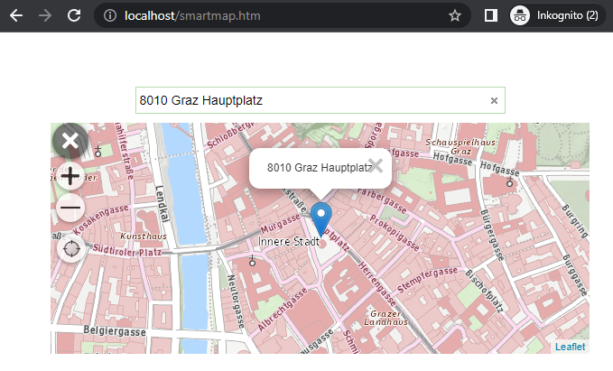

Einfache Smartmap Anwendung
===========================

In diesem Beispiel wird ein einfacher Anwendungsfall gezeigt, 
in dem eine Karte inklusive Suchfeld auf eine Webseite eingebunden wird. 
Der Anwender kann in der Karte navigieren. Wählt er eine Adresse aus dem 
Suchfeld aus, wird in der Karte an die entsprechenden Position gesprungen und ein *Marker* mit dem 
Suchtreffer als Text angezeigt:

Damit das *Smartmap-Plugin* verwendet werden kann, müssen auf der Webseite die üblichen WebGIS-API 
Scripte und das Script für das *Smartmap-Plugin* eingebunden werden:

.. code:: html

    <!-- required styles and scripts: jquery, api, api-ui, smartmap -->
    
    

    <link href="https://api.webgiscloud.com/content/styles/default.css" rel="stylesheet" />
    <link href="https://api.webgiscloud.com/content/api/ui.css" rel="stylesheet" />

    
    

    <link rel="stylesheet" href="https://api.webgiscloud.com/scripts/api/plugins/smartmap/smartmap.css" />
    

Innerhalb des *HTML Body Elements* muss dann ein *HTML Element* definiert werden, 
in dem die *Smartmap* dargestellt werden soll:

.. code:: html

    

    

Das Einbinden der *Smartmap* erfolgt im *Scriptblock* der Seite, bzw. in einer einer eigenen Javascript
Datei, die nach den oben Angeführten Scripts geladen werden muss.

.. code:: javascript

    // The WebGIS API Client ID
    webgis.clientid = 'ba2c101cbe6d40ad96c897be5dadf2eb';  // only an example client id, not valid

    webgis.init(function () {    
        webgis.$('#smartmap-container').webgis_smartmap({
            map_options: {
                services: 'geoland_bm@webgiscloud',
                extent: 'web_mercator_at@webgiscloud',
                enabled: false
            },
            quick_search_service: 'webgis_cloud_allgemein@webgiscloud',
            quick_search_category: '',
            quick_search_placeholder: 'Ihre Adresse ...',
            quick_search_map_scale: '',
            quick_tools: 'webgis.tools.navigation.currentPos',
            on_init: function (options) {
                // smartmap initialized
                options.map.setScale(2000000, [15.2, 47.3]);
            }
        });
    });

.. note::
   
   Wie für jede WebGIS API Anwendung muss zuerst die `webgis-clientid` angegeben werden.
   Die Domain der Webseite muss für diesen *Client* registriert sein (zB http://localhost).

Wurde ``webgis`` erfolgreich initialisiert, kann innerhalb der ``webgis.init`` Methode die 
*Smartmap* erstellt werden. 

Übergeben werden die Kartendienste (``map_options.services``) und der Kartenausschnitt (``map_options.extent``).
Über ``map_options.enabled`` kann angegeben werden, ob die Karte beim Start aktiv ist.
Bei Karten, die in eine größere Webseite eingebunden werden, wird empfohlen, dass dieser Wert auf ``false``
gesetzt wird. Der Anwender muss die Karte dann vor der Verwendung zuerst mit einem Klick aktivieren.
Das erhöht die *Usability*, da ansonsten beim Scrollen über die Seite unabsichtlich in die Karte gezoomt werden 
kann und der Anwender schlimmstenfalls nicht mehr "normal" auf über die Seite scrollen kann.

Über die ``quick_search_*`` Eigenschaften kann die Suche genauer spezifiziert werden.
Neben dem Suchdienst, kann eine Platzhalter für das leere Suchfeld angegeben werden. Ebenfalls kann 
ein Maßstab angegeben werden, auf den gezoomt wird, wenn der Anwender ein Suchergebnis auswählt.

Über die ``quick_tools`` wird angeben, welche Schnellwerkzeuge in der Karte neben ``+`` und ``-`` angezeigt werden.
``webgis.tools.navigation.currentPos`` stellt beispielsweise einen Button zur Verfügung, 
mit der der Anwender auf seine aktuelle Position in der Karte springen kann.

Ist die *Smartmap* initialisiert, wird die ``on_init`` Funktion aufgerufen. 
Hier kann, wie im Beispiel gezeigt, auf eine einen bestimmen Maßstab gesprungen werden.

Das komplette Beispiel befindet sich unter:

https://github.com/gis-eni/webgis-examples/blob/main/api/plugins/smartmap/smartmap-simple.html