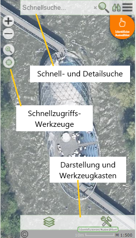

.. sectnum::
    :start: 1

Übersicht
=========

Nach dem Öffnen einer Karte erscheint der Kartenviewer in folgender Form:

Es müssen in einer Karte nicht alle hier gezeigten Elemente sichtbar sein. Die einzelnen Elemente werden vom Karten Administrator so festgelegt,
dass eine effiziente Bedienung für die jeweilige Anwendung möglich ist. 

Auf mobilen Geräten kann sich das Erscheinungsbild entsprechend anpassen:

