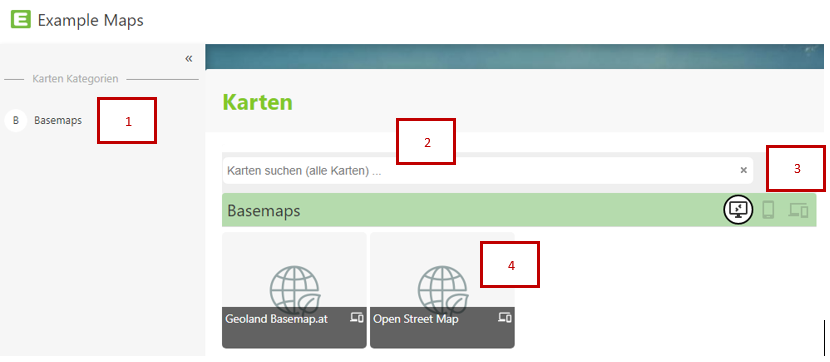
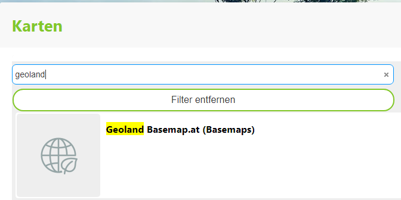

Kartenportal (Kartensammlungen)
===============================

Das es für die unterschiedlichen Anwendungsfälle mehrere Karten geben kann, ist der Einstiegspunkt für das WebGIS ein Kartenportal (bzw. eine Kartensammlung).
In diesem Portal werden alle Karten (gegliedert in Kategorien) aufgelistet:

Werden viele Karten angeboten, gibt auf für die Kartensammlung auch die Möglichkeit nach Karten zu suchen:

Gibt man Suchbegriffe ein, werden nur mehr jene Karten angezeigt, die zum aktuellen Suchbegriff passen. Dazu wird nicht nur im Karten-Titel gesucht, sondern auch einer eventuell 
vorhanden Beschreibung der Karten, wie wiederum auch *Schlagwörter* zum leicheren Auffinden von Karten dienen können (z.B. Kann ein Karte *Kataster* auch über die Schlagwörter *Grundstücke* gefunden werden)

Klickt man auf einer der Kacheln, wird der Kartenviewer mit der entsprechenden Karte geöffnet.