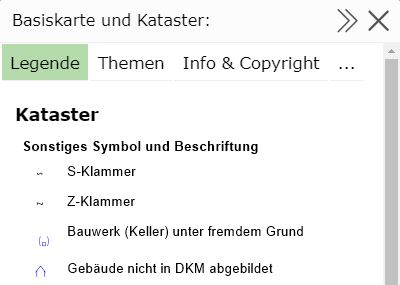
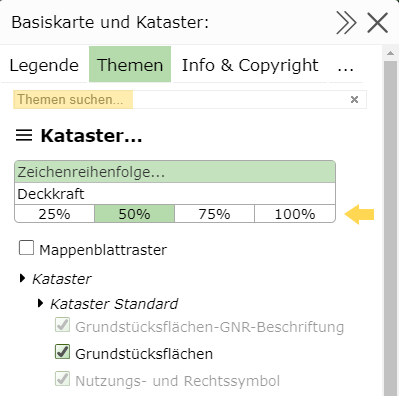

.. sectnum::
    :start: 4

Legende und Themen
==================

Durch komplexe Kartographie ist der Inhalt einer Karte nicht immer selbsterklärend. Um der Symbolik in der Karte ein entsprechendes Objekte 
zuordnen zu können, ist oft eine Legende hilfreich.

In der Legende werden alle kartographischen Symbole mit einer erklärenden Bezeichung dargestellt.

Die Legende kann über den Darstellungsvarianten Baum geöffnet werden:

Jeder Container bzw. auch der gesamte *Darstellung* Block bietet ein *Menü* Symbol an. Durch einen Klick wird ein entsprechendes Fenster mit weiteren Funktionen geöffnet.

.. note::
   Klickt man auf das Menü Symbol im *Darstellung* Block, öffnet sich das Eigenschaften Fenster für alle Themen. Interessiert man sich beispielsweise nur für die Legende
   der *Basisdaten* reicht es auch, auf das Menü Symbol für diesen Container zu klicken. Die Inhalte werden dann nur auf die in diesem Container enthaltenen Inhalte beschränkt 
   und sind so für die meisten Anwendungen übersichtlicher.

Ein Klick auf das *Menü Symbol* öffnet folgender Dialog:

.. note::
   **Tipp:** das Fenster kann über das Pfeilsymbol in der Titelzeile verbreitert bzw. wieder verschmälert werden. Den gleichen Effekt löst ein Klick auf die Titelzeile aus.
   Das Maximieren/Minimieren über einen Klick auf die Titelzeile funktioniert auch bei allen anderen Dialogen, die im Kartenviewer angezeigt werden.

   Mit dem **X** Symbol kann ein Dialog wieder geschlossen werden.

Der Dialog ist noch zusätzlich in unterschiedliche *Tabs* (Legende/Themen/Beschreibung und Copyright/Karteninfo) aufteilt

Legende
-------

Hier werden die kartographischen Symbole angezeigt. Diese werden nach Kartendiensten gruppiert.

.. note::
   **Hintergrundwissen:** Die Fachdaten, die im Kartenviewer dargestellt werden, kommen in der Regel von mindestens einem Kartendienst. Diese Dienste erledigen die kartographische Aufbereitung der Daten
   nach den individuellen Einstellungen durch den Anwender.

Die Legendenansicht ist dynamisch. Was angezeigt wird, ist von der aktuellen Sichtbarkeit der Themenebenen abhängig. Ein Ändern des Maßstabes oder des Kartenausschnittes kann auch den Inhalt der Legende verändern.

Themen
------

Die schon erwähnten (und für die Kartographie verantwortlichen) Kartendienste bestehen aus (oft sehr vielen) einzelnen Themenebenen. Sinnvolle Gruppierungen dieser Themenebenen können über die Darstellungsvarianten 
(siehe Abschnitt Darstellung und Karteninhalte) ein- und ausgeblendet werden. In der Regel sollten diese vordefinierten Schaltungen ausreichend sein.
Für spezielle Anforderungen kann es aber vorkommen, dass die vordefinierten Einstellungen nicht ausreichen und eine andere Kombination der Themenebenen wünschenswert ist.
Dafür werden in diesem Dialog alle möglichen Einzelthemenebenen der Kartendienste aufgelistet und hier schaltbar gemacht.

.. note::
   Der Themenbaum kann sehr umfangreich und unübersichtlich werden. Mehrere hundert Ebenen sind oft die Regel. Um sich im Baum besser zurecht zu finden, werden Themen teilweise in Gruppen zusammengefasst.
   Außerdem gibt es (wie auch bei den Darstellungsvarianten) die Möglichkeit über ein Suchfeld *Themen suchen...* den Baum auf einen Suchbegriff einzuschränken.

Der Dialog bietet ebenfalls die Möglichkeit einzelne Kartendienste über die *xx% Buttons* transparent darzustellen:   

Gleich wie bei den Darstellungsvarianten werden Themenebenen, die im aktuellen Kartenmaßstab nicht sichtbar sind *grau* dargestellt.

Beschreibung und Copyright
--------------------------

In diesem Bereich wird für die einzelnen Kartendienste (falls vorhanden) eine Beschreibung und ein Copyright Text angezeigt.

Karteninfo
----------

Hier werden weitere Informationen für die aktuelle Karte angezeigt:

* Name der Karte und Name der Kartengruppe/Kategorie

* (Benutzername) des Kartenautors/Administrators

* Der eigene Benutzername mit dem man für Benutzung der Karte angemeldet ist (falls anonymer Zugriff nicht erlaubt wird)

* Credits/Danksagungen der Kartenviewer Applikation

* Administratoren kommen von hier zu den Admin Tools für die Karte (MapBuilder...)

