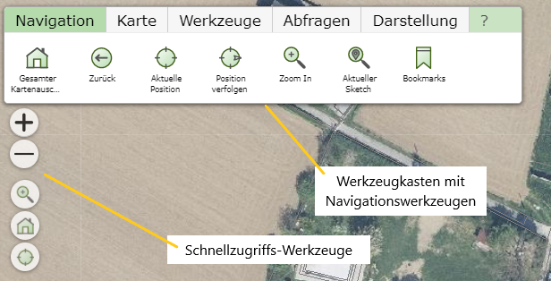

.. sectnum::
    :start: 2

Navigation in der Karte
=======================

Die Navigation in der Karte kann über die Maus (am Desktop), mit den entsprechenden Wischgesten (mobile Endgeräte) oder einer Kombination aus beiden erfolgen.

Navigation mit der Maus
-----------------------

* **Kartenausschnitt verschieben:** Dazu muss mit der linken Maustaste in die Karte geklickt und bei gedrückt gehaltener Maustaste die Karte verschoben werden. Durch das Loslassen der Maustaste wird der Vorgang beendet.

* **Kartenausschnitt vergrößern/verkleinern:** Dies kann mithilfe des Mausrades erfolgen.  Das nach Vorne drehen des Mausrads verkleinert den Ausschnitt und umgekehrt.

Navigation mit Wischgesten
--------------------------

* **Kartenausschnitt verschieben:** Mit einem Finger die Karte berühren und Ausschnitt verschieben. 

* **Kartenausschnitt vergrößern/verkleinern:** Mit zwei Fingern die Karte berühren und die Finger auseinander ziehen, bewirkt eine Verkleinerung des Ausschnittes. Die umgekehrte Geste bewirkt eine Vergrößerung des Ausschnittes.

Werkzeuge zur Navigation:
-------------------------

In einer Karte stehen je nach Möglichkeiten diverse Navigationswerkzeuge im Werkzeugkasten oder bei den Schnellzugriffs-Werkzeugen zur Verfügung.

Die Schnellzugriffs-Werkzeuge befinden sich in der Regel links oben direkt in der Karte (um das Kartenbild nicht zu stören, können diese leicht transparent dargestellt werden):

Bei den Schnellzugriffs-Werkzeugen befinden sich in der Regel eine kleine Auswahl der Werkzeuge, die auch im Navigations-Werkzeugkasten zu finden sind. Der Vorteil ist hier, dass diese Werkzeuge
immer sichtbar sind. Die Werkzeuge des Werkzeugkastens sind teilweise versteckt. Beispielsweise ist der Werkzeugkasten auf mobilen Geräten mit kleinerem Bildschirm beim Start zugeklappt.
Die Schnellzugriffs-Werkzeuge bieten noch zusätzlich eine einfache Möglichkeit mit den +/- Buttons den Kartenausschnitt zu verkleinern bzw. zu vergrößern.

Der Werkzeugkasten hat den Vorteil, dass hier mit dem Werkzeugsymbol auch eine Bezeichnung des Werkzeugs angezeigt wird. 

Folgende Werkzeuge stehen unter *Navigation* zur Verfügung (abhängig von den Einstellungen des Kartenautors):

* **Gesamter Kartenausschnitt:** Mit diesem Werkzeug wird der Kartenausschnitt maximal vergrößert.

* **Zurück:** Hiermit kann nach einem Verschieben oder Zoomen wieder zum letzten Kartenausschnitt zurückgekehrt werden.

* **Aktuelle Position:** Es wird versucht, den Kartenausschnitt auf die aktuelle Position des Anwenders einzustellen. Dies ist abhängig von der Positionsgenauigkeit, die durch ein Endgerät bereitgestellt wird (GPS, ...).

* **Position verfolgen:** Auf mobilen Endgeräten ermöglicht dieses Werkzeug, dass der Kartenausschnitt mit der aktuellen Position des Anwenders mitwandert. Auf der aktuellen Position wird ein Pfeilsymbol mit der Bewegungsrichtung dargestellt. Im Werkzeugdialog wird die aktuelle Geschwindigkeit angezeigt.

* **Zoom In:** Dieses Werkzeug ermöglicht es dem Anwender, den aktuellen Kartenausschnitt durch das Aufziehen eines "Fensters" festzulegen. Wählt man dieses Werkzeug aus, kann im nächsten Schritt in die Karte geklickt und bei gedrückter Maustaste ein Fenster aufgezogen werden. Beim Loslassen der Maustaste versucht der Kartenviewer den aktuellen Kartenausschnitt bestmöglich an dieses Fenster anzupassen.

.. note::
   **Profitipp:** Auf Desktop Geräten mit Tastatur ist das Aufziehen eines Fensters auch immer ohne dieses Werkzeug möglich. Dazu muss mit gedrückter ``Shift`` Taste in der oben beschriebenen 
   Art ein Fenster aufgezogen werden.

.. note::
   Das Aufziehen eines Fensters mit der ``Shift`` Taste sollte nicht mit dem Aufziehen eines Fensters mit der ``Strg/Ctrl`` Taste verwechselt werden. Dabei wird nicht der Kartenausschnitt geändert, sondern die 
   Kartenobjekte (Grundstücke, Adressen, ...) im Fenster abgefragt (siehe Abschnitt *Suchen und Abfragen*) 

* **Aktueller Sketch:** Bei diversen Werkzeugen, die später noch behandelt werden (Messen, Objekte erstellen/bearbeiten), kann ein sogenannter *Sketch* gezeichnet werden. Dabei handelt es sich um eine Art Umrisszeichnung eines Objektes. Befindet sich in der Karte ein solcher *Sketch*, wird der Kartenausschnitt mit diesem Werkzeug so eingestellt, dass der gesamte Sketch sichtbar dargestellt wird.

