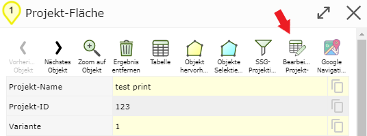
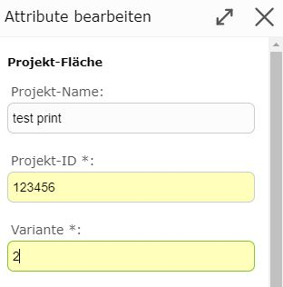
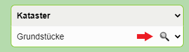

Build 3.0.3902 (24.09.2020)
===========================

Attribute Editieren aus Suchergebnissen
---------------------------------------

Werden Geo-Objekte über eine Suche oder Abfrage gefunden, die auch editierbar sind, können die Sachdaten
direkt bearbeitet werden. Dazu muss nicht mehr wie früher ins *Bearbeiten* Werkzeug gewechselt und
die Geo-Objekte dort ausgewählt werden.

.. note::
   Geo-Objekte können sowohl mit der Schnellsuche oder der Detailsuche gefunden werden. 
   Abgefragt werden Geo-Objekte mit dem *Identify* Werkzeug durch anklicken oder Fenster aufziehen.

Dafür erscheint jetzt in den Detailergebnissen des entsprechenden Geo-Objektes ein neuer Button:

.. note::
   Der *Button* steht nur für Geo-Objekte zur Verfügung, die auch bearbeitet werden dürfen.
   Ein Anwender muss dazu spezielle Berechtigungen besitzen.

Klickt man auf den *Button* öffnet sich eine Attributmaske mit dem die Sachdaten geändert werden können.

Wird der Dialog mit ``Speichern`` abgeschlossen, werden die Sachdaten entsprechend die Datenbank geändert.

Kategorisierte Auswahllisten für Such- und Editthemen
-----------------------------------------------------

In umfangreichen Karten wird die Auswahl von Suchthemen in der Detailsuche oder beim Identify oft mühsam.
Die Themen werden zwar in Gruppen (Diensten) mit Überschriften zusammengefasst dargestellt, da die Liste
allerdings sehr lange sein kann, muss zum Auffinden des gewünschten Themas oft lange *gescrollt* werden.

Ein Vereinfachung bieten hier *kategorisierte* Auswahllisten. Diese stehen für die Detailsuche, für
das Identify Werkzeug und beim Editthemen zur Verfügung.
Für die Detailsuche sieht die Auswahlliste etwa folgendermaßen aus:

Die Auswahlliste besteht jetzt aus zwei Auswahllisten. Die untere (weiße) Auswahlliste 
entspricht der bisherigen Liste mit Themen. Standardmäßig werden hier alle Gruppen mit allen Themen angezeigt (wie bisher).

In der oberen (grauen) Auswahlliste werden alle Gruppen (Überschriften) angeführt. Wählt man hier eine 
Gruppe aus, werden in der unteren Auswahlliste nur mehr die Themen dieser Gruppe angezeigt. Die Liste
wird dadurch kürzer und übersichtlicher. Unnötiges Scrollen kann so vermieden werden.

Möchte man wieder alle Themen in der Auswahlliste anzeigen, muss die Gruppe ``--- Alle --`` 
(oder die ursprüngliche Einstellung ``Kategorie wählen (optional)``) gewählt werden.

Ein weiteres Feature von *kategorisierten* Auswahllisten ist, dass nach Themen auch über Texteingabe
gesucht werden kann. Um die Suche zu aktivieren muss auf das *Lupen* Symbol geklickt werden:

Dadurch erscheint anstelle der zweiten Auswahlliste ein Eingabefeld:

In dieses Feld können Begriffe eingeben werden, die dem Namen des Themas entsprechen.
Sofort nach der Eingabe jedes Zeichens, werden in der Liste passende Themen angezeigt. Wählt man einen Vorschlag
aus (anklicken), wird dieser automatisch in die Auswahlliste übernommen.

.. note::
   **Achtung:** Die Suche nach Themen bezieht sich immer auf die aktuell eingestelle Gruppe (z.B. oben 
   auf *Kataster*). Es werden nur Themen aus dieser Gruppe gefunden. Möchte man in allen Gruppen suchen,
   muss die Auswahl auf ``--- Alle ---`` oder ``Kategorie wählen (optional)`` gesetzt werden.

