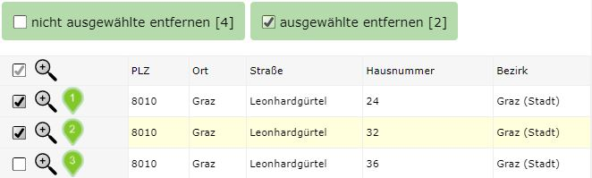
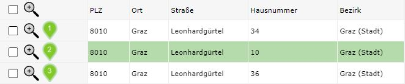
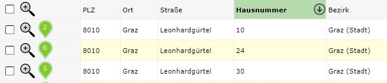

Build 3.0.4002 (1.10.2020)
==========================

Ergebnistabelle
---------------

Nach einer Suche oder Abfrage werden die Ergebnisse zuerst in der Ergebnisliste angezeigt.
Klickt man dort auf ein Ergebnis, werden in einem Dialog die Details dieses Geo-Objektes angezeigt.
Alternativ dazu können die Ergebnisse auch in einer Tabelle mit allen Feldern angezeigt werden.
Zur Tabelle kommt man über den Suchergebnisse Bereich, in dem auch die Ergebnisliste zu finden ist:

Mit der Tabelle werden Werkzeuge angeboten, die sich auf alle Ergebnisse beziehen, beispielsweise *Export als CSV für MS Excel*.

Ab Build 3.0.4002 bietet die Tabelle zusätzlich noch folgende Funktionen:

In der ersten Spalte werden zusätzliche *Buttons* (*Checkbox* und *Lupe*) angeboten.

Über die *Checkbox* können einzelne Zeilen ausgewählt werden. Dies kann verwendet werden, um Ergebnisse aus der 
Liste zu entfernen. Wählt man Zeilen aus, erscheinen über der Tabelle weitere *Buttons*, um markierte bzw. nicht
markierte Zeilen zu löschen:

Nach dem Entfernen der Zeilen werden ebenfalls die entsprechenden *Marker* in der Karte entfernt.

.. note::
   In der Titelzeile der Tabelle befindet sich ebenfalls eine *Checkbox*. Mit dieser können alle *Checkboxen*
   der einzelnen Zeilen geschallten werden.

.. note::
   Die beiden *Entfernen Buttons* erscheinen nur dann, wenn mindestens eine Zeile ausgewählt wurde.
   Allerdings verschwinden die *Buttons* auch, wenn alle Zeilen ausgewählt werden, da es nicht möglich
   ist alle Zeilen einer Abfrage zu löschen. 
   Möchte man alle Ergebnisse entfernen, kann dies beispielsweise über den *Ergebnisse entfernen Button*
   aus dem Suchergebnisse Bereich erfolgen:

    .. image:: img/table4.png

Das *Lupe Symbol* dient dazu, dass in der Karte in den Bereich des entsprechenden Geo-Objektes gezoomt wird.

.. note::
   Auch das *Lupen Symbol* gibt es in der Titelzeile der Tabelle. Dieses bewirkt, dass in der Karte auf einen 
   Bereich gezoomt wird, in dem alle Abfrageergebnisse enthalten sind.

Beim Zoomen mittels *Lupen Symbol* bleibt die Tabelle geöffnet. Das Standardverhalten der Tabelle ist,
dass nach einem Klick auf eine Zeile, ebenfalls auf das Geo-Objekt gezoomt wird. Allerdings wird hier die
Tablle geschlossen und die Detailergebnisse für dieses Geo-Objekt angezeigt.

Die Detailergebnisse bieten für dieses Geo-Objekt noch zusätzliche Werkzeuge (z.B. Navigation, Filter, usw.).
Neu ist hier, dass jetzt auch bei Detailergebnissen ein Werkzeug angeboten wird, um direkt in die Tabellenansicht
zu springen:

Öffnet man die Tabelle aus einem Detailergebnis Dialog eines Geo-Objektes, wird in der Tabelle auf die entsprechende
Zeile gesprungen und diese markiert dargestellt:

**Hinweis:** Die Tabelle kann auch nach einer oder mehrere Spalten sortiert werden. Dazu muss auf die 
entsprechende(n) Überschrift(en) geklickt werden.

1. Klick: nach dieser Spalte sortieren
2. Klick: Sortierreihenfolge umkehren
3. Klick: Sortierung aufheben

   
