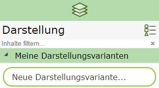
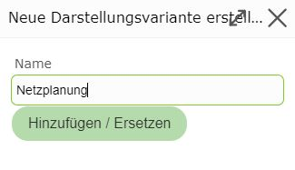
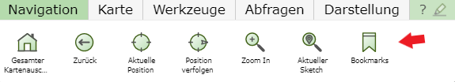
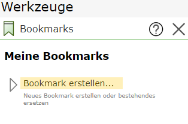
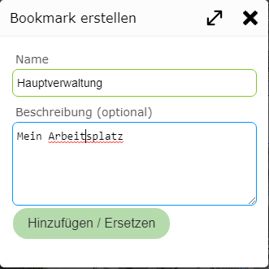

Build 3.21.1501 (14.04.2021)
============================

Meine Darstellungsvarianten
---------------------------

Mit *Meine Darstellungsvarianten* könnten für jede Karte benutzerdefinierte Darstellungsvarianten erstellt werden.

Wenn in einer Karte die ideale Layerschaltung gefunden ist, kann diese gespeichert und für diese Karte immer wieder verwendet werden.
Dazu klickt man bei den Darstellungsvarianten unter ``Meine Darstellungsvarianten`` auf ``Neue Darstellungsvariante``:

Damit öffnet sich ein Dialog, in dem ein Namen für die Darstellungsvariante vergeben werden muss:

Die neue Darstellungsvariante erscheint dann im Bereich ``Meine Darstellungsvarianten`` und kann von dieser Karte jederzeit wieder verwendet werden.

.. note::
   Möchte man eine bestehende benutzerdefinierte Darstellungsvariante ersetzen, ist die Vorgangsweise gleich. Wird in den Dialog ein bereits bestehender
   Name eingetragen, wird die Darstellungsvariante ersetzt. Als Hilfestellung werden per *Autocomplete* bestehende Darstellungsvarianten angeboten, sobald die 
   ersten Zeichen in das Eingabefeld eingegeben werden.

.. note::
   Hat man in eine Karte zusätzliche Dienste mit ``Dienste hinzufügen`` eingefügt und sind diese von der Darstellungsvariante betroffen, 
   werden diese Dienste beim nächsten öffnen der Karte automatisch nachgeladen, sobald die Darstellungsvariante ausgewählt wird.
   Dadurch können *benutzerdefinierte Darstellungsvarianten* auch das Speichern von Projekten ersetzen. Ein Vorteil zu Projekte ist hier außerdem,
   dass pro Karte mehrere *benutzerdefinierte Darstellungsvarianten* definiert werden können.
   
Bookmarks
---------

Zoom man immer wieder auf die gleichen geographischen Ausschnitte (Betriebsregion, Projektgebiet, …) wird empfohlenen, Bookmarks anzulegen. 
Über diese kann man dann mit wenigen Klicks zu den geographischen Ausschnitten springen.

Bookmarks werden global für den User angelegt. Das heißt, alle Bookmarks stehen in allen Karten zur Verfügung. Egal in welche WebGIS Karte man einsteigt, 
mit den Bookmarks kann auf den gewünschten Ausschnitt gezoomt werden.

Bookmarks werden über folgendes Werkzeug verwaltet:

Hat man auf den gewünschten Ausschnitt gezoomt und klickt danach auf ``Bookmark erstellen`` öffnet sich folgender Dialog:

Hier kann ein Name und optional noch eine genauere Beschreibung vergeben werden.
Klickt man auf ``Hinzufügen/Ersetzen`` erscheint das *Bookmark* in der Liste. Mit einem Klick auf ein *Bookmark* kann immer wieder auf den definierten Ausschnitt gezoomt werden.
Die aktuelle Darstellung wird dabei beigehalten.

Bookmarks sind nicht karten-spezifisch, das heißt alle erstellt Bookmarks stehen in allen Karten zu Verfügung.
