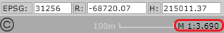
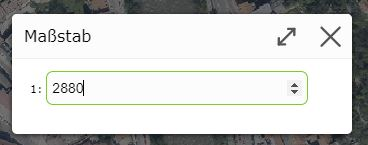

Build 3.21.1608 (29.04.2021)
============================

Kartenmaßstäbe (Freies Zoomen)
------------------------------

Die Maßstäbe für die Darstellung der Karte auf dem Bildschirm, waren bisher über Maßstäbe der vorprozessierten Hintergrund Karten-Kacheln (Ortsplan, Luftbild, ...) zwingend vorgegeben.
Da die Sprünge dieser Maßstäbe teilweise groß sind und die voreingestellten Maßstäbe nicht für jeden Anwendungsfall optimal sind, kann ab dieser Version *frei gezoomt* werden.

Zum Zoomen stehen die selben Werkzeuge wie bisher zur Verfügung:

* **Gesten:** Zwei-Finger-Zoom Gesten für Geräten mit Touchbedienung 
* **Zoom Werkzeug:** Einmaliges Aufziehen eines Fensters
* **Shift-Taskte:** bei gedrückter *Shift (Umschalt) Taste* kann mit der Maus immer ein Fenster aufgezogen werden, auf das gezoomt werden sollte. Diese Methode ist unabhängig von gerade aktiven Werkzeug.

Durch das freie Zoomen sind die Anzeigemaßstäbe nicht mehr *rund*:

Möchte man auf einen bestimmten Maßstab wechseln, erfolgt das wie bisher über einen Klick auf die Maßstabsanzeige.
Hier wird jetzt allerdings keine Auswahlliste mehr angezeigt, sonder im Dialog wird eine *freies* Zahleneingabefeld angezeigt. 
Die Eingabe des Maßstabs wird mit der *ENTER* Taste bestätigt:

Druckmaßstab
------------

Beim Drucken kann der Ausgabe-Maßstab über eine Auswahlliste mit voreingstellen Maßstäbe angebeben werden.
Reichen diese voreingestellen Druckmaßstäbe nicht aus, können für die einmalige Verwendungen auch individuelle Maßstäbe eingegeben werden.

In der Auswahlliste wird dazu ein *Plus* Symbol angezeigt:

.. image:: img/printscale1.png

Klickt man auf das *Plus* Symbol, erscheint ein Dialog, in dem man den gewünschten Maßstab eingeben kann:

Bestätigt man den Dialog mit der *ENTER* Taste, wird die Auswahlliste um den neuen Wert erweitert und der neue Druckmaßstab automatisch umgestellt.

.. note::
   Die erweiterten Druckmaßstäbe bleiben nur für den aktuellen Druck erhalten. Sobald das Druckwerkzeug geschlossen wird, stehen wieder nur die voreingestellten Druckmaßstäbe zur Verfügung.

.. note::
   Es kann Drucklayouts geben, mit denen nur in bestimmten Maßstäben gedruckt werden dürfen. Für diese steht das *Plus* Symbol nicht zur Verfügung.