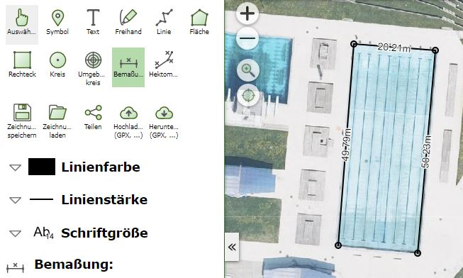
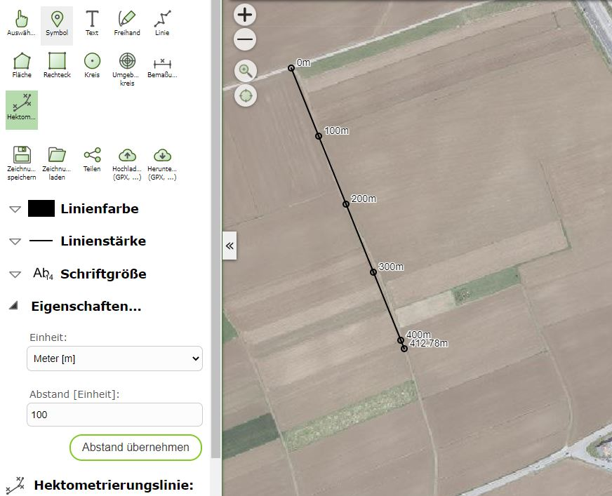

Build 3.21.2403 (16.06.2021)
============================

Mit diesem Build wurden neue Redlining Werkzeug eingeführt. Mit Redlining können in der Regel einfache Grafiken (Linien, Flächen) und Texten einer Karte hinzugefügt und ausgedruckt werden.

Aus neue Grafiktypen sind:

* Bemaßungslinie: Zum einfügen von einfachen Maßlinien mit automatischer Beschriftung der einzelnen Segmente
* Hektometrierungslinie: Linie auf der Punkte mit einem bestimmten Abstand (z.B. 100m) markiert und beschriftet werden

eingefügt worden

