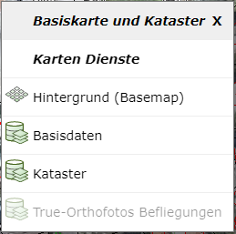
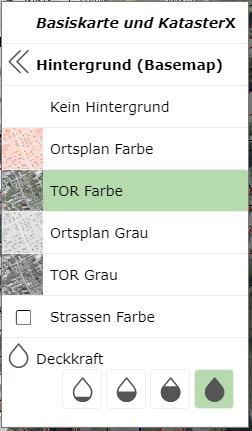
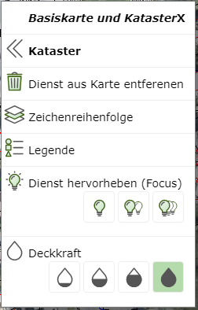
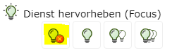
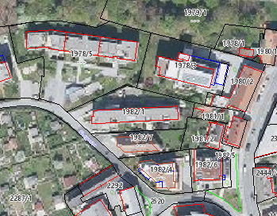
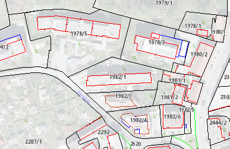
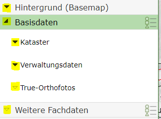
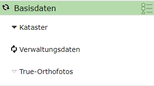

Build 3.21.4601 (17.11.2021)
============================

In diesem Release wurden ein Kontextmenü für die Karte eingeführt, mit der schneller auf die Eigenschaften (z.B. Transparenz, Focus, Legende) der einzelnen Dienste zugegriffen werden kann.
Außerdem kann über das Kontextmenü der Kartenhintergrund (Ortsplan, Luftbild) einfach und schnell umgestellt werden.
Das Kontextmenü erscheint mit einem Rechtsklick in die Karte und ist derzeit nur in der *Desktop* Variante verfügbar (nicht am Handy).

Außerdem wurde die Eigenschaft **Focus** für Dienste eingeführt. Focus ist mit dem transparent schalten von Diensten vergleichbar. Allerdings wird hier für den gewünschten Dienst die Deckkraft 
auf den Maximalwert gesetzt und alle anderen Kartendienste transparent dargestellt (siehe unten).

Kleine Änderungen wurden auch im Darstellungsvarianten Baum vorgenommen (Sanduhr, ...)

Karten Kontextmenü
------------------

Das Kontextmenü einer Karte erscheint, wenn mit der rechten Maustaste in die Karte geklickt wird.

.. note::
   Das Kontextmenü der Karte steht nicht zur Verfügung, wenn das aktuelle Werkzeug ein Zeichenwerkzeug (Sketch-Werkzeug, z.B. Redlining, Messen, Bearbeiten, ...) ist.
   Dort ist die rechte Maustaste bereits für das Kontextmenü des Sketch reserviert (Konstruktionswerkzeuge).

In de Überschrift wird der Name der aktuellen Karte angezeigt (hier: *Basiskarte und Kataster*).
Ein Klick auf die Überschrift bzw. das ``X`` Symbol schließt das Kontextmenü wieder.

Unter dem Abschnitt ``Karten Dienste`` werden alle Dienste aufgelistet, die in die Karte eingebunden sind. Wird ein Dienst mit 
*grauer Schrift* dargestellt, sind im aktuellen Kartenmaßstab keine Themen für diesen Dienst sichtbar geschalten.

Der erste Eintrag unter ``Karten Dienst`` ist immer ``Hintergrund (Basemap)``. Klickt man auf diesen Eintrage werden im Kontextmenü
alle verfügbaren Hintergrunddienste aufgelistet:

Der aktuelle dargestellte Hintergrunddienst wird hervorgehoben angezeigt. Ein Klick auf einen Hintergrunddienst schaltet diesen
in der Karte aktiv. An Ende der Liste kann die Deckkraft für den aktuellen Hintergrunddienste eingestellt werden.

Mit ``« Hintergrund (Basemap)`` kann wird auf die ursprüngliche List der Dienste des Kontextmenüs gewechselt werden.

Bewegt man in der Auflistung der Kartendienste im Kontextmenü den Mauszeiger über einen Eintrag, wird im Hintergrund in der 
Karte nur diese Dienst dargestellt. Das sollte dabei helfen, den gewünschten Dienst in der Karte zu identifizieren.
Klick man auf einen Dienst, öffnet sich das Kontextmenü für diesen Kartendienst:

Folgende Optionen für den Dienst werden hier angeboten:

* **Dienst aus der Karte entfernen:** 
  Der Dienst wird aus der Karte entfernt. Dies bezieht sich nur auf die aktuelle Session. Öffnet man die Karte zu einem späteren 
  Zeitpunkt, befindet sich diese Dienst wieder in der Karte. Das gilt natürlich nicht für Dienste, die während der Session 
  manuell zur Karte hinzugefügt wurden.

* **Zeichenreichenfolge:**
  Öffnet den *Zeichenreichenfolge* Dialog für diese Karte. Dort kann der Dienst nach oben oder unten geschoben werden.

* **Legende:** 
  Öffnet den *Legende Dialog* für diesen Dienst.

* **Dienst hervorheben (Focus):**
  hier kann der Dienst hervorgehoben werden. Diese Eigenschaft ist ebenfalls eine Neuerung Releases und wird unten noch genauer 
  beschreiben.

* **Deckkraft:**
  Hier kann die Deckkraft/Transparenz für diesen Dienst eingestellt werden.

Dienste hervorheben (Focus)
---------------------------

Mit dieser Funktion können Dienste gegenüber allen Kartendienste hervorgehoben dargestellt werden. Bei überladenen Karten,
ergibt sich oft das Problem, dass die *entscheidende* Information nur schwer von weniger wichtigen Inhalten unterscheidbar ist.

Mit *Dienste hervorheben (Focus)* werden alle Dienste *transparent* (weniger intensiv) dargestellt (inklusive Hintergrunddienst).
Der betroffen Dienst wird mit voller Deckkraft dargestellt. Der *Grad des Hervorhebens* kann über das Glühbirnen Symbol 
bestimmt werden: Je mehr Glühbirnen, desto höher der *Focus*:

Der *Focus* für den Dienst kann über das oben beschriebene Kontextmenü für einen Dienst erfolgen. Wählt man eine *Focus-Stufe* aus,
wird auch zusätzlich das Symbol zum Beenden des *Focus Modus* angezeigt. Mit deinem Klick auf diese Symbol, wird der 
ursprüngliche Zustand der Karte wieder hergestellt:

.. note::
   Das Symbol zum Beenden des *Focus Modus* taucht an mehren Stellen auf. Das ist nützlich, um zu erkennen, dass der *Focus Modus*
   aktiv ist und dieser einfach wieder beendet werden kann:

  .. image:: img/focus2.png

Was der Focus bewirkt, soll in folgenden Beispiel gezeigt werden:
In einer Karte wird das Luftbild und der Kataster jeweils mit voller Deckkraft angezeigt werden. Durch die farbliche Darstellung
des Luftbildes lassen sich nicht alle Details des Katasters einfach erkennen:

Wendet man den Focus auf den Kataster Dienst an, ergibt sich folgende Darstellung:

Der Hintergrund ist hier zwar noch für die Übersicht vorhanden, die entscheidende Information (Kataster) ist allerdings 
besser erkennbar.

.. note::
   Den selben Effekt könnte man auch erzielen, würde man den Hintergrunddienst transparent schalten. Befinden sich allerdings
   mehrere Dienste in der Karte, ist der *Focus Modus* für einen einzelnen Dienst einfach herzustellen.

Darstellungsvarianten Baum
---------------------------

Die Icons zum Aufklappen von Gruppen werden in zwei Varianten angezeigt:

* **Schwarzes (ausgefülltes) Dreieck:**
  Gibt an, dass sich unter dieser Gruppen Themen beifinden, die sichtbar geschalten sind.

* **Weißes (umrandetes) Dreieck:**
  In dieser Gruppe gibt es momentan keine Themen, die sichtbar geschalten sind.

Die unterschiedlichen *Icons* helfen dabei, eine Übersicht zu geben, aus welchen Containern/Gruppen aktuell Themen in der Karte sichtbar geschalten sind.

Wird die Karte neu aufbaut, wird im Darstellungsvarianten Baum über ein Sanduhr Symbol angezeigt, aus welchen Gruppen Daten 
aktuell geladen werden:

