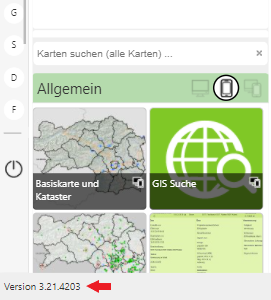

.. sectnum::
    :start: 7

Neuerungen
==========

In diesem Abschnitt werden Neuerungen am Kartenviewer beschrieben, die für den Anwender relevant sind.
Als Referenz entsprehenden hier die einzelnen Kapiteln den Build-Nummern der Software und dem *Release* Datum.

.. toctree::
   :maxdepth: 1

   index.rst

Welcher *Release* aktuell verwendet wird, hängt vom Dienstanbieter ab. Für den Anwender ist die
aktuelle Version an unterschiedlichen Stellen in der Oberfläche ersichtlich:

**Portal Startseite**

Die Versionnummer wird hier *Footer* (Fußzeile) der Seite angezeigt:

**Kartenviewer**

Beim Kartenviewer muss zuerst im Menü (rechts oben) auf ``Karteninfo & Copyright`` geklickt werden:

.. image:: img/news2.png

Von dort kommt man über ``Karteninfo`` und ``Credits`` zu folgender Ansicht, auf der die Versionsnummer 
zu finden ist:

