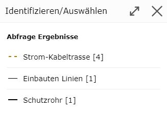

Abfragen
--------

Eine Abfrage erfolgt durch Klicken auf ein Geo-Objekt mit einem entsprechenden Abfragewerkzeug.
Die unterschiedlichen Abfragefragewerkzeuge befinden sich im Werkzeugkasten im Abschnitt *Abfragen*.

Diese Abschnitt wird später noch behandelt. Hier soll einmal nur das Grundprinzip des Abfragen gezeigt werden bzw.
das Abfragen mit den *Standard* Werkzeug.

Standard Werkzeug
+++++++++++++++++

Öffnet man den Kartenviewer ist in der Regel das *Standard* oder *Default* Werkzeug aktiv. Dieses Werkzeug ist immer aktiv,
wen kein anderes Werkzeug aus dem Werkzeugkasten aktiv ist.

Am Desktop ist dieses Werkzeug am Mauszeiger ersichtlich: *Zeigefinger* mit blauem *(i)*

Der Zeigefinger sollte anzeigen, dass mit dem *Standard* Werkzeug der Kartenausschnitt verschoben werden kann.
Das blaue *(i)* steht für *Identifizieren* von Geo Objekten.

Mit dem *Standard* Werkzeug können folgende Funktion ausgeübt werden:

* Mit gedrückter Maustaste den Kartenauschnitt verschieben

* Mit dem Mausrad den Kartenausschnitt vergrößern/verkleinern

* Durch Klick die Sachdaten eines Geo-Objekts Abfragen

.. note::
   Die ersten beiden Punkte funktionieren auch bei fast allen Werkzeugen aus dem Werkzeugkasten.

.. note::
   Auf (mobilen) Geräten mit Touch Bedienung funktioniert der Klick in der Karte über das *Klick Bubble* Werkzeug (siehe Abschnitt...)
   Der Vorteil der *Klick Bubble* ist die Vermeidung von unabsichtlichen Klicks beim Navigieren und die höhere
   Präzision beim Klicken.

Klickt man mit dem Werkzeug in die Karte, werden für den gewünschten Ort die Geo-Objekte aller Themen abgefragt, für 
die eine Abfrage zulässig ist (und die auch aufgrund der Themenschaltung und des Maßstabes sichtbar sind).

War die Abfrage erfolgreich und eindeutig, werden die Ergebnisse gleich angezeigt.
Die Abfrage ist nicht eindeutig, wenn Geo-Objekte aus unterschiedlichen Themenebenen gefunden werden. Ist das der Fall,
öffnet sich ein Dialog, in dem das gewünschte Thema festgelegt werden kann:

Mit der Bezeichnung der Themenebenen wird auch noch ein Symbol aus der Legende des Themas angezeigt, das hilfreich 
sein kann, die gewünschte Themenebene auszuwählen. Außerdem wird noch zusätzlich (in eckigen Klammern) angezeigt,
wie viele Objekte von dieser Abfrage betroffen sind.

Wählt man eine Themenebene aus, wird die Abfrage eindeutig und die Ergebnisse werden angezeigt.

.. note::
   Der hier beschrieben Zwischenschritt ist notwendig, weil im Kartenviewer immer nur die Abfrage- und Suchergebnisse
   von genau einer Themenebene gleichzeitig angezeigt werden können.