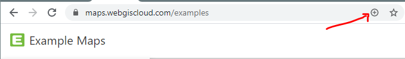
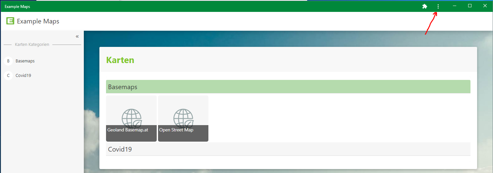

Als App installieren (PWA)
==========================

Das WebGIS Portal kann, falls dies vom WebGIS Betreiber erwünscht, auch als App auf einem mobilen Device (Handy, Tablett) oder für Windows 10 installiert werden.
Damit erscheint die Anwendung mit einem Icon auf dem Startbildschirm bzw. unter Windows auf dem Desktop. Öffnet man diese App, wird WebGIS nicht mehr in einem Browser geöffnet, sondern erscheint in einem eigenständigen Fenster.
Damit erzielt man auf kleinen Displays eine bessere Ausnutzung für die Kartenansicht. Ein weiterer Vorteil ist ein besseres Caching von Inhalten (Icons, Scripten, ...), was zu einem schnelleren Laden der Anwendung führen kann.

Die Installation erfolgt nicht über den jeweiligen Store, sondern die WebGIS Portalseite muss wie bisher über den Browser aufgerufen werden. Allerdings erscheint im Browser entweder ein entsprechendes Symbol zum Installieren (unter Windows) 
oder eine direkte Aufforderung (unter Android).

Unter iOS muss die Installation manuel erfolgen (siehe unten).

Installation auf Windows 10
---------------------------

Hier muss zuerst mit dem (Chrome) Browser zur WebGIS Portalseite navigiert werden. Ist eine Installation möglich, erscheint in der Adressleiste ein *Plus Symbol*:

Durch einen Klick aus dieses Symbol erscheint die Aufforderung, die App zu installieren. Damit wird ein Symbol auf den Desktop gelegt. Ebenfalls werden entsprechende Symbole im Startmenü angelegt und können auf Wunsch auch an die Taskleiste geheftet werden.
Öffnet man die Anwendung über des angelegte Icon (Desktop, Startmenü) erscheint sie ein einem eigenen Fenster (nicht mehr im Browser):

In der Titelzeile des Fensters gibt es ein *Menü Symbol* (siehe Abbildung oben), über das die App wieder deinstalliert werden kann.

Installation auf Android Geräten
--------------------------------

Hier muss zuerst mit dem (Chrome) Browser zur WebGIS Portalseite navigiert werden. Der Browser zeigt dann in der Regel eine Aufforderung an, ob die App auf den Home-Bildschrim hinzugefügt werden sollte. Erfolgt dies nicht automatisch, kann das auch über das 
Browser Menü erfolgen (``Zum Startbildschirm / Homebildschrim hinzufügen``).

Die App wird deinstalliert, wenn das Symbol vom Home Bildschirm wieder gelöscht wird. 

Installation auf iOS (iPhones oder iPads)
-----------------------------------------

.. note::
   Unter iOS (iPhone oder iPad) erfolgt keine Aufforderung oder ein dezidiertes Symbol, um eine Installation zu veranlassen. 
   Hier muss man die WebGIS Portal Seite zuerst mit dem Safari Browser öffnen, dann auf das *Teilen Symbol* klicken und darunter ``Zum Home-Bildschirm`` wählen.

   .. image:: img/pwa1.png

Die App wird deinstalliert, wenn das Symbol vom Home Bildschirm wieder gelöscht wird. 

