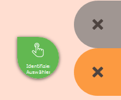

Click Bubble
============

Kurzbeschreibung
----------------

Anstatt in die Karte zu klicken, ziehe die "Bubble" in die Karte an die gewünschte Position.

Detailierte Beschreibung
------------------------

Manche Werkzeuge erfordern einen Klick in die Karte, z.B. Identifizieren und Auswählen, Zeichnen, usw.
Da es auf mobilen Geräten mit Touch-Bedienung nicht immer leicht ist an genau die gewünschte Position zu klicken, steht dieses Gadget zur Verfügung.
Es hilft außerdem die Bedienbarkeit der Karte zu verbessern, da versehentliche Klicks in die Karte bei Zoomen oder Verschieben nicht sofort eine Aktion auslösen.
        
.. note::
    Solange die "Bubble" aktiv ist, wird durch einen Klick in die Karte keine Aktion ausgeführt. Alle Gesten dienen so nur der Navigation in der Karte.
        

Um das Werkzeug zu verwenden, muss die "Bubble" an die gewünschte Stelle gezogen werden. Sobald die "Bubble" grün wird, ist sie aktiv.
Das Werkzeug wird nach dem Loslassen direkt an dem Punkt ausgelöst, auf den die rechte obere Spitze zeigt.
    

Nach dem Auslösen, kehrt die "Bubble" wieder an ihre Ausgangslage zurück.
    
Während des Ziehens werden links noch zwei mit einen "X" gekennzeichneten Bereiche sichtbar.
        
.. note::
    Auf mobilen Geräten mit kleinen Displays kann es sein, dass der graue Bereich aus Platzgründen nicht zur Verfügung steht.

Zieht man die "Bubble" auf einen dieser Bereiche, ändert diese sofort ihre Farbe. Die Farben haben dabei folgende Bedeutungen:
    
* **Oranger Bereich** 

    Die "Bubble" soll wieder in den Ruhebereich zurückkehren. Das kann beispielsweise wünschenswert sein, wenn das Ziehen ein Versehen war und keine Aktion ausgelöst werden soll.
    Legt man die "Bubble" im Orangen Bereich ab, wird keine Aktion ausgelöst.

* **Grauer Bereich**

    Zieht man die "Bubble" in diesen Bereich, wird sie deaktiviert. Wenn die "Bubble" deaktiviert ist, kann ein Werkzeug auch über einen Klick in die Karte ausgelöst werden.
    Das kann wünschenswert sein, wenn man neben der Gestensteuerung auf dem Gerät auch noch ein weiteres Eingabemedium wie Maus oder Stift verwenden möchte.
    Will man die "Bubble" wieder aktivieren, kann man sie aus dem grauen Bereich einfach in die Karte ziehen (und so eine Aktion auslösen)
    oder die "Bubble" in den orangen Bereich ziehen (keine Aktion).

Die "Bubble" erscheint auch bei den Zeichen Werkzeugen. Damit können die Stützpunkte einzeln durch Ziehen der "Bubble" gesetzt werden.
Zusätzlich erscheint bei den Zeichen Werkzeugen noch eine zweite "Bubble" für das Kontextmenü.
    

Die zweite "Bubble" öffnet das Kontextmenü für den (Zeichen)Sketch und entspricht somit der rechten Maustaste. Da es oft entscheidend ist, an welcher Stelle man das Kontextmenü öffnet,
kann man auch diese "Bubble" an die gewünschte Stelle ziehen, um das Menü zu öffnen. Will man beispielsweise einen Stützpunkt löschen, zieht man die "Bubble" auf den Stützpunkt und wählt
im Menü "Vertex löschen" aus.
    
