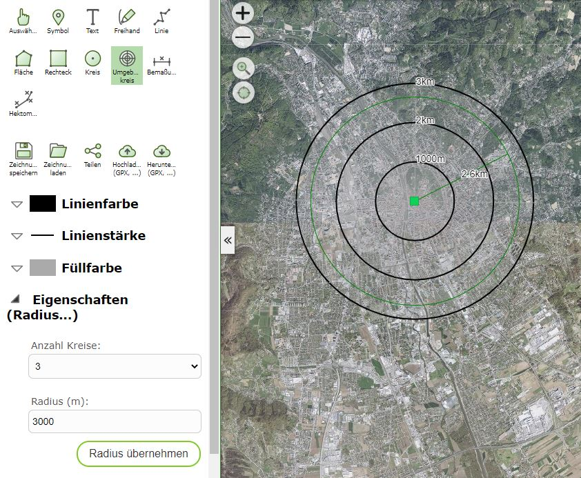
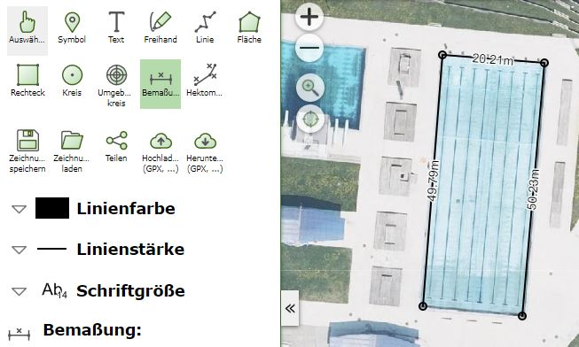
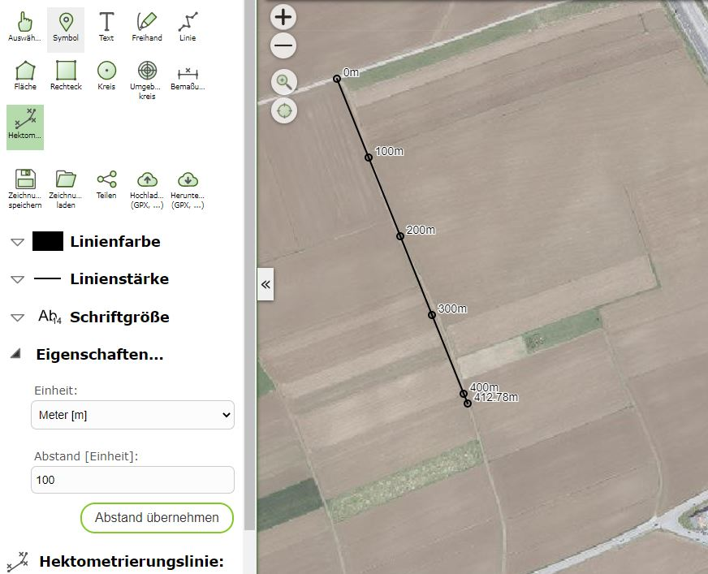

Spezialwerkzeuge
================

Neben Linien, Flächen, Freihand, Texten, Rechtecken und Kreisen gibt es noch speziellere Graphiken auf die hier eingegangen wird.

Umgebungskreis
--------------

Mit diesem Werkzeug kann ein Kreis mit einem bestimmten Radius um einen Mittelpunkt definiert werden. Zum eigentlich Umgebungskreis werden noch Kreise mit Zwischenschritten angezeigt und beschriftet:

Das Ergebnis kann für Abstandsuntersuchungen verwendet werden.

Bemaßungslinie
--------------

Mit diesem Werkzeug kann eine (Poly-) Linie gezeichnet werden, bei der jedes Segment mit der entsprechenden Länge in Metern beschriftet wird:

.. note::
   Die angezeigte Länge wird immer *live* aus den Stützpunkte im aktuellen Karten Koordinatensystem berechnet. Übernimmt man die Zeichnung (durch Speichern und Laden) in eine Karte mit einem anderen Koordinatensystem, 
   könne die Werte abweichen. Dies gilt für allen für Karten, in denen mit *WebMercator* gerechnet wird, weil es hier große Verzerrungen geben kann. Welches Koordinatensystem verwendet wird kann im *Kartenviewer*
   links unten abgelesen werden.
   
   .. image:: img/advanced-tools3.png

Hektometrierungslinie
---------------------

Bei dieser Linie werden Zwischenpunkte über einen vordefinierten Abstand (z.B. alle 100m) markiert und beschriftet:

Als Anzeigeeinheit kann Meter [m] und Kilometer [km] angebeben werden.

.. note::
   Gleich wie bei der Bemaßungslinie werden auch hier die Abstandspunkte *live* berechnet und beziehen sich immer auf das aktuelle Kartenkoordinatensystem. Fügt man die Zeichnung in unterschiedliche Karten ein, kann es zu Abweichungen kommen!