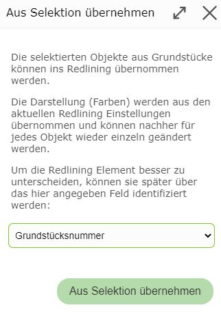

Elemente aus Selektion ins Redlining übernehmen
===============================================

Je nach Berechtigung ist es möglich, die Geometrie für Redlining Element aus einer bestehenden Abfrage/Selektion zu übernehmen.
Anwendungsfälle hierfür sind beispielsweise:

* Selektion von mehreren Abfragen gleichzeitig darstellen, individuell einzufärben und auszudrucken

* Vereinfachung beim Nachzeichnen bereits bestehender Geometrien aus einer Abfrage

* Text aus abgefragten Objekten in die Karte übernehmen

.. note::
   Ob diese Funktion zur Verfügung steht, bestimmt der Betreiber des Kartenviewers. Eventuell wird diese Funktion auch nur eingeschränkt angeboten.
   Beispielsweise kann beschränkt werden, wie viele Objekte übernommen werden dürfen, oder ob ein Download dieser Element möglich ist.

Vorgehensweise
--------------

Damit diese Funktion angeboten wird, müssen zuerst Objekte abgefragt werden. Dies erfolgt wie im Abschnitt *Suchen und Abfragen* beschrieben, oder mit dem *Identifizieren/Auswählen* Werkzeug.

.. note::
   Die Abfrageergebnisse müssen **ausgewählt** in der Karte erscheinen (*cyan* hinterlegt). Ansonsten werden sie vom *Zeichnen (Redlining)* Werkzeug nicht erkannt.
   Abfrageergebnisse werden ausgewählt (selektiert), wenn in der Ergebnisliste die entsprechende Option gesetzt wurde:

   .. image:: img/selection1.png

Wechselt man zum *Zeichnen (Redlining)* Werkzeug, kann man diese Objekte übernehmen. Dabei ist zuerst darauf zu achten, welchen Geometrietyp (Punktförmig, Linienförmig, Flächenförmig) die ausgewählten Abfrageergebnisse aufweisen.
Punkte lassen sich beispielsweise *nicht* als Linien oder Flächen übernehmen.

Hat man beispielsweise Grundstücksflächen ausgewählt, kann man im *Zeichnen (Redlining)* Werkzeug ebenfalls das Sub-Werkzeug *Flächen* auswählen. Im Werkzeug Dialog sollte jetzt folgender Button erscheinen:

Klickt man auf diesen Button erscheint folgender Dialog:

Hier kann ein Attribut aus den Abfrageergebnissen gewählt werden, dessen Werte beim Einfügen der Objekte ins Redlining als Beschreibung verwendet werden sollten. Das erleichtert es später, die Graphik-Element
in der Liste zu Identifizieren. Die Möglichen Attributwerte sind vom Abfragethema abhängig. 
Bei Grundstücksflächen bietet sich dafür beispielsweise die *Grundstücksnummer* an. 

.. note::
   Die Darstellung (Farben, ...) der eingefügten Elemente hängt von den aktuellen Darstellungsoptionen ab. Diese können zwar nachträglich geändert werden, dazu muss allerdings jedes Element extra bearbeitet werden.
   Es empfiehlt sich daher, schon vor dem Übernehmen die richtigen Darstellungsoptionen zu setzen.  

Sind alle Einstellung korrekt, können die Objekte mit dem Button *Aus Selektion übernehmen* in Zeichenelemente umgewandelt werden.

Formen der Übernahme
--------------------

Wie bereits gezeigt, können flächenhafte Objekte in *Flächen* Zeichenelemente umgewandelt werden. Das gleiche gilt für Linie und Punkte (können als Symbole übernommen werden).
Zusätzlich können alle Objekte als Texte übernommen werden. Die folgende Auflistung zeigt, welche Objekt Geometrien in welche Zeichenelemente umgewandelt werden können

+---------------------------------------------------+--------------------------------------------------------------+
| **Objekt Geometrie**                              | **Zeichnen (Redlining) Geometrie**                           |
+---------------------------------------------------+--------------------------------------------------------------+
| Punkte                                            | * Symbole                                                    |
|                                                   | * Texte                                                      |
+---------------------------------------------------+--------------------------------------------------------------+
| Linien                                            | * Symbole                                                    |
|                                                   | * Texte                                                      |
|                                                   | * Linien                                                     |
+---------------------------------------------------+--------------------------------------------------------------+
| Flächen                                           | * Symbole                                                    |
|                                                   | * Texte                                                      |
|                                                   | * Flächen                                                    |
+---------------------------------------------------+--------------------------------------------------------------+

Es scheint verständlich zu sein, das Punkte sowohl in Symbole aus auch Texte umgewandelt werden können (der Einfügepunkt ist immer die Lage es Objektpunktes).
Trotzdem kann es auch Sinn machen, Linie und Fächen in Symbole oder Texte umzuwandeln. Beim Umwandelt von Linie und Flächen in Symbole oder Texte wird der Einfüge automatisch so berechnet, 
dass er auf dem jeweiligen Objekte zu liegen kommt.

Ein Anwendungsfall kann beispielsweise sein, wenn für einen Ausdruck die Grundstücksnummer für die ausgewählten Abfrageergebnisse in einer bestimmten Form dargestellt werden sollten. 
Dazu wäre die Vorgehensweise folgende:

* Grundstücksflächen mit Suchen oder Abfragen auswählen

* Zum *Zeichnen (Redlining)* Werkzeug wechseln

* Auf das Sub-Werkzeug Text klicken

* Darstellungsoptionen (Schriftgröße und Farbe) einstellen

* Auf Button *Texte aus Selection Grundstücksflächen übernehmen...* klicken.

* Im Dialog als Beschreibungsfeld *Grundsnummern* auswählen und mit Button *Aus Selektion übernehmen* bestätigen

* Die einzeln entstanden Texte optional noch verändern oder an eine passende Position verschieben

* Optional können die ausgewählten Abfrageergebnisse aus der Karte entfernt werden, die Zeichenelemente bleiben bestehen

Das Ergebnis könnte damit etwa so aussehen (rote Texte sind Zeichenelemente und kommen aus einer Abfrage)

Auf die gleiche Weise könnte man die gewählten Grundstücke auch mit einem Marker versehen. Dazu ist beim *Zeichnen (Redining)* Werkzeug das Sub-Werkzeug *Symbol* anstelle von *Text* zu wählen und 
auf den Button *Symbole aus Selektion Grundstücksflächen übernehmen...* zu klicken

