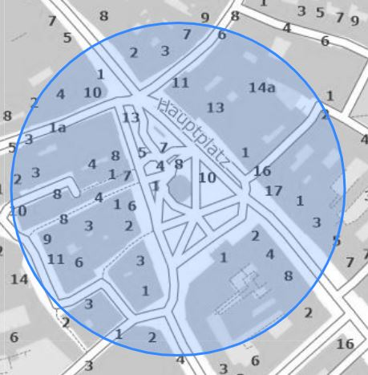

Umgebungskreis
==============

Umgebungskreis ist ein einfaches *Mess*-Werkzeug. Durch einen Klick in die Karte wird der Mittelpunkt
des Kreises definiert. Für den Radius werden im Werkzeugdialog vordefiniert Werte angeboten:

Durch wiederholtes Klicken in die Karte, wir der Kreis jeweils neu positioniert.

Das Werkzeug ist absichtlicht einfach gehalten und dient hauptsächlich dazu, Entfernung in der Karte
einfach abzuschätzen:

Weitere Möglichkeiten bietet der *Umgebungskreis*, der mit dem *Zeichnen (Redlining)* Werkzeug erstellt werden kann,
zB individueller Radius, Beschriftung, Ausdrucken

.. image:: img/circle3.png
