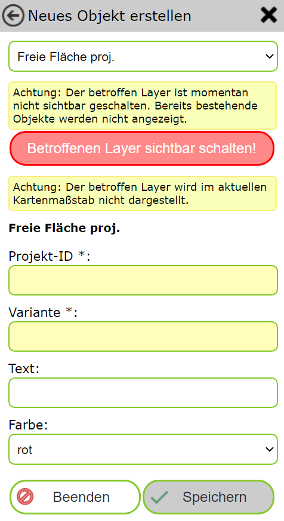
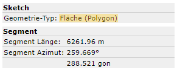
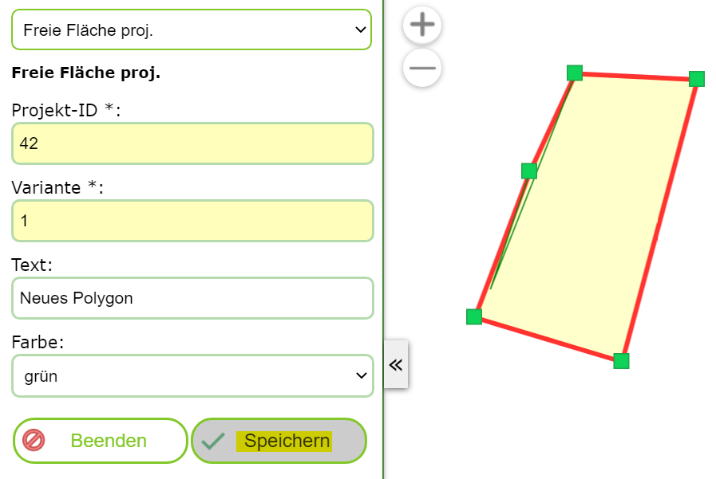
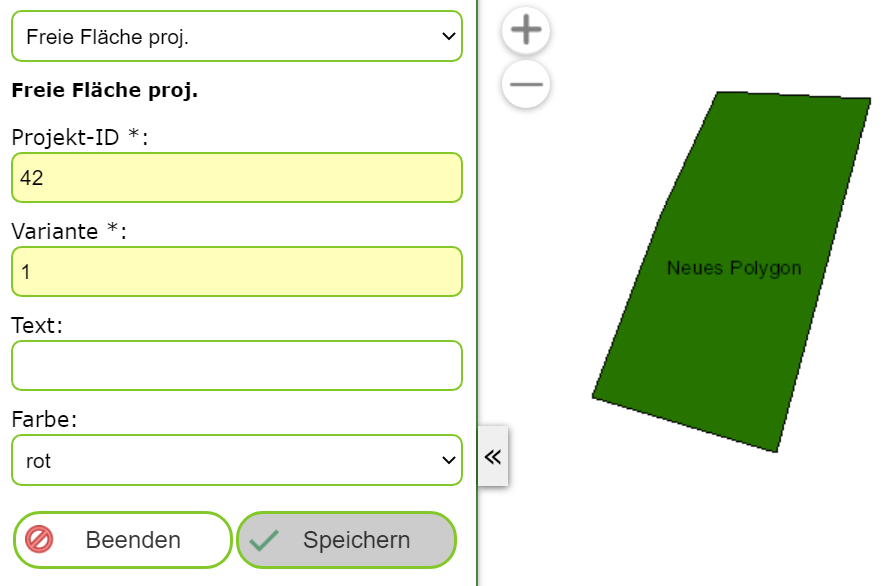

Neues Objekt anlegen
====================

Klickt man auf dieses (Sub) Werkzeug, öffnet sich eine neuen Dialog mit einer Erstellungsmaske.
Am der ersten Auswahlliste im Dialog muss das Thema gewählt werden, für welches ein Geo-Objekte erstellt werden sollte:

Ändert man hier das Thema, ändern sich in der Regel auch die Sachdaten, die für dieses Thema einzutragen sind.

.. note::
   Um bestehende Objekte eines Themas beim Bearbeiten berücksichtigen zu können, sollte die entsprechenden Layer
   sichtbar geschalten sein. 
   Es besteht die Möglichkeit, dass der Layer für das gewünschte Thema in der Karte noch nicht sichtbar geschalten
   wurden. Wenn das so ist, wird die oben gezeigte Meldung angezeigt. Mit einem Klick auf ``Betroffenen Layer sichtbar schalten``
   werden bestehende Objekte aus diesem Thema in der Karte angezeigt.
   Ebenfalls kann es möglich sein, dass der Layer nicht im aktuellen Kartenmaßstab sichtbar ist. Auch darauf wird
   hier als Warnung hingewiesen. Das kann behoben werden, wenn in auf den richtigen Maßstab gezoomt wird (in der Regeln,
   muss hier der Kartenausschnitt verkleinert werden).
   
Ist das gewünschte Thema ausgewählt, kann mit dem Erstellen begonnen werden. Je nach Thema muss eine Punkt-, Linien-
oder Flächengeometrie gezeichnet/konstruiert werden. Um welchen Geometrie Type es sich handelt, ist auf in der
*Sketch Info* unter der *Objekt erstellen Maske* ersichtlich:

Zusätzlich müssen auch die Sachdaten in der Maske ausgefüllte werden (Pflichtfelder haben in der Regel ein gelbes
Eingabefeld):

Sind alle Werte richtig eingetragen und ist die Geometrie gültig, dann das Objekte mit dem ``Speichern`` Button
in die Geo-Datenbank übernommen werden. Nach dem Speichern sollte das neue Objekte in der Karte erscheinen
und eine neues Objekte angelegt werden können:

