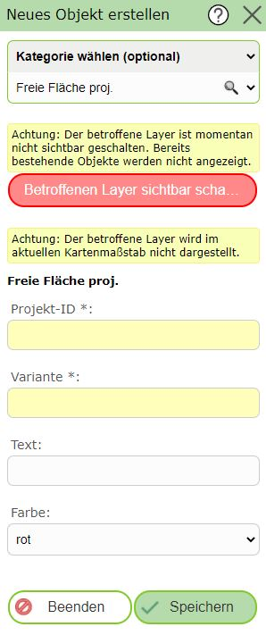

Neues Objekt anlegen
====================

Klickt man auf dieses (Sub)Werkzeug, öffnet sich ein neuer Dialog mit einer Erstellungsmaske.
Mit der ersten Auswahlliste im Dialog muss das Thema gewählt werden, für welches ein Geo-Objekte erstellt werden sollte:

Ändert man hier das Thema, ändern sich in der Regel auch die Sachdaten, die für dieses Thema einzutragen sind.

.. note::
   Um bestehende Objekte eines Themas beim Bearbeiten berücksichtigen zu können, sollten die entsprechenden Layer
   sichtbar geschalten sein. 
   Es besteht die Möglichkeit, dass der Layer für das gewünschte Thema in der Karte noch nicht sichtbar geschalten
   wurde. Wenn das so ist, wird die oben gezeigte Meldung angezeigt. Mit einem Klick auf ``Betroffenen Layer sichtbar schalten``
   werden bestehende Objekte aus diesem Thema in der Karte angezeigt.
   Ebenfalls kann es möglich sein, dass der Layer nicht im aktuellen Kartenmaßstab sichtbar ist. Auch darauf wird
   hier als Warnung hingewiesen. Das kann behoben werden, wenn auf den richtigen Maßstab gezoomt wird (in der Regel
   muss hier der Kartenausschnitt verkleinert werden).
   
Ist das gewünschte Thema ausgewählt, kann mit dem Erstellen begonnen werden. Je nach Thema muss eine Punkt-, Linien-
oder Flächengeometrie gezeichnet/konstruiert werden. Um welchen Geometrie Type es sich handelt, ist in der
*Sketch Info* unter der *Objekt erstellen Maske* ersichtlich:

Zusätzlich müssen auch die Sachdaten in der Maske ausgefüllte werden (Pflichtfelder haben in der Regel ein gelbes
Eingabefeld):

.. image:: img/edit4.png

Sind alle Werte richtig eingetragen und ist die Geometrie gültig, dann kann das Objekt mit dem ``Speichern`` Button
in die Geo-Datenbank übernommen werden. Nach dem Speichern sollte das neue Objekte in der Karte erscheinen
und eine neues Objekte angelegt werden können:

Je nach Editthema kann es unterschiedliche Methoden zum Speichern eines neuen Objektes geben. Neben dem ``Speichern``
kann es beispielsweise auch noch ``Speichern und Auswählen`` geben:

Dabei wird die Editierumgebung verlassen und das neu erstellte Objekte wie nach einer Abfrage ausgewählt (selektiert) in der Karte
angezeigt. Das kann hilfreich sein, wenn das neu erstellte Objekt beispielsweise für eine Nachbarschaftsberechnung weiterverwendet werden sollte.

Je nach Anwendung kann der Kartenautor auch noch weitere Möglichkeiten anbieten, zB ``Speichern und alle Eingabefelder beibehalten`` (im 
Normfall werden nach dem Speichern alle Eingabefelder auf den Standard zurückgesetzt).  

Das Erstellen von Objekten kann mit dem ``Beenden`` Button oder durch Schließen des Werkzeugdialogs beendet werden.

.. note::
   Auf Endgeräten kann sich der hier beschriebene Ablauf leicht ändern. Hier muss zuerst die Geometrie erfasst werden. Danach kann man
   über einen Button ``Sachdaten bearbeiten`` zur Eingabemaske für die Sachdaten wechseln. Darin befindet sich dann auch der ``Speichern`` Button. 