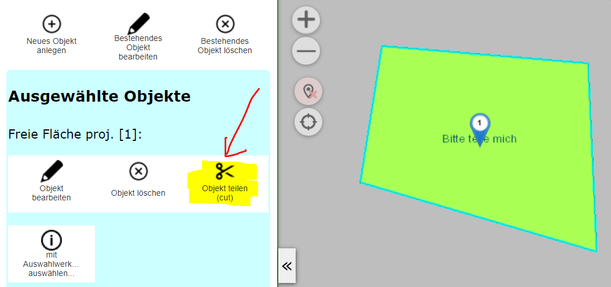
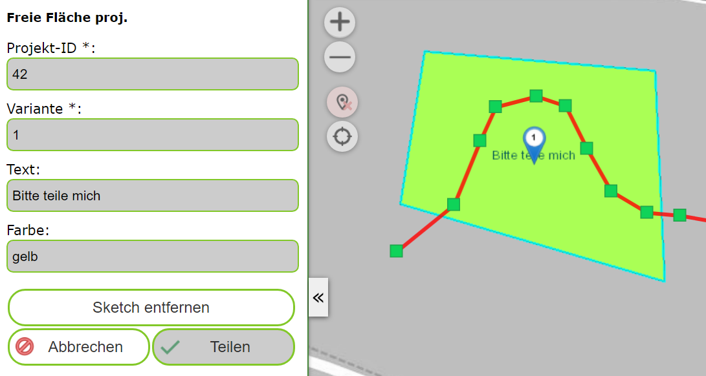
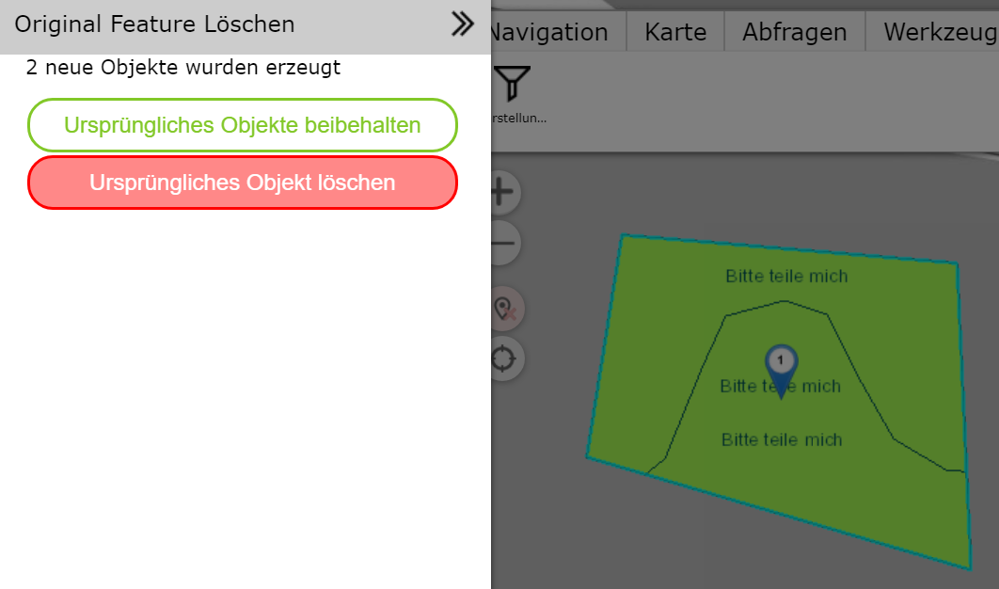

Geo-Objekte teilen (cut)
========================

Mit diesem Werkzeug kann eine Linien- oder Flächtenobjekt mittels einer Schnittlinie 
in mehrere Teile geteilt werden. Voraussetzung ist, dass das entsprechende Geo-Objekt
mit dem einem Abfragewerkzeug ausgewählt (selektiert) in der Karte angezeigt wird.
Außerdem darf für diesen Vorgang nur exakt ein Geo-Objekt ausgewählt sein.

Wechselt man zum Bearbeiten (Edit) Werkzeug, wird das *Objekte Teilen* Werkzeug angeboten:

Klickt man auf das *Objekt teilen* Werkzeug, öffnet sich ein Dialog, in dem die Sachdaten,
des Geo-Objektes angezeigt werden. In der Karte kann man eine Linie zeichnen, die zum Teilen
des Objektes verwendet wird. Diese Linie sollte die Geometrie des Geo-Objekte (Linie oder Fläche)
komplett schneiden:

Mit dem ``Teilen`` Button, wird das Objekte *geteilt*. Durch ein erfolgreiches Teilen, 
entstehen mindestens zwei neue Objekte. Die Sachdaten aus dem ursprünglichen Objekte werden in 
die neuen Objekte übernommen. Im angezeigten Dialog kann man entscheiden, ob das ursprüngliche 
Objekte erhalten oder gelöschte werden sollte:

Entscheidet man sich für ``Ursprüngliches Objekt löschen`` wird das am Anfang selektierte Objekte
gelöscht.

.. note::
   Löscht man das ursprüngliche Objekt, kann es später theoreitsch mit *Undo* wieder hergestellt werden
   (siehe voriges Kapitel)

