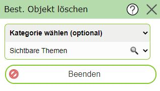
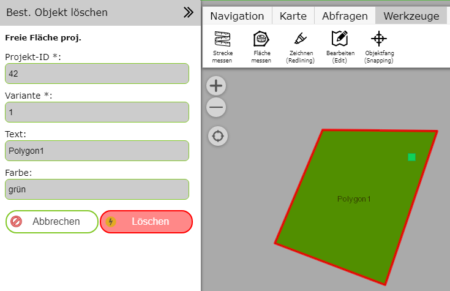

Bestehendes Objekt löschen
==========================

Gleich wie beim Bearbeiten von bestehenden Objekten muss hier zuerst ein Objekt durch anklicken ausgewählt werden.
Diese erfolgt wieder durch Angabe eines speziellen Objekt Typs oder mit der Option ``Sichtbare Themen``:

Wurde eine Objekte gefunden, öffnet sich die der ``Bestehendes Objekte löschen`` Dialog. Hier werden die Sachen des 
entsprechenden Objektes aufgelistet sowie die Geometrie in der Karte *rot* umrandet:

Möchte man das Objekte wirklich löschen, erfolgt das mit dem ``Löschen`` Button. Ansonsten kann die Aktion mit dem
``Abbrechen`` Button abgebrochen werden.

.. note::
   Das Löschen wird direkt auf der Geo-Datenbank ausgeführt und ist in der Regel endgültig. Für manche Dienste besteht
   allerdings auch eine Undo Funktion (siehe nächstes Kapitel)

