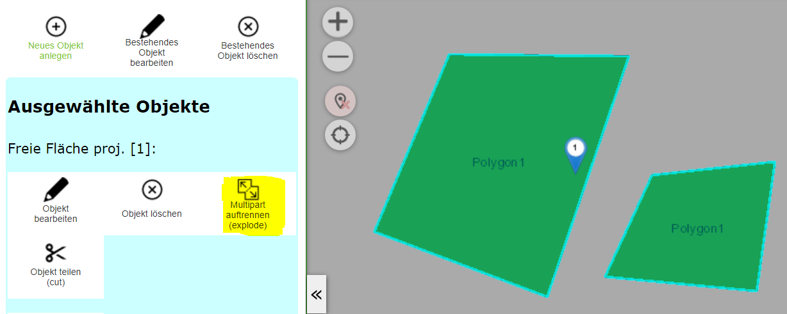
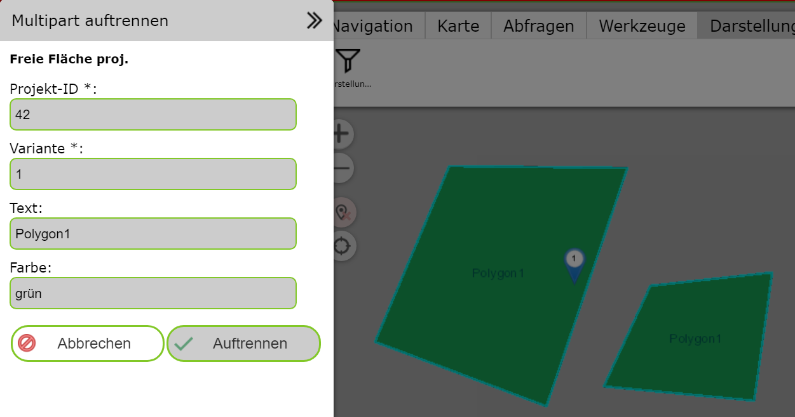
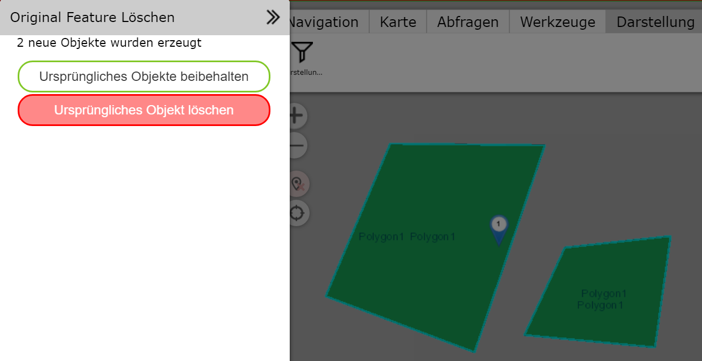

Multipart Geo-Objekt auftrennen (explode)
=========================================

Mit diesem Werkzeug kann ein *multipart Objekt* in seine einzelnen Geometrieteile
aufgetrennt werden. Voraussetzung ist, dass das entsprechende Geo-Objekt
mit einem Abfragewerkzeug ausgewählt (selektiert) in der Karte angezeigt wird.
Außerdem darf für diesen Vorgang nur exakt ein Geo-Objekt ausgewählt sein.

Wechselt man zum Bearbeiten (Edit) Werkzeug, wird das *Multipart Objekte auftrennen (explode)* 
Werkzeug angeboten:

Das hier dargestellte Flächenobjekt besteht aus zwei Teilfächen. Klickt man auf das Werkzeug,
erscheint ein Dialog, in dem die Sachdaten des Geo-Objekts angezeigt werden:

Möchte man das Objekt auftrennen, ist auf den ``Teilen`` Button zu klicken. Dadurch werden 
mindestens zwei neue Geo-Objekte erzeugt. Die Sachdaten werden aus dem ursprünglichen Objekt
übernommen. In der Folge kann noch entschieden werden, ob das ursprüngliche Objekte gelöscht 
werden soll:

