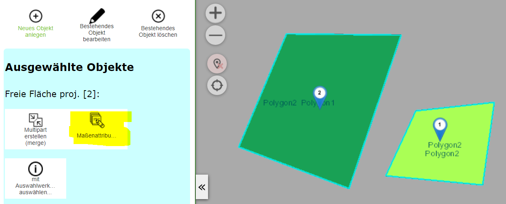
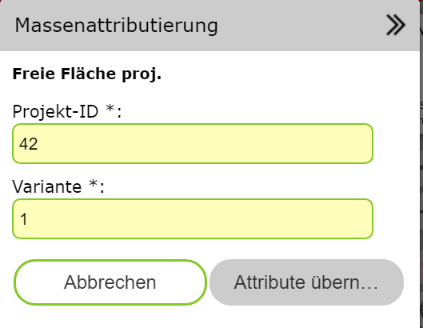

Massenattributierung
====================

Mit diesen Werkzeug können Sachdaten auf mehrere Geo-Objekte gleichzeit übertragen werden.
Voraussetzung ist, dass die Objekte über eine Abfrage ausgewählt (selektiert) in der Karte 
dargestellt werden.

Wechselt man zum Bearbeiten (Edit) Werkzeug, wird das *Massenattributierung* Werkzeug angeboten:

Klickt man auf das Werkzeug, wird eine Attributemaske angezeigt. Hier werden in der Regel nicht
alle Attribute anboten, die auch beim einzelnen Bearbeiten möglich sind. Welche Attribute
bei der Massenattributierung sinnvoll/erlaubt sind, entscheidet der Kartenautor:

Mit ``Attribute übernehmen`` werden die Sachdaten auf alle Ausgewählen Objekte übernommen.