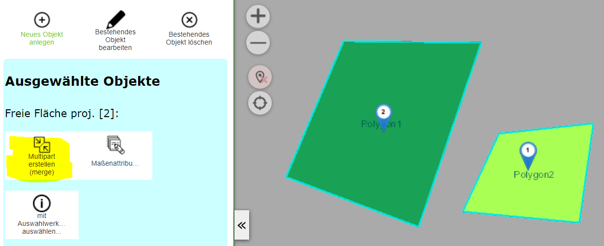
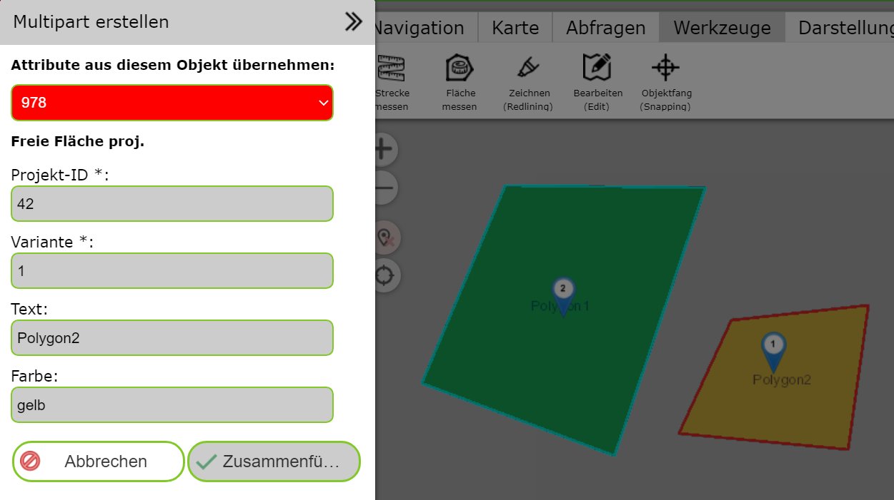

Multipart Geo-Objekte erstellen (merge)
=======================================

Mit diesem Werkzeug kann aus mehreren Objekte ein *Multipart Objekt* erstellt werden.
Das Ergebnis ist ein Geo-Objekte mit mehreren Geometrie Abschnitten.
Voraussetzung ist, dass die entsprechenden Geo-Objekte
mit dem einem Abfragewerkzeug ausgewählt (selektiert) in der Karte angezeigt werden.
Außerdem müssen für diesen Vorgang mindestens zwei Geo-Objekt ausgewählt sein.

Wechselt man zum Bearbeiten (Edit) Werkzeug, wird das *Multipart erstellen* Werkzeug angeboten:

Klickt man auf das Werkzeug, öffnet sich ein neuer Dialog ``Multipart erstellen``. Da beim 
Erstellen eines *Multipart Objektes* aus vielen Objekten extakt ein Objekt erstellt wird,
muss man sich im nächsten Schritt entscheiden aus welchem der ursprünglichen Objekte die 
Sachdaten auf das neue Übertragen werden sollte:

Dazu bietet der Dialog eine Auswahlliste in die einzelnen Ids der ursprünglichen Objekte 
aufgelistet werden. Ändert man hier die Id, ändern sich in der Ansicht die Sachden für das 
entsprechende Objekte. In der Karte wird das aktuelle Objekte *rot* umrandet dargestellt.

Sind die Sachdaten es richtigen Objektes ausgewählt, können die Objekte mit ``Zusammenfügen``
zu einem *Multipart Objekt* zusammengefügt werden. Nach dem *Zusammenfügen* kann noch entscheiden,
ob die ursprünglichen Objekte gelöscht werden sollte:

.. image:: img/edit25.png
